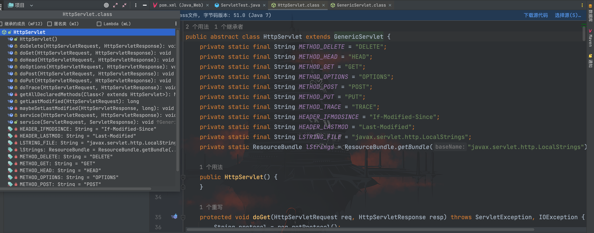
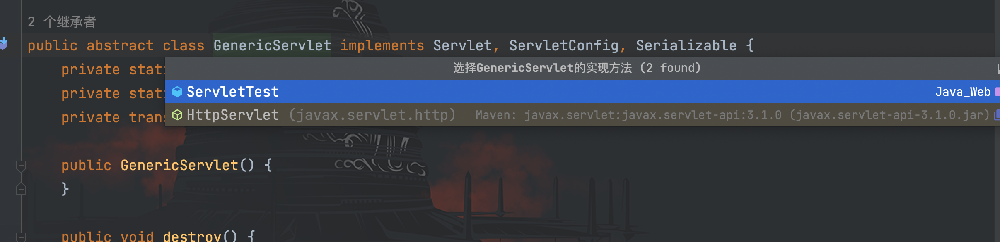
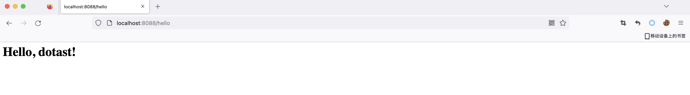
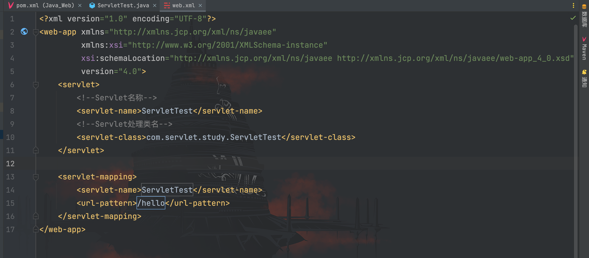
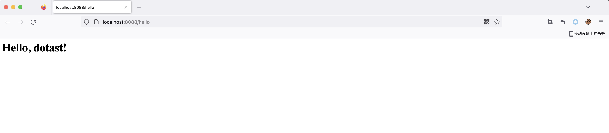

# Servlet基础

## 概念

> Java Servlet 是运行在 Web 服务器或应用服务器上的程序，它是作为来自 Web 浏览器或其他 HTTP 客户端的请求和 HTTP 服务器上的数据库或应用程序之间的中间层。
>
> 使用 Servlet，您可以收集来自网页表单的用户输入，呈现来自数据库或者其他源的记录，还可以动态创建网页。
>
> 狭义的Servlet是指Java语言实现的一个接口，广义的Servlet是指任何实现了这个Servlet接口的类，一般情况下，人们将Servlet理解为后者。

Java EE 提供了 Servlet API，通过 Servlet，我们可以处理 Web 应用程序的 HTTP 请求以及响应，关系如下：


## Servlet的定义

定义 Servlet 只需要编写的类继承`javax.servlet.http.HttpServlet`类并重写`doGet()`或者`doPost()`等代表请求方式的方法即可。

### HttpServlet

先了解一下`HttpServlet`类，从图中可以看到该类继承于`GenericServlet`类


而`GenericServlet`类实现了`Servlet`、`ServletConfig`和`Serializable`接口


`HttpServlet`抽象类中含有`doGet/doPost/doDelete/doHead/doPut/doOptions/doTrace`等方法用于处理客户端的不同请求方法，因此我们在定义 Servlet 时，要重写该抽象类中的方法用于处理请求。

### 基于注解方式配置

在 Servlet 3.0 之后可以采用注解方式配置 Servlet，在任意类导入`javax.servlet.annotation.WebServlet;`

在 pom.xml 文件中添加 maven 依赖：

```
<dependency>
    <groupId>javax.servlet</groupId>
    <artifactId>javax.servlet-api</artifactId>
    <version>3.1.0</version>
</dependency>
```

编写 ServletTest.class
```java
package com.servlet.study;

import javax.servlet.annotation.WebServlet;
import javax.servlet.http.HttpServlet;
import javax.servlet.http.HttpServletRequest;
import javax.servlet.http.HttpServletResponse;
import java.io.IOException;
import java.io.PrintWriter;

/**
 * Created by dotast on 2022/10/21 10:41
 */
@WebServlet(urlPatterns = "/hello")
public class ServletTest extends HttpServlet {
    protected void doGet(HttpServletRequest req, HttpServletResponse resp) throws IOException {
        PrintWriter out = resp.getWriter();
        out.write("<h1>Hello, dotast!</h1>");
        out.flush();
        out.close();
    }
}
```

访问`/hello`接口



### 基于web.xml文件配置

编写好 ServletTest 类
```java
package com.servlet.study;

import javax.servlet.http.HttpServlet;
import javax.servlet.http.HttpServletRequest;
import javax.servlet.http.HttpServletResponse;
import java.io.IOException;
import java.io.PrintWriter;

/**
 * Created by dotast on 2022/10/21 10:41
 */

public class ServletTest extends HttpServlet {
    protected void doGet(HttpServletRequest req, HttpServletResponse resp) throws IOException {
        PrintWriter out = resp.getWriter();
        out.write("<h1>Hello, dotast!</h1>");
        out.flush();
        out.close();
    }
}
```

在 web.xml 文件中配置 servlet 标签


启动后访问定义好的`url-pattern`


## Request与Response

在前面我们编写的 Servlet 类中，`doGet()`方法传入了`HttpServletRequest`对象和`HttpServletResponse`对象
```java
public class ServletTest extends HttpServlet {
    protected void doGet(HttpServletRequest req, HttpServletResponse resp) throws IOException {
        PrintWriter out = resp.getWriter();
        out.write("<h1>Hello, dotast!</h1>");
        out.flush();
        out.close();
    }
```

`HttpServletRequest`对象用于处理来自客户端的请求，当客户端通过HTTP协议访问服务器时，HTTP 中的所有信息都封装在这个对象中，通过`HttpServletRequest`对象可以获取到客户端请求的所有信息。

`HttpServletResponse`对象用于响应客户端的请求，通过`HttpServletResponse`对象可以处理服务器端对客户端请求响应。

### HttpServletRequest常用方法

| 方法                            | 说明                                       |
| ------------------------------- | ------------------------------------------ |
| getParameter(String name)       | 获取请求中的参数，该参数是由name指定的     |
| getParameterValues(String name) | 返回请求中的参数值，该参数值是由name指定的 |
| getRealPath(String path)        | 获取Web资源目录                            |
| getAttribute(String name)       | 返回name指定的属性值                       |
| getAttributeNames()             | 返回当前请求的所有属性的名字集合           |
| getCookies()                    | 返回客户端发送的Cookie                     |
| getSession()                    | 获取session回话对象                        |
| getInputStream()                | 获取请求主题的输入流                       |
| getReader()                     | 获取请求主体的数据流                       |
| getMethod()                     | 获取发送请求的方式，如GET、POST            |
| getParameterNames()             | 获取请求中所有参数的名称                   |
| getRemoteAddr()                 | 获取客户端的IP地址                         |
| getRemoteHost()                 | 获取客户端名称                             |
| getServerPath()                 | 获取请求的文件的路径                       |

### HttpServletResponse常用方法

| 方法                                 | 说明                                 |
| ------------------------------------ | ------------------------------------ |
| getWriter()                          | 获取响应打印流对象                   |
| getOutputStream()                    | 获取响应流对象                       |
| addCookie(Cookie cookie)             | 将指定的Cookie加入到当前的响应中     |
| addHeader(String name,String value)  | 将指定的名字和值加入到响应的头信息中 |
| sendError(int sc)                    | 使用指定状态码发送一个错误到客户端   |
| sendRedirect(String location)        | 发送一个临时的响应到客户端           |
| setDateHeader(String name,long date) | 将给出的名字和日期设置响应的头部     |
| setHeader(String name,String value)  | 将给出的名字和值设置响应的头部       |
| setStatus(int sc)                    | 给当前响应设置状态码                 |
| setContentType(String ContentType)   | 设置响应的MIME类型                   |