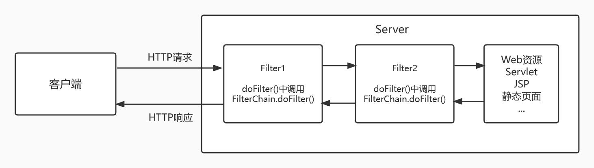
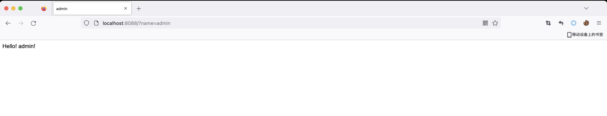

# Filter基础

## 概念

`javax.servlet.Filter`是`Servlet2.3`新增的一个特性,主要用于过滤URL请求，通过Filter我们可以实现URL请求资源权限验证、用户登陆检测等功能。

Filter是一个接口，实现一个Filter只需要重写`init`、`doFilter`、`destroy`方法即可，其中过滤逻辑都在`doFilter`方法中实现。

`Filter`的配置类似于`Servlet`，由`<filter>`和`<filter-mapping>`两组标签组成，如果Servlet版本大于3.0同样可以使用注解的方式配置Filter。

Filter 的生命周期和 Servlet 一样，如下所示：

- `init(FilterConfig)`：初始化方法，只会在 web 应用程序启动时调用一次。
- `doFilter(ServletRequest, ServletResponse, FilterChain)`：实现过滤功能。当客户请求访问与过滤器关联的 URL 的时候，过滤器将先执行 doFilter 方法。FilterChain 参数用于访问后续过滤器
- `destory()`：销毁 Filter，只会在当 web 应用移除或服务器停止时才调用一次来销毁 Filter 对象

一个 Servlet 可以注册多个 Filter，Web 容器会将注册的多个 Filter 组合成一个“Filter链”，并按照一定的顺序依次执行各 Filter 的 doFilter() 方法。



## 基于注解实现的Filter

简单写个 demo

```
package com.servlet.study;

import javax.servlet.*;
import javax.servlet.annotation.WebFilter;
import java.io.IOException;

/**
 * Created by dotast on 2022/10/21 10:41
 */
@WebFilter(filterName = "ServletTest", urlPatterns = {"/*"})
public class ServletTest implements Filter {

    public void init(FilterConfig filterConfig) throws ServletException {

    }

    public void doFilter(ServletRequest servletRequest, ServletResponse servletResponse, FilterChain filterChain) throws IOException, ServletException {
        String name = servletRequest.getParameter("name");
        if(name.equals("admin")){
            // 跳转到 amdin.jsp
            RequestDispatcher redirect = servletRequest.getRequestDispatcher("/admin.jsp");
            redirect.forward(servletRequest,servletResponse);
        }else {
            RequestDispatcher redirect = servletRequest.getRequestDispatcher("/loginerror.jsp");
            redirect.forward(servletRequest,servletResponse);
        }
        // 使下一个 Filter 能够继续执行
        filterChain.doFilter(servletRequest,servletResponse);
    }

    public void destroy() {

    }
}
```


