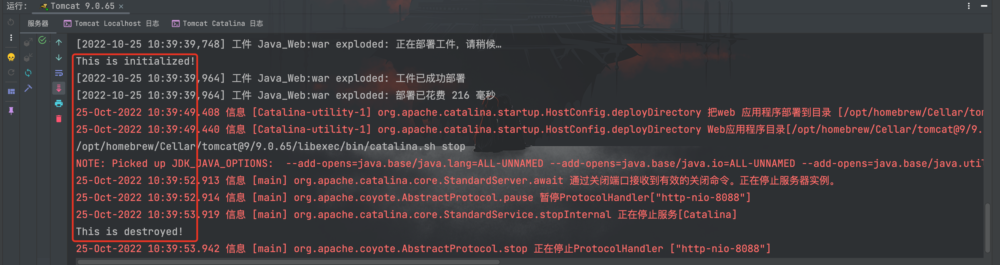
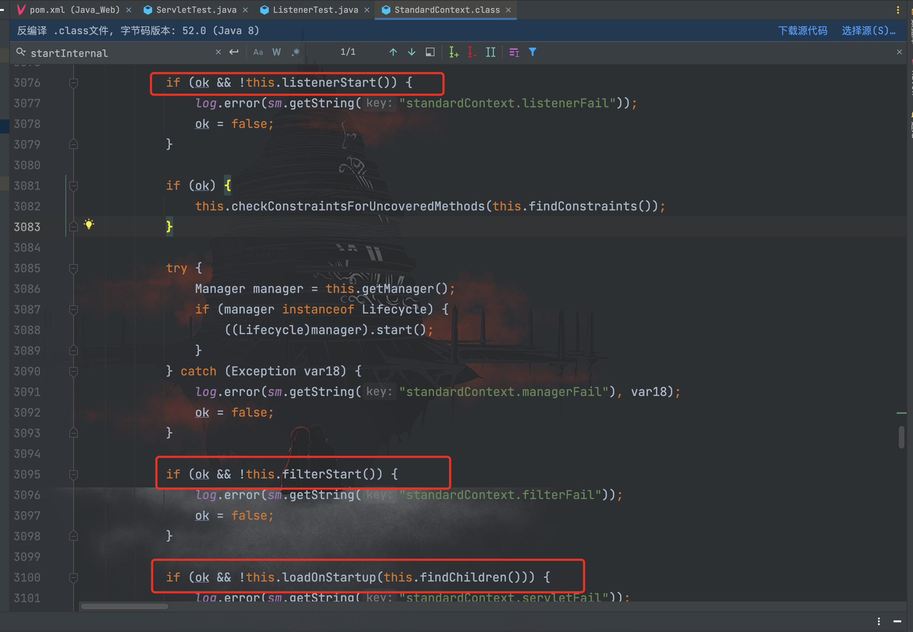

# Listener基础

## 前言

Listener 顾名思义就是监听器，本质为实现特定接口的 Java 程序，用于监听方法和属性。当被监听的方法或者属性有所变化时，Listener 会自动执行所设定好的对应操作。

监听器的分类如下所示：

| 事件源         | 监听器                          | 描述                                                         |
| :------------- | :------------------------------ | :----------------------------------------------------------- |
| ServletContext | ServletContextListener          | 用于监听 ServletContext 对象的创建与销毁过程                 |
| HttpSession    | HttpSessionListener             | 用于监听 HttpSession 对象的创建和销毁过程                    |
| ServletRequest | ServletRequestListener          | 用于监听 ServletRequest 对象的创建和销毁过程                 |
| ServletContext | ServletContextAttributeListener | 用于监听 ServletContext 对象的属性新增、移除和替换           |
| HttpSession    | HttpSessionAttributeListener    | 用于监听 HttpSession 对象的属性新增、移除和替换              |
| ServletRequest | ServletRequestAttributeListener | 用于监听 HttpServletRequest 对象的属性新增、移除和替换       |
| HttpSession    | HttpSessionBindingListener      | 用于监听 JavaBean 对象绑定到 HttpSession 对象和从 HttpSession 对象解绑的事件 |
| HttpSession    | HttpSessionActivationListener   | 用于监听 HttpSession 中对象活化和钝化的过程                  |

较为常用的有`ServletContextListener`、`HttpSessionListener`和`ServletRequestListener`等。

## 基于注解实现的Listener

一个Web服务器可以运行一个或多个WebApp，对于每个WebApp，Web服务器都会为其创建一个全局唯一的`ServletContext`实例，`ServletContext`实例最大的作用就是设置和共享全局信息。

编写一个实现`ServletContextListener`接口的实现类如下：

```java
package com.servlet.study;

import javax.servlet.ServletContextEvent;
import javax.servlet.ServletContextListener;
import javax.servlet.annotation.WebListener;

/**
 * Created by dotast on 2022/10/25 10:35
 */
@WebListener
public class ListenerTest implements ServletContextListener {

    public void contextInitialized(ServletContextEvent servletContextEvent) {
        System.out.println("This is initialized!");
    }

    public void contextDestroyed(ServletContextEvent servletContextEvent) {
        System.out.println("This is destroyed!");
    }
}
```

启动 Tomcat 服务器，`ServletContextListener`监听到`ServletContext`对象被创建，触发`contextInitialized()`方法。

关闭 Tomcat 服务器，`ServletContextListener`监听到`ServletContext`对象被销毁，触发`contextDestroyed`方法。

## 总结

关于`Servlet`、`Filter`和`Listener`的调用顺序可以在`org.apache.catalina.core.StandardContext#startInternal()`方法中找到答案

如图所示，调用顺序分别为`listenerStart()`、`filterStart()`和`loadOnStartup()`，三个方法分别调用了`Listener`、`Filter`和`Servlet`，因此可以得到调用顺序为：
```
Listener --> Filter --> Servlet
```

