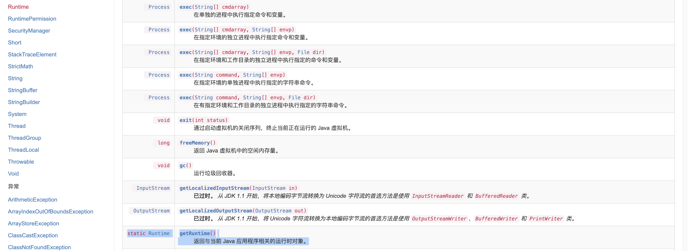

# 反射

## 前言

> 反射是大多数语言都必不可少的组成部分，对象可以通过反射获取他的类，类可以通过反射拿到所有⽅法（包括私有），拿到的⽅法可以调⽤，总之通过“反射”，我们可以将 Java 这种静态语⾔附加上动态特性。

在前面 JavaSE 学习的时候已经了解过反射的基本知识：[反射](../00-JavaSE/2-反射/反射.md) ，所以这里开始学习在 Java安全中，反射可以给我们带来什么以及如何去利用。

## 命令执行

根据前面的学习，反射中的几个极为重要的利用方法：

获取 class 实例 之后

- 获取类名：`forName()`
- 创建对应类型的实例：`newInstance()`
- 获取字段的值：`get()`、设置字段的值：`set()`
- 获取方法：`getMethod()`、调用方法：`invoke()`

**我们如何通过反射去执行命令？**

最常见的情况就是调用`java.lang.Runtime`类，按照我们前面的学习，构造方式如下
```java
public class Main{
    public static void main(String[] args)throws Exception {
        Class aClass = Class.forName("java.lang.Runtime");
        aClass.getMethod("exec", String.class).invoke(aClass.newInstance(),"whoami");
    }
}
```

但运行后报了错，报错原因是类的构造方法是私有的，而`newInstance()`只能调用 public 无参构造方法
查看手册，我们可以通过`getRuntime`来获取到当前的`Runtime`类对象


因此构造 payload 如下
```java
public class Main{
    public static void main(String[] args)throws Exception {
        Class aClass = Class.forName("java.lang.Runtime");
        aClass.getMethod("exec", String.class).invoke(aClass.getMethod("getRuntime").invoke(aClass),"open /System/Applications/Calculator.app");
    }
}

/*变成一句话就是
Class.forName("java.lang.Runtime").getMethod("exec", String.class).invoke(Class.forName("java.lang.Runtime").getMethod("getRuntime").invoke(Class.forName("java.lang.Runtime")),"");
*/
```


当然在前面的学习中，我们知道可以通过`getDeclaredConstructor()`去获取私有的构造方法，因此 payload 还可以构造成
```java
import java.lang.reflect.Constructor;

public class Main{
    public static void main(String[] args)throws Exception {
        Class aClass = Class.forName("java.lang.Runtime");
        Constructor con = aClass.getDeclaredConstructor();
        con.setAccessible(true);
        aClass.getMethod("exec", String.class).invoke(con.newInstance(),"open /System/Applications/Calculator.app");
    }
}
```

在《Java安全漫谈中》中，p牛提过：<u>如果一个类没有无参构造方法，也没有类似单例模式里的静态方法，我们怎样通过反射实例化该类呢？</u>的问题并给出了解决方案

我们采用`getConstructor`来替代`getMethod`，同时调用`java.lang.ProcessBuilder`类来执行命令。下面 payload 使用的是`ProcessBuilder`其中的一个构造函数`public ProcessBuilder(List<String> command)`，因此需要传入`List.class`
```java
import java.util.Arrays;
import java.util.List;

public class Main{
    public static void main(String[] args)throws Exception {
        Class aclass = Class.forName("java.lang.ProcessBuilder");
        aclass.getMethod("start").invoke(aclass.getConstructor(List.class).
                                         newInstance(Arrays.asList("open","/System/Applications/Calculator.app")));
    }
}
```


