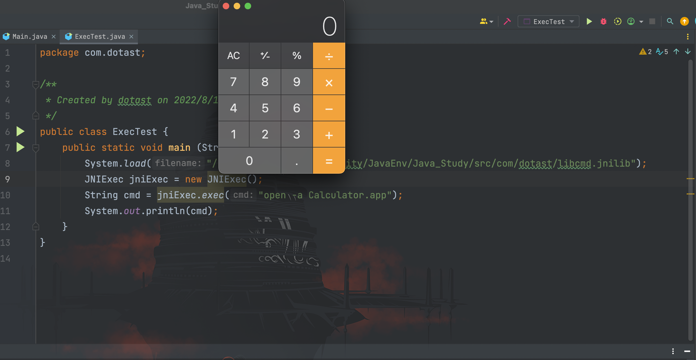
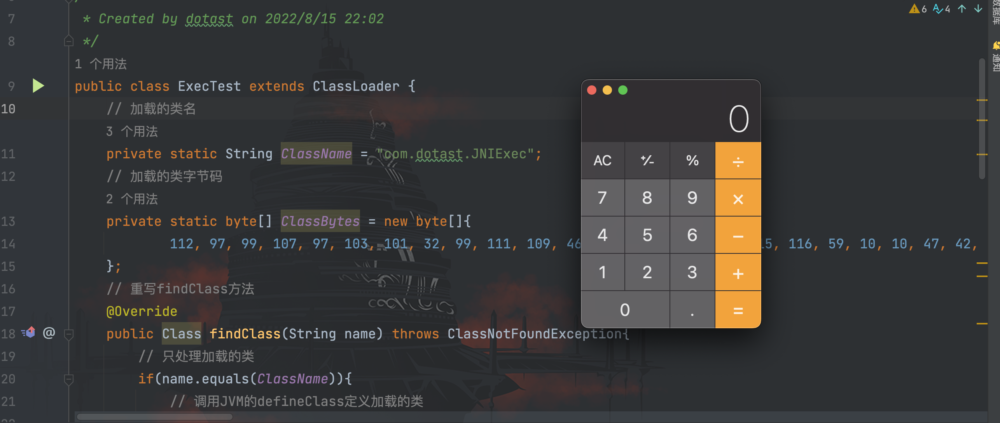

# JNI安全基础

## 前言

Java 语言是基于 C 语言实现，并且 Java 底层的很多 API 都是通过`JNI(Java Native Interface)`来实现的。`JNI`的作用是可以通过 Java 程序去调用 C 的程序（调用的是编译好的 DLL 动态链接库里的方法）。

## JNI实现

JNI 的实现大致分为以下步骤：
```
1.定义一个 native 修饰的方法
2.使用 javah 进行编译
3.编写 C 代码
4.编译成动态链接库
5.编写 Java 类并加载动态链接库进行调用
```

### 定义native方法

```java
package com.dotast;

/**
 * Created by dotast on 2022/8/15 21:26
 */
public class JNIExec {
    public static native String exec (String cmd);
}
```

### 使用javah进行编译

**注意JDK版本：**

JDK 10 移除了`javah`,需要改为`javac`加`-h`参数的方式生产头文件，如果 JDK 版本正好`>=10`,那么使用如下方式可以同时编译并生成头文件。
```bash
 javac -cp . com/dotast/JNIExec.java -h com/dotast/
```

当前目录生成`.class`文件和`.h`头文件


其中的`Java_com_dotast_JNIExec_exec`前面的`Java`是固定的，后面则是类名和方法名。

括号里面的参数`JNIEnv`是`JNI`环境变量对象，`jclass`是`java`调用的对象，后面则是传入的参数类型。该文件是后面编写 C 代码的时候导入的头文件。

### 编写C代码

`com_dotast_JNIExec.cpp`源代码

```cpp
#include <iostream>
#include <stdlib.h>
#include <cstring>
#include <string>
#include "com_dotast_JNIExec.h"

using namespace std;

JNIEXPORT jstring

JNICALL Java_com_dotast_JNIExec_exec
        (JNIEnv *env, jclass jclass, jstring str) {

    if (str != NULL) {
        jboolean jsCopy;
        // 将jstring参数转成char指针
        const char *cmd = env->GetStringUTFChars(str, &jsCopy);

        // 使用popen函数执行系统命令
        FILE *fd  = popen(cmd, "r");

        if (fd != NULL) {
            // 返回结果字符串
            string result;

            // 定义字符串数组
            char buf[128];

            // 读取popen函数的执行结果
            while (fgets(buf, sizeof(buf), fd) != NULL) {
                // 拼接读取到的结果到result
                result +=buf;
            }

            // 关闭popen
            pclose(fd);

            // 返回命令执行结果给Java
            return env->NewStringUTF(result.c_str());
        }

    }

    return NULL;
}
```

### 编译成动态链接库

`MacOS编译:`

```bash
g++ -fPIC -I"$JAVA_HOME/include" -I"$JAVA_HOME/include/darwin" -shared -o libcmd.jnilib com_dotast_JNIExec.cpp
```

`Linux编译:`

```bash
g++ -fPIC -I"$JAVA_HOME/include" -I"$JAVA_HOME/include/linux" -shared -o libcmd.so com_dotast_JNIExec.cpp
```

本人为`MacOS`系统，编译后生成`libcmd.jnilib`文件

### 编写java类并调用动态链接库

```java
package com.dotast;

/**
 * Created by dotast on 2022/8/15 22:02
 */
public class ExecTest {
    public static void main (String[] args){
        System.load("/xxx/dotast/libcmd.jnilib");
        JNIExec jniExec = new JNIExec();
        String cmd = jniExec.exec("open -a Calculator.app");
        System.out.println(cmd);
    }
}

```



这里通过调用动态链接库里封装的方法，可以去绕过一些限制，例如RASP的限制。

当然，正常情况下我们是没有`JNIExec`这个类的，所以我们需要通过类加载机制去实现，实现代码如下
```java
package com.dotast;

import java.io.File;
import java.lang.reflect.Method;

/**
 * Created by dotast on 2022/8/15 22:02
 */
public class ExecTest extends ClassLoader {
    // 加载的类名
    private static String ClassName = "com.dotast.JNIExec";
    // 加载的类字节码
    private static byte[] ClassBytes = new byte[]{
            112, 97, 99, 107, 97, 103, 101, 32, 99, 111, 109, 46, 100, 111, 116, 97, 115, 116, 59, 10, 10, 47, 42, 42, 10, 32, 42, 32, 67, 114, 101, 97, 116, 101, 100, 32, 98, 121, 32, 100, 111, 116, 97, 115, 116, 32, 111, 110, 32, 50, 48, 50, 50, 47, 56, 47, 49, 53, 32, 50, 49, 58, 50, 54, 10, 32, 42, 47, 10, 112, 117, 98, 108, 105, 99, 32, 99, 108, 97, 115, 115, 32, 74, 78, 73, 69, 120, 101, 99, 32, 123, 10, 32, 32, 32, 32, 112, 117, 98, 108, 105, 99, 32, 115, 116, 97, 116, 105, 99, 32, 110, 97, 116, 105, 118, 101, 32, 83, 116, 114, 105, 110, 103, 32, 101, 120, 101, 99, 32, 40, 83, 116, 114, 105, 110, 103, 32, 99, 109, 100, 41, 59, 10, 125, 10
    };
    // 重写findClass方法
    @Override
    public Class findClass(String name) throws ClassNotFoundException{
        // 只处理加载的类
        if(name.equals(ClassName)){
            // 调用JVM的defineClass定义加载的类
            return defineClass(ClassName, ClassBytes, 0, ClassBytes.length);
        }
        return super.findClass(name);
    }

    public static void main (String[] args) throws Exception{
        // 创建自定义类加载器
        var classLoader = new ExecTest();
        String cmd = "open -a Calculator.app";
        File libPath = new File("src/com/dotast/libcmd.jnilib");
        try{
            // 使用自定义的类加载器加载类
            Class ExecClass = classLoader.loadClass(ClassName);
            // 使用反射创建JNIExec类
            Object execInstance = ExecClass.newInstance();
            // 获取loadLibrary0方法
            Method loadLibrary0Method = ClassLoader.class.getDeclaredMethod("loadLibrary0", Class.class, File.class);
            loadLibrary0Method.setAccessible(true);
            // 将动态链接库加载进虚拟机中
            loadLibrary0Method.invoke(execInstance,ExecClass, libPath);

            String result = (String) ExecClass.getMethod("exec", String.class).invoke(null, cmd);
            System.out.println(result);
        }catch (ClassNotFoundException e){
            throw new RuntimeException(e);
        }
    }
}

```



上述是通过反射去调用`loadLibrary0()`方法去加载动态链接库，如果直接采用`System.load()`方法去加载则会报错。

具体原因已经有人写过：https://cloud.tencent.com/developer/article/1006269

简单总结就是：因为`System.load()`方法使用的是系统类加载器，而我们则是通过自定义的类加载器去实现，不同的`ClassLoader`去加载类和动态链接库就会导致报错。

和`7herightp4th`师傅交流了一下，他的解决方案是通过反射去调用`Runtime.load0()`方法去实现，我们按照这个思路去走一下。我们跟一下`System.load()`方法


可以看到`System.load()`会调用`Runtime.getRuntime().load0()`方法，因此我们可以通过反射调用该方法来实现`System.load()`的功能，实现代码如下
```java
package com.dotast;

import java.lang.reflect.Method;

/**
 * Created by dotast on 2022/8/15 22:02
 */
public class ExecTest extends ClassLoader {
    // 加载的类名
    private static String ClassName = "com.dotast.JNIExec";
    // 加载的类字节码
    private static byte[] ClassBytes = new byte[]{
            112, 97, 99, 107, 97, 103, 101, 32, 99, 111, 109, 46, 100, 111, 116, 97, 115, 116, 59, 10, 10, 47, 42, 42, 10, 32, 42, 32, 67, 114, 101, 97, 116, 101, 100, 32, 98, 121, 32, 100, 111, 116, 97, 115, 116, 32, 111, 110, 32, 50, 48, 50, 50, 47, 56, 47, 49, 53, 32, 50, 49, 58, 50, 54, 10, 32, 42, 47, 10, 112, 117, 98, 108, 105, 99, 32, 99, 108, 97, 115, 115, 32, 74, 78, 73, 69, 120, 101, 99, 32, 123, 10, 32, 32, 32, 32, 112, 117, 98, 108, 105, 99, 32, 115, 116, 97, 116, 105, 99, 32, 110, 97, 116, 105, 118, 101, 32, 83, 116, 114, 105, 110, 103, 32, 101, 120, 101, 99, 32, 40, 83, 116, 114, 105, 110, 103, 32, 99, 109, 100, 41, 59, 10, 125, 10
    };
    // 重写findClass方法
    @Override
    public Class findClass(String name) throws ClassNotFoundException{
        // 只处理加载的类
        if(name.equals(ClassName)){
            // 调用JVM的defineClass定义加载的类
            return defineClass(ClassName, ClassBytes, 0, ClassBytes.length);
        }
        return super.findClass(name);
    }

    public static void main (String[] args) throws Exception{
        // 创建自定义类加载器
        var classLoader = new ExecTest();
        String cmd = "ls";
        // 动态链接库的绝对路径
        String path = ("/xxx/Java_Study/src/com/dotast/libcmd.jnilib");
        try{
            // 使用自定义的类加载器加载类
            Class ExecClass = classLoader.loadClass(ClassName);
            // 获取loadLibrary0方法
            Method load0Method = Runtime.class.getDeclaredMethod("load0", Class.class, String.class);
            load0Method.setAccessible(true);
            // 将动态链接库加载进虚拟机中
            load0Method.invoke(Runtime.getRuntime(),ExecClass, path);

            String result = (String) ExecClass.getMethod("exec", String.class).invoke(null, cmd);
            System.out.println(result);
        }catch (ClassNotFoundException e){
            throw new RuntimeException(e);
        }
    }
}

```

