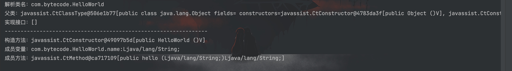
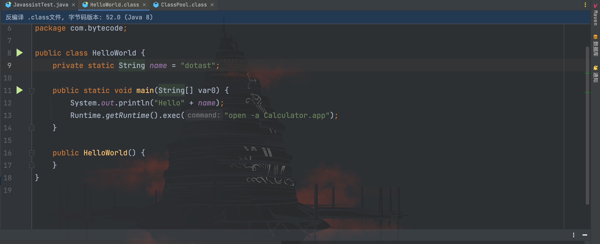

# Javassist

## 前言

`Javassist`是一个开源的分析、编辑和创建 Java 字节码的类库；相对于`ASM`，`Javassist`提供了更加简单便捷的`API`。通过`Javassist`，我们可以像写`Java`代码一样直接插入`Java`代码片段，不用关注`Java`底层的字节码和栈操作，仅仅需要学会使用`Javassist`的`API`即可实现字节码编辑。

## API和标识符

`Javassist`提供了类似于 Java 反射机制的 API，如 [CtClass](http://www.javassist.org/html/javassist/CtClass.html)，[CtConstructor](http://www.javassist.org/html/javassist/CtConstructor.html)、[CtMethod](http://www.javassist.org/html/javassist/CtMethod.html)、[CtField](http://www.javassist.org/html/javassist/CtField.html) 与 Java 反射的`class`、`Constructor`、`Method`、`Field`非常的相似。

| 类            | 描述                                                         |
| ------------- | ------------------------------------------------------------ |
| ClassPool     | ClassPool是一个存储CtClass的容器，如果调用`get`方法会搜索并创建一个表示该类的CtClass对象 |
| CtClass       | CtClass表示的是从ClassPool获取的类对象，可对该类就行读写编辑等操作 |
| CtMethod      | 可读写的类方法对象                                           |
| CtConstructor | 可读写的类构造方法对象                                       |
| CtField       | 可读写的类成员变量对象                                       |

`Javassist`使用了内置的标识符来表示一些特定的含义，如：`$_`表示返回值。我们可以在动态插入类代码的时候使用这些特殊的标识符来表示对应的对象。

| 表达式            | 描述                                      |
| ----------------- | ----------------------------------------- |
| `$0, $1, $2, ...` | `this`和方法参数                          |
| `$args`           | `Object[]`类型的参数数组                  |
| `$$`              | 所有的参数，如`m($$)`等价于`m($1,$2,...)` |
| `$cflow(...)`     | cflow变量                                 |
| `$r`              | 返回类型，用于类型转换                    |
| `$w`              | 包装类型，用于类型转换                    |
| `$_`              | 方法返回值                                |
| `$sig`            | 方法签名，返回`java.lang.Class[]`数组类型 |
| `$type`           | 返回值类型，`java.lang.Class`类型         |
| `$class`          | 当前类，`java.lang.Class`类型             |

## 读取类/成员变量/方法信息

`Javassist`通过`ClassPool`对象获取到`CtClass`对象后就可以像使用 Java 反射 API 一样去读取类信息

`Javassist`读取类信息示例代码：

```java
package com.bytecode;


import javassist.*;

import java.util.Arrays;

/**
 * Created by dotast on 2022/9/28 17:32
 */
public class JavassistTest {
    public static void main(String[] args) throws Exception{
        // 创建ClassPool对象
        ClassPool classPool = ClassPool.getDefault();
        // 获取类对象
        CtClass ctClass = classPool.get("com.bytecode.HelloWorld");
        System.out.println("解析类名："+ ctClass.getName());
        System.out.println("父类："+ ctClass.getSuperclass());
        System.out.println("实现接口："+ Arrays.toString(ctClass.getInterfaces()));
        System.out.println("----------------------------------------------------------------");
        // 获取所有构造方法
        CtConstructor[] constructors = ctClass.getDeclaredConstructors();
        // 获取所有成员变量
        CtField[] ctFields = ctClass.getDeclaredFields();
        // 获取所有成员方法
        CtMethod[] ctMethods = ctClass.getDeclaredMethods();
        // 输出所有的构造方法
        for(CtConstructor constructor:constructors){
            System.out.println("构造方法："+ constructor);
        }
        // 输出所有的成员变量
        for(CtField ctField:ctFields){
            System.out.println("成员变量："+ctField);
        }
        // 输出所有的成员方法
        for(CtMethod ctMethod: ctMethods){
            System.out.println("成员方法："+ctMethod);
        }

    }
}
```



## 修改类方法

`CtMethod`提供了类方法修改的`API`：

- `setModifies()`：修改类的访问修饰符
- `insertBefore()`：在类方法执行前插入任意 Java 代码片段
- `insertAfter()`：在类方法执行后插入任意 Java 代码片段
- `setBody()`：修改整个方法的代码
- `removeField()`：删除类的成员变量
- `removeMethod()`：删除类的方法

修改前：


修改类方法代码：
```java
package com.bytecode;


import javassist.ClassPool;
import javassist.CtClass;
import javassist.CtMethod;
import javassist.Modifier;

/**
 * Created by dotast on 2022/9/28 17:32
 */
public class JavassistTest {
    public static void main(String[] args) throws Exception{
        // 创建ClassPool对象
        ClassPool classPool = ClassPool.getDefault();
        // 获取类对象
        CtClass ctClass = classPool.get("com.bytecode.HelloWorld");
        // 获取hello方法
        CtMethod ctMethod = ctClass.getDeclaredMethod("hello", new CtClass[]{classPool.get("java.lang.String")});
        // 修改hello方法访问权限为private
        ctMethod.setModifiers(Modifier.PRIVATE);
        // 修改整个hello方法
        ctMethod.setBody("{Runtime.getRuntime().exec(\"open -a Calculator.app\");" +
                         "return \"ok!\";}");
        // 替换原有的文件，绝对路径
        ctClass.writeFile("target/classes");
    }
}
```

运行后类文件被修改如下


再次运行时执行我们插入的命令执行代码片段


## 动态创建Java类二进制

`Javassist`可以动态的创建一个类的二进制，例如需要生成一个`HelloWorld`类：

```java
package com.bytecode;

public class HelloWorld{
    private static String name = "dotast";
    public static void main(String[] args){
        System.out.println("Hello" + name);
        Runtime.getRuntime().exec("open -a Calculator.app");
    }
}
```

使用`Javassist`生成类字节码示例：
```java
package com.bytecode;


import javassist.ClassPool;
import javassist.CtClass;
import javassist.CtField;
import javassist.CtMethod;

/**
 * Created by dotast on 2022/9/28 17:32
 */
public class JavassistTest {
    public static void main(String[] args) throws Exception{
        // 创建ClassPool对象
        ClassPool classPool = ClassPool.getDefault();
        // 创建HelloWorld类
        CtClass helloWorldClass = classPool.makeClass("com.bytecode.HelloWorld");
        // 创建类成员
        CtField ctField = CtField.make("private static String name = \"dotast\";",helloWorldClass);
        // 添加类成员到类中
        helloWorldClass.addField(ctField);
        // 创建 main 主方法
        CtMethod mainMethod = CtMethod.make("public static void main(String[] args){\n" +
                "        System.out.println(\"Hello\" + name);\n" +
                "        Runtime.getRuntime().exec(\"open -a Calculator.app\");\n" +
                "    }", helloWorldClass);
        helloWorldClass.addMethod(mainMethod);
        // 替换原有的文件，绝对路径
        helloWorldClass.writeFile("target/classes");
    }
}
```

生成后如下

