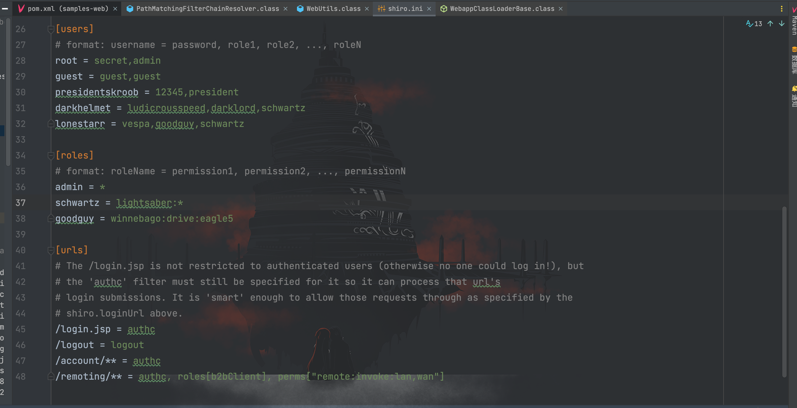
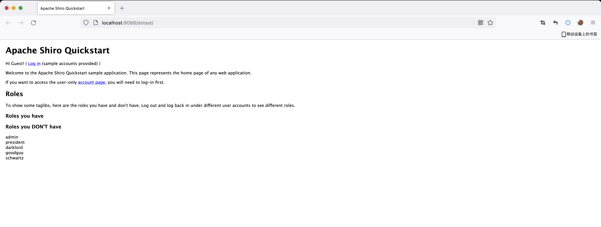
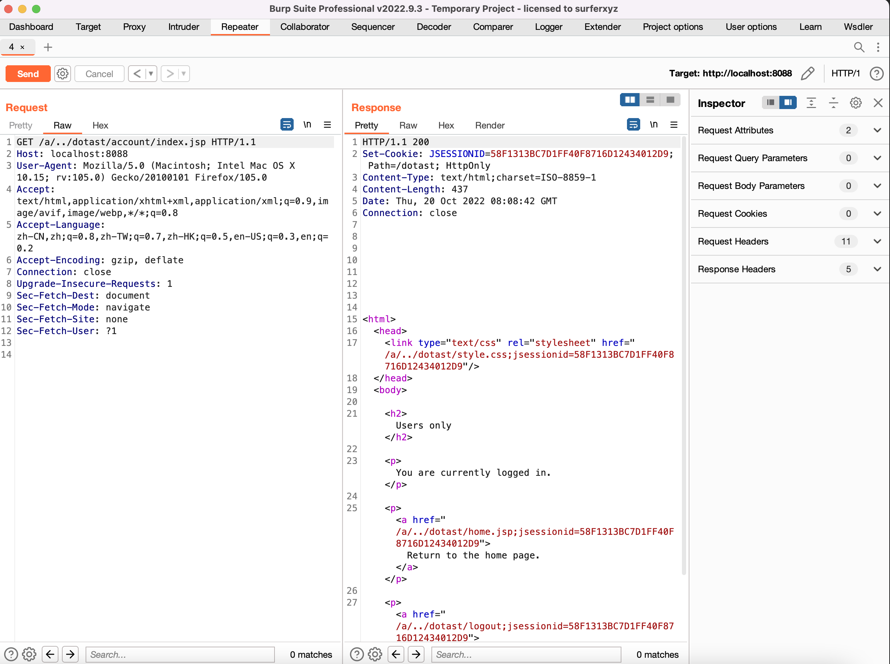
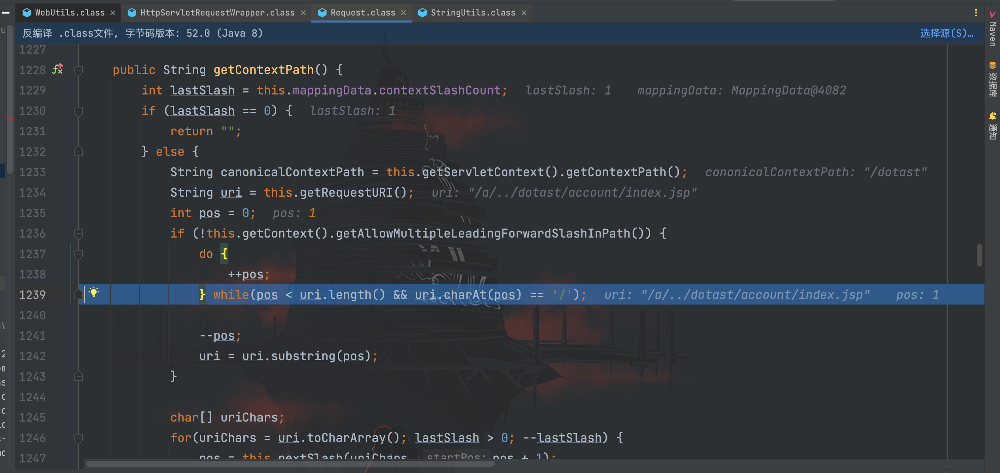
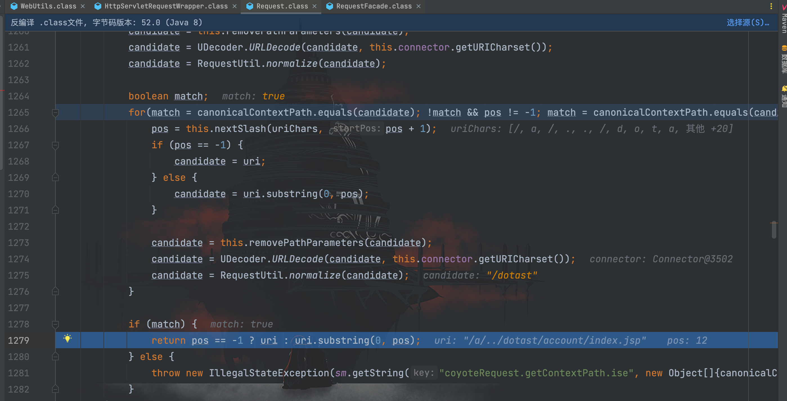
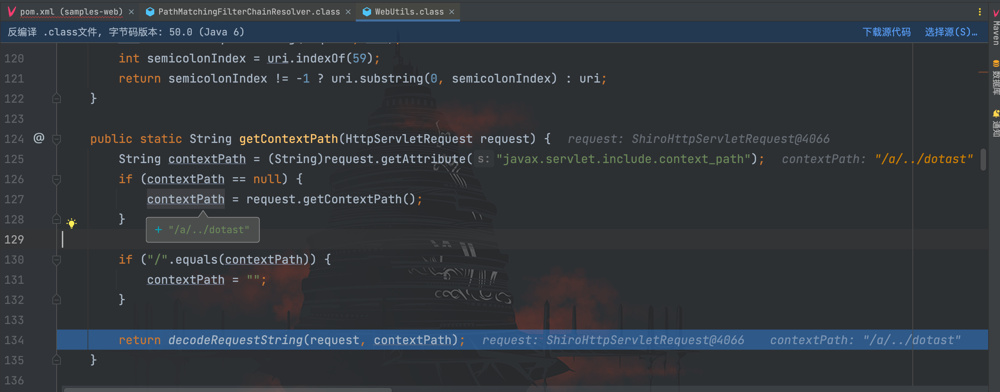
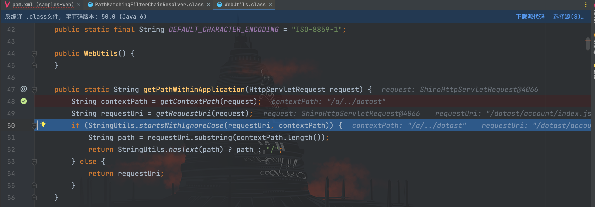
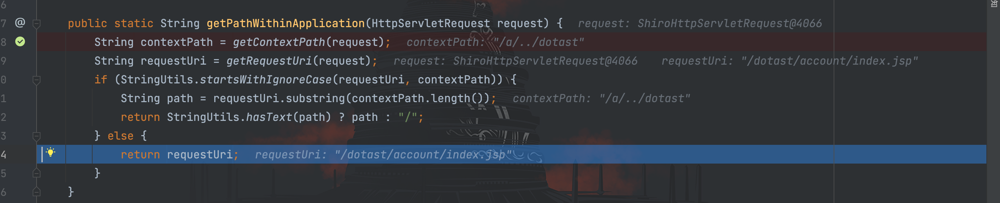
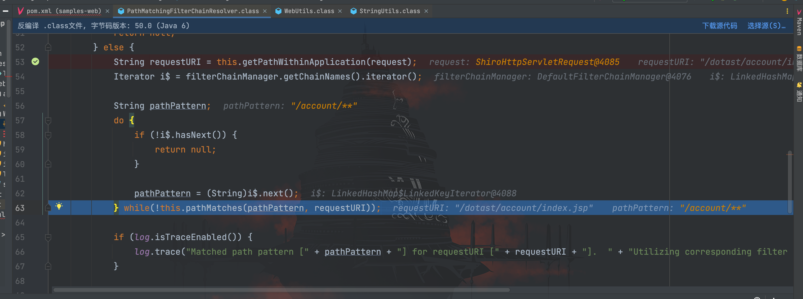

# CVE-2016-6802权限绕过分析

## 前言

该漏洞和前面的`CVE-2010-3863`相似，还是路径标准化导致的问题，只是漏洞点不一样。先看看影响版本：
```
shiro < 1.3.2
```

这里漏洞环境使用上一个`Shiro-550`的原生 shiro 环境，权限配置如下：


该漏洞利用有前提条件：项目部署不在根目录，我这里写的`dotast`


启动后访问登录页面


## 漏洞复现

访问登录后的页面`/dotast/account/index.jsp`，因为无权限 302 会跳转到登录页面


访问`/a/../dotast/account/index.jsp`，成功绕过 Shiro 的鉴权访问到登录后的页面


## 漏洞分析

还是和之前一样，将断点打在`getPathWithinApplication()`方法上


之前在`CVE-2010-3863`分析的时候得知，出现问题的地方在于`getRequestUri()`方法返回了未进行标准化处理的路径。但从上图中可以看到`getRequestUri()`方法已经将我们的构造的路径进行了处理，返回了`/dotast/account/index.jsp`。

根据漏洞信息可以得知，该条 CVE 出现漏洞点在`getContextPath()`方法中，我们跟进一下`getContextPath()`方法


接着跟进`request.getContextPath()`方法，到`Request#getContextPath()`方法


先是通过`this.getServletContext().getContextPath()`方法获取当前工程路径，然后通过`this.getRequestURI()`方法获取传入的 URL 路径，随后进入 while 循环中

接着往下走，该处逻辑为以`/`为分隔符进行截取字符串，进行路径标准化

然后不断与`canonicalContextPath`进行对比，也就是`/dotast`，过程如下：
```
1. /a           --> 标准化为 /a      --> equals("/dotast") == false
2. /a/..        --> 标准化为 /       --> equals("/dotast") == false
3. /a/../dotast --> 标准化为 /dotast --> equals("/dotast") == true
```



因此 return 回去`/a/../dotast/account/index.jsp`的前 12 个字符串，也就是`/a/../dotast`



这里将`/a/../dotast`传入到了`decodeRequestString()`方法中，继续跟进


`decodeRequestString()`方法只做了一个 URL 解码的操作就 return 回去了，现在回到一开始的`getPathWithinApplication()`方法


接下来跟进`startsWithIgnoreCase()`方法


根据`/a/../dotast`的长度截取`/dotast/account/index.jsp`字符串，这里`/a/../dotast`为 12 ，因此得到`/dotast/accou`。接着又将两个字符串进行`equals()`对比是否相等，很显然并不相等，因此 return 回去之后会进入 else 条件里。


返回的`/dotast/account/index.jsp`在去除掉我们设置的目录`/dotast`后也就是`/account/index.jsp`，就会和配置文件中的`/account/**`匹配成功，因而导致绕过鉴权，访问到`/account/index.jsp`。

