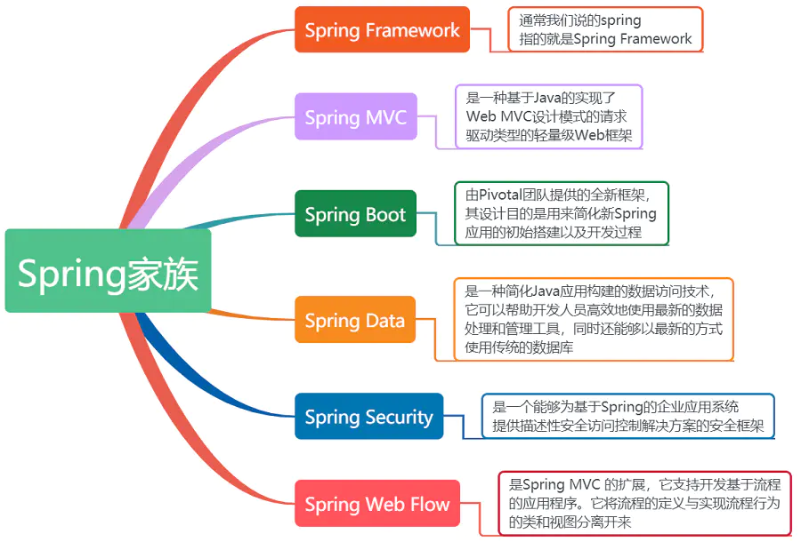
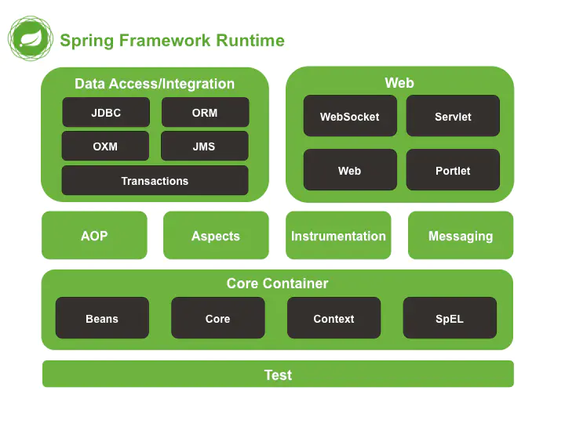
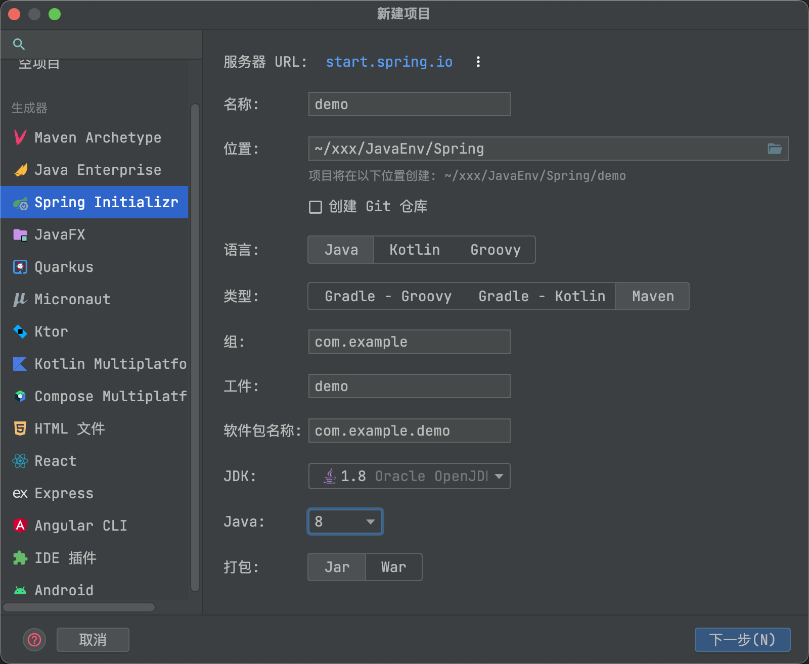
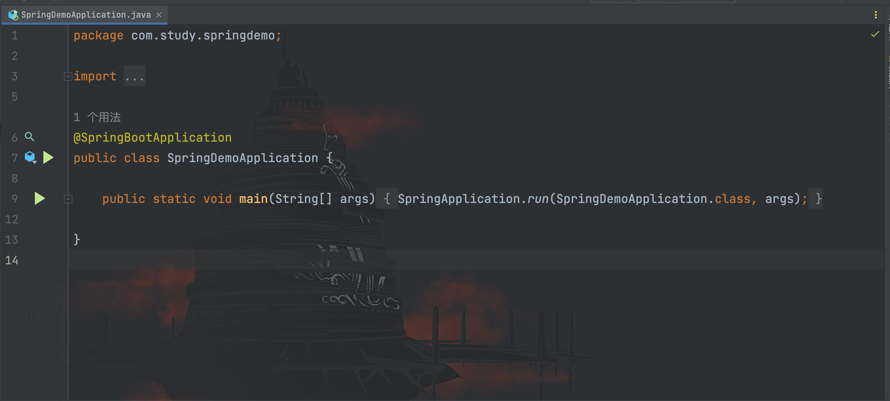
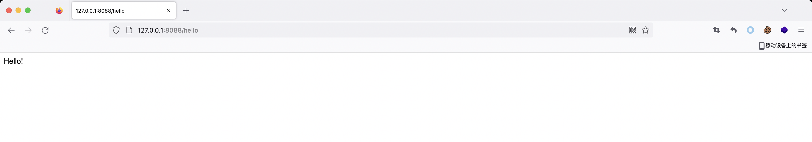
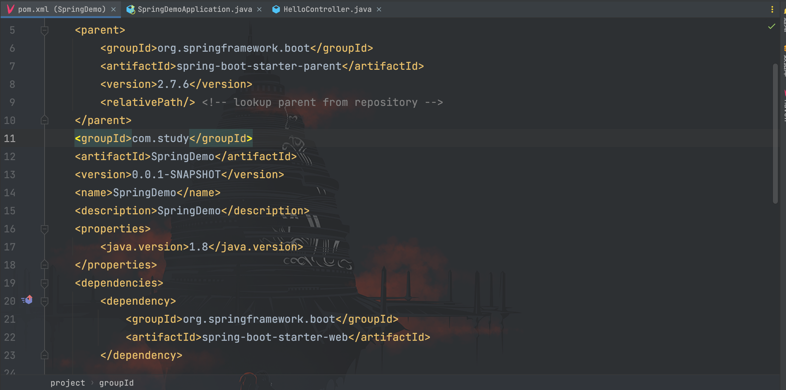
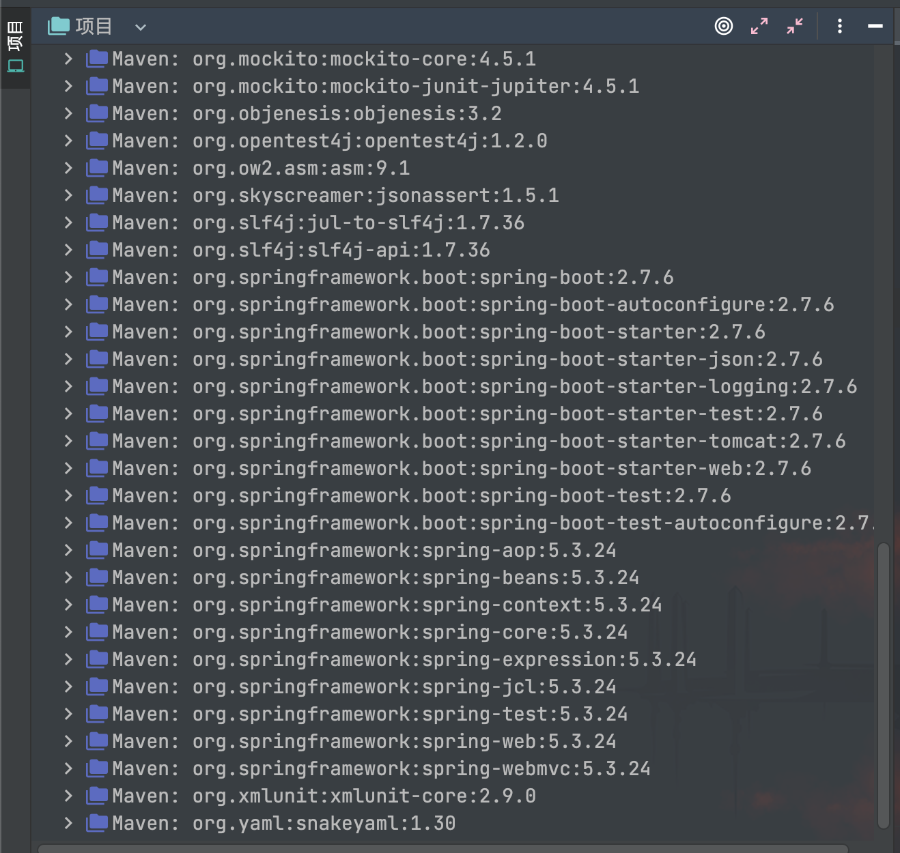
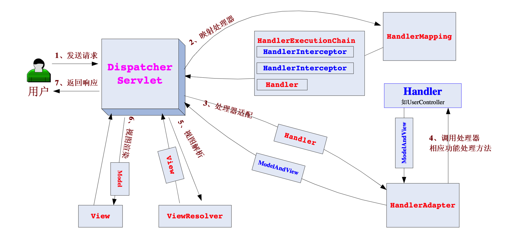

# Spring内存马之Controller

## Spring简介

这里为了先过一遍内存马，关于 Spring 的知识简单写了一点，实际上我们应该更深入的去学习 Spring 的内容，不应局限于本文所提内容。

Spring（Spring Framework）是一个支持快速开发 Java EE 应用程序的开源框架，提供了一系列底层容器和基础设施，同时可以和其他常用的开源框架无缝集成，其核心理念为 IoC（Inversion of Control，控制反转）和 AOP（AspectOrientedProgramming，面向切面编程）。

随着 Spring 越来越受到开发者的青睐，又不断诞生了 Spring Boot、Spring Cloud、Spring Data、Spring Security 等一系列基于 Spring Framework 的项目。



Spring 框架分层结构如下图所示：



## Spring Boot

Spring Boot 是一个基于 Spring 的套件，它帮我们预组装了 Spring 一系列组件，目的是为了简化配置开发基于 Spring 的 Java 应用程序。通过 Spring Boot 我们可以对大部分组件开箱即用，仅仅需要少量配置代码，使开发者更加专注于处理系统的业务逻辑。

通过 IDEA 的 Spring Initializr 可以快速创建好一个 SpringBoot Web 项目


创建完成之后生成一个启动类


编写一个`HelloController`类
```java
package com.study.springdemo.Controller;

import org.springframework.stereotype.Controller;
import org.springframework.web.bind.annotation.RequestMapping;
import org.springframework.web.bind.annotation.ResponseBody;

/**
 * Created by dotast on 2022/11/25 16:37
 */
@Controller
public class HelloController {

    @ResponseBody
    @RequestMapping("/hello")
    public String SayHello(){
        return "Hello!";
    }
}
```

启动后访问`/hello`


我们看一下默认创建的 pom.xml 文件


官方说明如下


在外部库中也可以看到已经自动帮我们导入了包括 Spring MVC 等依赖，这也是为什么我们上面的`HelloController`生效的原因所在。


## Spring MVC

我们知道 Tomcat 是一个 Servet 容器，在底层封装网络通信和协议解析，而作为处理请求业务逻辑的 Servlet 逻辑处理器又被 Tomcat 所管理其生命周期。因此可以简单认识到 WEB 应用程序的核心是基于 Servlet，启动运行又依靠于 Tomcat。

那么什么又是 Spring MVC 呢？Spring MVC 是 Spring 框架提供的基于 MVC 模式，结合 Java 注解的轻量级 WEB 开发框架。其核心类是继承于 HttpServlet 的`DispatchServlet`，负责处理请求业务逻辑部分，那么剩下的运行环境则由 Tomcat 提供支持。

看看 Spring MVC 处理请求的流程图：


简单分析一下流程：

1. **用户发送请求 --> DispatcherServlrt**：接受用户发送的请求委托给`DispatcherServlrt`进行处理；
2. **DispatcherServlrt --> HandlerMapping**：`HandlerMapping`处理器映射组件把请求映射为`HandlerExecutionChain`对象（包含一个 Handler 处理器和多个 HandlerInterceptor 拦截器）；
3. **DispatcherServlet --> HandlerAdapter**：`DispatcherServlrt`获取到返回的`Handler`处理器之后还不能直接调用其逻辑，需要发送到`HandlerAdapter`将`Handler`包装为适配器；
4. **HandlerAdapter --> 调用处理器相应功能处理方法**：`HandlerAdapter`根据适配的结果调用真正的处理器（Controller 控制器）功能处理对应的方法，在完成处理之后，返回`ModelAndView`对象（包含模型数据、逻辑视图名）；
5. **ModelAndView 的逻辑视图名 --> ViewResolver**：`ViewResolver`将逻辑视图名解析为具体的`View`并返回；
6. **View --> 渲染**：`View`根据传进来的`Model`（模型数据）进行渲染并返回到`DispatcherServlrt`；
7. **DispatcherServlrt --> 用户**：最后由`DispatcherServlrt`返回渲染后的响应结果给用户，完成一次请求响应过程。

## Controller型内存马

### Bean

Bean 是 Spring 框架的一个核心概念，是构成应用程序的主干，由 Spring Ioc 容器负责实例化、配置、组装和管理的对象。

### Ioc容器

Ioc（Inversion of Control）直译为控制反转，又称许多人称为“依赖注入”。在谈 Ioc 容器前，先了解一下容器的相关概念。在前面的学习中，我们知道 Tomcat 是一个 Servlet 容器，为 Servlet 的运行提供了运行环境，那么我们可以简单的定义：容器是为某个组件提供运行支撑环境的存在。

当前容器本身还提供了许多我们“看不见”的服务，例如，我们知道 Tomcat 底层实现了 TCP 连接，解析 HTTP 协议等非常复杂的服务。早期的 JavaEE 服务器提供的 EJB 容器就是通过声明式事务服务，使得 EJB 的开发人员不必再编写冗长的事务处理代码，极大简化了事务处理。

说回 Spring，Spring 提供的 Ioc 容器可以轻松管理所有轻量级的 JavaBean 组件，提供的底层服务包括组件的生命周期管理、配置和组装服务、AOP 支持以及建立在 AOP 基础上的声明式事务服务。那么不禁让人发起疑问：Ioc 出现的背景是什么？又解决了什么问题？

我们给出一个例子：假定一个外卖小程序

通过`FoodService`获取商品
```java
public class FoodService{
  private ProgramConfig config = new ProgramConfig();
  private DataSource dataSource = new ProgramDatasource(config);
  
  public Food getFood(long foodId){
    try(Connection conn = dataSource.getConnection()){
      ......
      return food;
    }
  }
  ......
}
```

通过`UserService`获取用户
```java
public class UserService{
  private ProgramConfig config = new ProgramConfig();
  private DataSource dataSource = new ProgramDatasource(config);
  
  public User getUser(long userId){
    try(Connection conn = dataSource.getConnection()){
      ......
      return user;
    }
  }
  ......
}
```

通过这两个类我们可以看到，为了从数据库中取出商品信息，`FoodService`需要一个`DataSource`，而`DataSource`的一些配置信息又需要从配置类`ProgramConfig`中获取，我们还需要再实例化`FoodService`类。

而在`UserService`类中，为了从数据库中取出用户信息，我们又做了上述工作，再实例化一次`ProgramConfig`。接下来场景到了用户购买商品时，我们得编写一个`BuyServlet`。
```java
public class BuyServlet extends HttpServlet{
  private FoodService foodService = new FoodService();
  private UserService userService = new UserService();
  ......
} 
```

在`BuyServlet`中，我们分别得实例化`FoodService`类和`UserService`类，而这仅仅是一个购买的问题，在购买订单或者退款订单相关的`Servlet`中我们依然继续要实例化上述两个类，这时候问题就出现了。

1. 代码开始变得冗长，多个类完全可以使用同一个`DataSource`，同样多个相关功能也完全可以共享同一个`FoodService`和`UserService`，但谁来担任创建和负责获取的角色？这是一个问题。
2. 实例化的组件在结束流程后需要进行销毁以释放连接资源，但如果像第一个问题已经开始共享了`DataSource`，那么如何确保使用该组件的类都进行了销毁？
3. 上述例子只举例了寥寥两三个组件，但一个实际上线的系统所使用的组件是很多的，编写共享的依赖关系时呈逐渐复杂上升的趋势。

因此，当一个系统使用了大量组件的时候，如果其生命周期和依赖关系依然由组件自身维护，将大大增加系统的复杂度，并且会使其有极其紧密的耦合关系，而 Ioc 就是为了解决这一系列问题而诞生。

在传统的应用程序中，控制权在应用程序本身，而在 Ioc 模式下，控制权发生了反转变化，从应用程序转移到了 Ioc 容器，即所有的组件不再由应用程序自己创建和配置，而是全权交由 Ioc 容器负责处理。在这种模式下，应用程序只需要直接使用已经创建并配置完成的组件，也就是使用“依赖注入”。举例来说，就是`FoodService`不再创建`DataSource`，而是由外部通过`setDataSource()`方法注入`DataSource`。
```java
public class FoodService{
  private DataSource dataSource;
  
  public void setDataSource(DataSource dataSource){
    this.dataSource = dataSource;
  }
  ......
}
```

这也是为什么 Ioc 又被称为“依赖注入”的原因，它将组件的创建配置与组件的使用相分离，由 Ioc 来负责管理组件的生命周期。既然 Ioc 要负责实例化程序需要的组件，那么我们需要告诉容器如何去创建组件与处理各组件的依赖关系，比较简单的方式就是通过 XML 文件来实现：
```xml
<beans>
    <bean id="dataSource" class="ProgramDatasource" />
    <bean id="foodService" class="FoodService">
        <property name="dataSource" ref="dataSource" />
    </bean>
    <bean id="userService" class="UserService">
        <property name="dataSource" ref="dataSource" />
    </bean>
</beans>
```

上述配置文件中，告诉 Ioc 容器需要创建三个 JavaBean 组件（在 Spring Ioc 容器中，将所有组件统称为 JavaBean），并把 id 为`dataSource`的组件通过属性`dataSource`（调用`setDataSource()`方法注入到另外两个组件中）。

另一种方式则是采用注解的方式进行配置，例如给`FoodService`添加一个`@Component`注解
```java
@Component
public class FoodService{
  ......
}
```

`@Component`注解相当于定义了一个 Bean，名称默认为`foodService`，即小写开头的类名。

接着我们到`UserService`类中添加`@Component`注解和`@Autowired`注解
```java
@Component
public class UserService {
    @Autowired
    FoodService foodService;
    ...
}
```

使用`@Autowired`注解相当于把制定类型的 Bean 注入到指定的字段中，当然也可以选择注入到方法中。