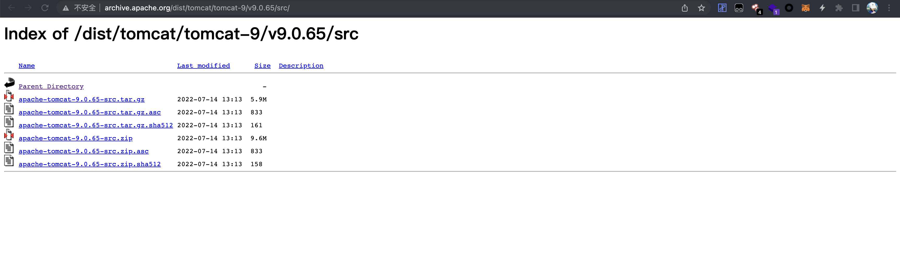
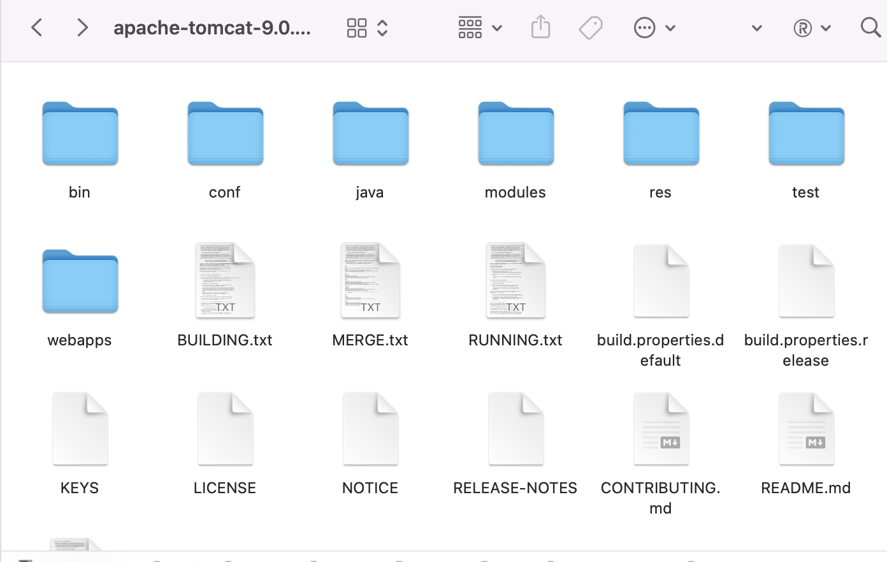
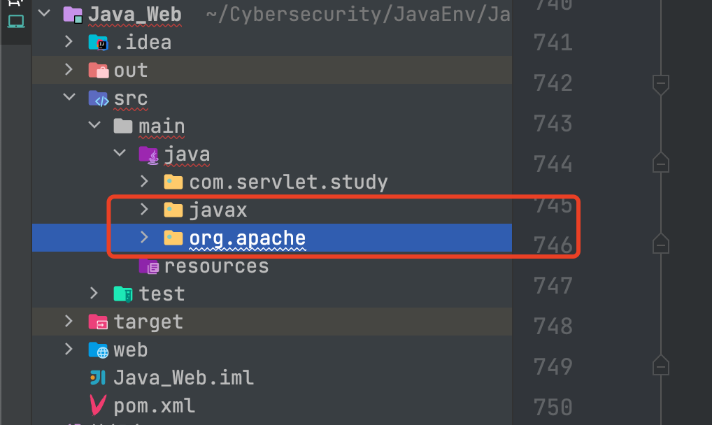
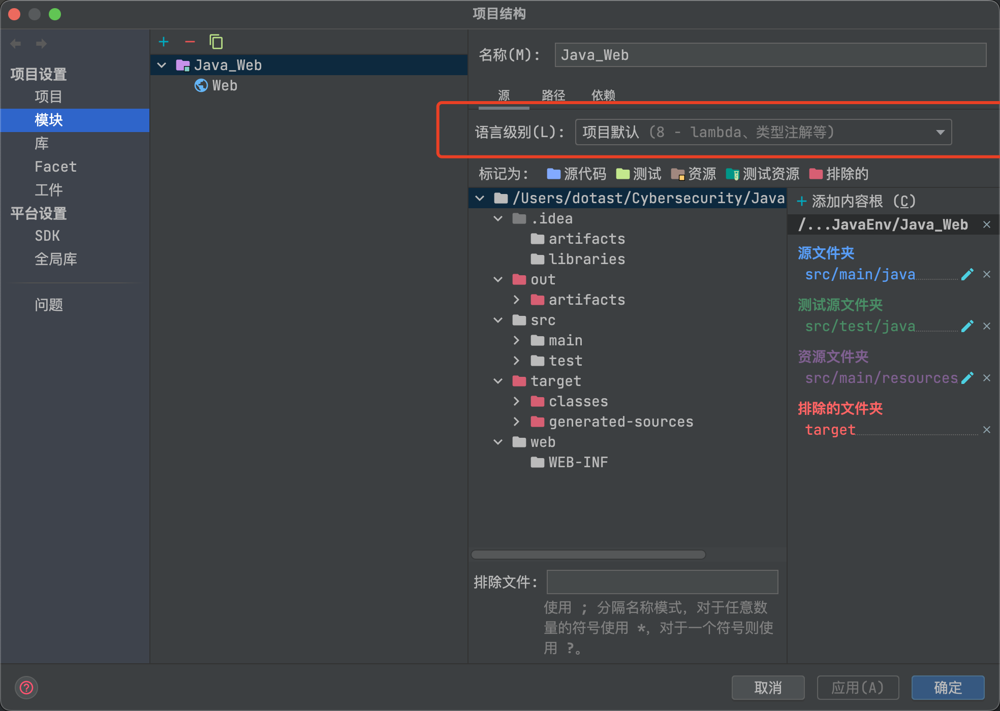
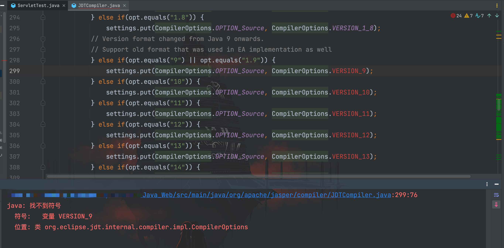
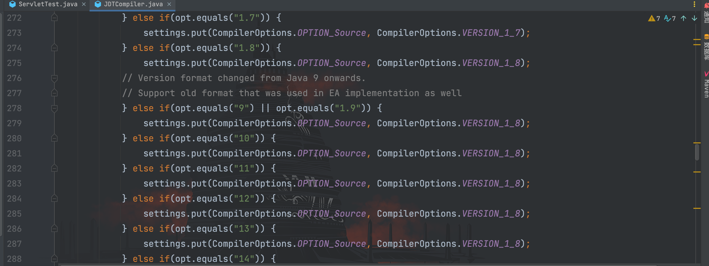
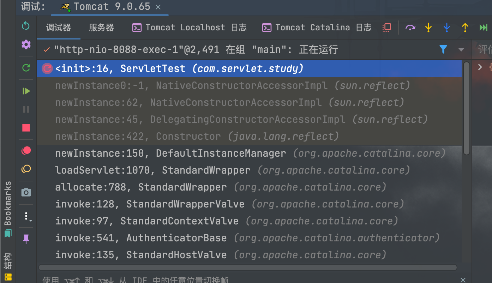
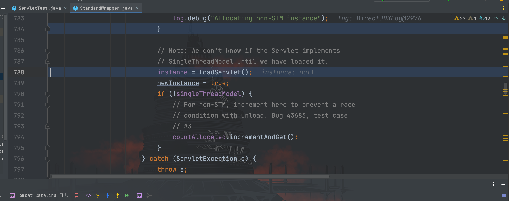

# Tomcat源码调试

## 前言

后面的很多漏洞环境在调试的时候都需要步入 Tomcat 源码文件里，在步入的 class 反编译文件观感不佳（例如变量名丢失，变成了 var 1,2,3...诸如此类）。所以这里写篇笔记记录一下自己的配置过程和遇到的问题的解决方案（自己瞎鼓捣的，并非最好的解决方案），如果其他师傅有比较好的配置方法，欢迎分享学习学习。

## 正文

因为我的 Tomcat 版本是 9.0.65，所以我在官方下载的也是该版本的源码压缩包


解压如下


把 java 文件夹里的 javax 和 org 两个文件夹复制到创建的 Java 项目中


在 pom.xml 里添加如下的 maven 依赖：
```
<!-- tomcat source-->
<dependency>
    <groupId>biz.aQute.bnd</groupId>
    <artifactId>biz.aQute.bndlib</artifactId>
    <version>5.2.0</version>
    <scope>provided</scope>
</dependency>
<dependency>
    <groupId>org.apache.ant</groupId>
    <artifactId>ant</artifactId>
    <version>1.9.7</version>
</dependency>
<dependency>
    <groupId>wsdl4j</groupId>
    <artifactId>wsdl4j</artifactId>
    <version>1.6.2</version>
</dependency>
<dependency>
    <groupId>javax.xml</groupId>
    <artifactId>jaxrpc</artifactId>
    <version>1.1</version>
</dependency>
<dependency>
    <groupId>org.eclipse.jdt.core.compiler</groupId>
    <artifactId>ecj</artifactId>
    <version>4.5.1</version>
</dependency>
```

接下来就是设置字节码版本（以自己的 JDK 版本为准），我的是 jdk 1.8，故配置如下：

项目结构-模块


偏好设置-构建运行部署-编译器-Java 编译器


运行 Java 项目，可能会遇见如下错误；

```
java: 找不到符号
  符号:   变量 VERSION_9
  位置: 类 org.eclipse.jdt.internal.compiler.impl.CompilerOptions
```



个人理解该报错原因是我的 JDK 版本为1.8，所以没有后面的符号变量（非准确说法，勿信），我的解决方案是把这些所有报错的红色变量都改为：`VERSION_1_8`，也可以注释掉


现在项目可以正常运行了，调试情况如下：


可以看到调用栈上关于 Tomcat 的部分，都有明显的颜色区分，步入进去是 java 源文件，而非 class 反编译的文件
